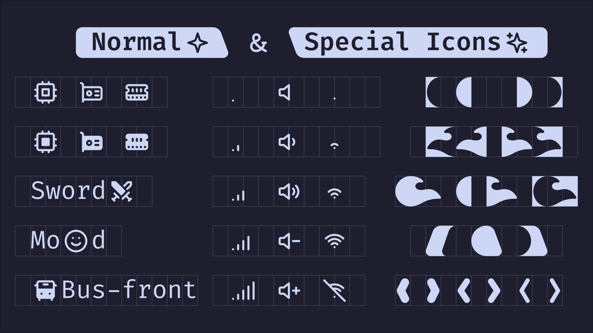
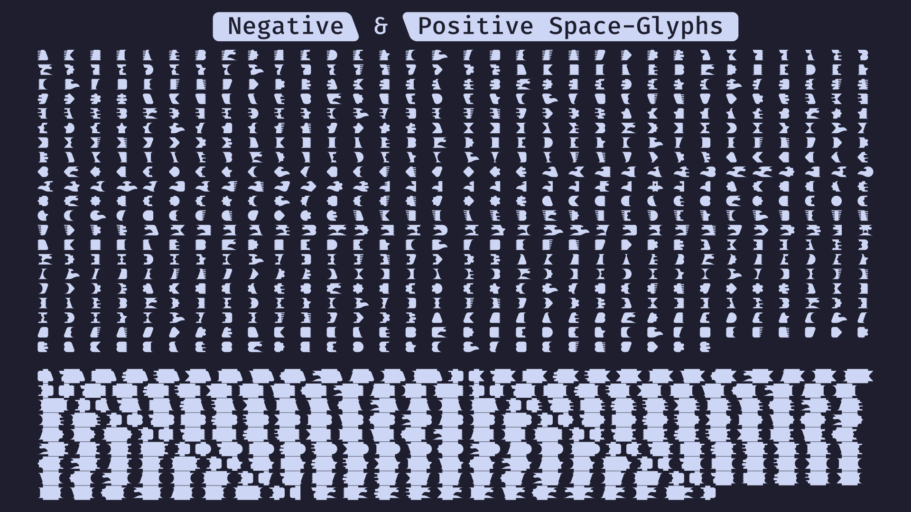
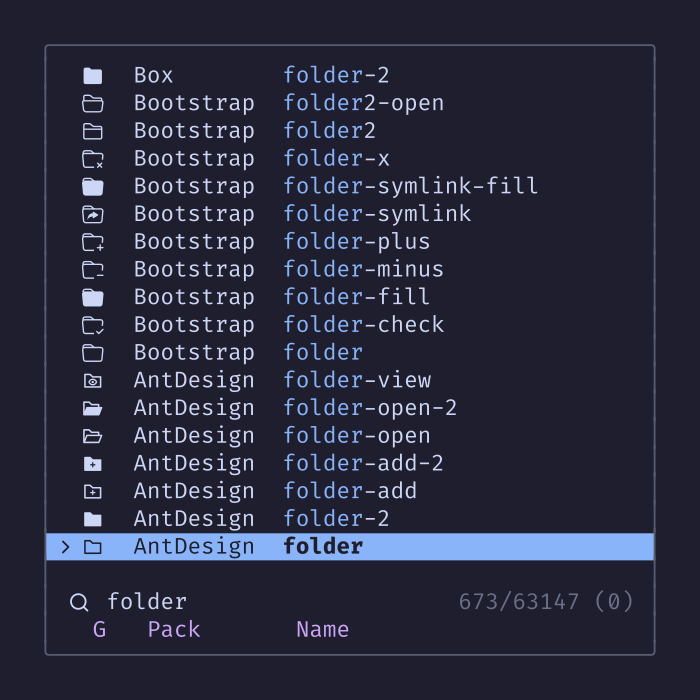

[](https://techforpalestine.org/learn-more)

# Iconic Fonts

Over **50 Pre-patched** fonts designed for enthusiasts who love to rice their terminal, window manager, and more, featuring over **60k icons** as glyphs for ultimate customization and flair!


> [!IMPORTANT]
> The project is currently in its beta phase. We greatly appreciate any feedback you can provide, as it will be extremely helpful in improving the project. Please feel free to open new [issues](https://github.com/iconicFonts/if/issues) or start [discussions](https://github.com/iconicFonts/if/discussions).

> [!NOTE]
> All images in this repository are created solely from Iconic Fonts glyphs (icons) using [Inkscape](https://inkscape.org). No additional drawn elements have been added. The SVG and text source files for each image can be found in the [assets](assets) directory.

## Table of Contents

- [Installation](#installation)
- [Modes](#modes)
- [Patched Fonts](#patched-fonts)
- [Icon Packs](#icon-packs)
- [Icon Types & Alignment](#icon-types-and-alignment)
- [Modern Line Symbols](#modern-line-symbols)
- [Searching Glyphs](#searching-glyphs)
- [Glyph Limitations](#glyph-limitations)
- [Credits](#Credits)
- [Licensing](#licensing)

## Installation

Select your preferred font from our [patched fonts](#patched-fonts) and follow the provided instructions.

## Modes

> [!IMPORTANT]
> Please note that these modes are still under development. The scripts will be published once they're ready. This section provides some insights into what you can expect from these features in the future.

### Tweak Mode

Tweak Mode lets you customize your patched fonts to suit your needs. You can include or exclude specific icon packs from a selected font using the corresponding index file. This index file, available in CSV format, makes it easy to search for glyphs with tools like [fzf](https://github.com/junegunn/fzf) and can be seamlessly integrated with other tools for enhanced functionality.

### Forge Mode

Forge Mode allows you to create your own iconic fonts by converting SVG icons into a font format.

## Patched Fonts

Here is a list of all all patched fonts that we support.

<!-- prettier-ignore-start -->

| Font Name                                                  | Repo/Website                                 | Version   | Preview                                                      | Download                                                                     |
| ---------------------------------------------------------- | -------------------------------------------- | --------- | ------------------------------------------------------------ | :--------------------------------------------------------------------------: |
| [0xProto IF][if-0xproto]                                   | [0xProto][0xproto]                           | `2.100`   | [0xProto][preview-0xproto]                                   | [ZIP][zip-0xproto]                  - [TAR.GZ][tar-0xproto]                  |
| [Anonymous Pro IF][if-anonymous-pro]                       | [Anonymous Pro][anonymous-pro]               | `1.002`   | [Anonymous Pro][preview-anonymous-pro]                       | [ZIP][zip-anonymous-pro]            - [TAR.GZ][tar-anonymous-pro]            |
| [Apl2741 IF][if-apl2741]                                   | [Apl2741][apl2741]                           | `2.00003` | [Apl2741][preview-apl2741]                                   | [ZIP][zip-apl2741]                  - [TAR.GZ][tar-apl2741]                  |
| [Apl385 IF][if-apl385]                                     | [Apl385][apl385]                             | `2.00066` | [Apl385][preview-apl385]                                     | [ZIP][zip-apl385]                   - [TAR.GZ][tar-apl385]                   |
| [AudioLink Mono IF][if-audiolink-mono]                     | [AudioLink Mono][audiolink-mono]             | `1.4.0`   | [AudioLink Mono][preview-audiolink-mono]                     | [ZIP][zip-audiolink-mono]           - [TAR.GZ][tar-audiolink-mono]           |
| [Aurulent Sans Mono IF][if-aurulent-sans-mono]             | Aurulent Sans Mono                           | Unknown   | [Aurulent Sans Mono][preview-aurulent-sans-mono]             | [ZIP][zip-aurulent-sans-mono]       - [TAR.GZ][tar-aurulent-sans-mono]       |
| [Azeret Mono IF][if-azeret-mono]                           | [Azeret Mono][azeret-mono]                   | `1.002`   | [Azeret Mono][preview-azeret-mono]                           | [ZIP][zip-azeret-mono]              - [TAR.GZ][tar-azeret-mono]              |
| [B612 IF][if-b612]                                         | [B612][b612]                                 | `1.008`   | [B612][preview-b612]                                         | [ZIP][zip-b612]                     - [TAR.GZ][tar-b612]                     |
| [Bedstead IF][if-bedstead]                                 | [Bedstead][bedstead]                         | `2.006`   | [Bedstead][preview-bedstead]                                 | [ZIP][zip-bedstead]                 - [TAR.GZ][tar-bedstead]                 |
| [BigBlue TerminalPlus IF][if-bigblue-terminalplus]         | [BigBlue TerminalPlus][bigblue-terminalplus] | `1.0`     | [BigBlue TerminalPlus][preview-bigblue-terminalplus]         | [ZIP][zip-bigblue-terminalplus]     - [TAR.GZ][tar-bigblue-terminalplus]     |
| [Bitstream Vera Sans Mono IF][if-bitstream-vera-sans-mono] | Bitstream Vera Sans Mono                     | `1.10`    | [Bitstream Vera Sans Mono][preview-bitstream-vera-sans-mono] | [ZIP][zip-bitstream-vera-sans-mono] - [TAR.GZ][tar-bitstream-vera-sans-mono] |
| [Borg Sans Mono IF][if-borg-sans-mono]                     | [Borg Sans Mono][borg-sans-mono]             | `0.2.0`   | [Borg Sans Mono][preview-borg-sans-mono]                     | [ZIP][zip-borg-sans-mono]           - [TAR.GZ][tar-borg-sans-mono]           |
| [Comic Mono IF][if-comic-mono]                             | [Comic Mono][comic-mono]                     | `0.1.1`   | [Comic Mono][preview-comic-mono]                             | [ZIP][zip-comic-mono]               - [TAR.GZ][tar-comic-mono]               |
| [CommitMono IF][if-commitmono]                             | [CommitMono][commitmono]                     | `1.143`   | [CommitMono][preview-commitmono]                             | [ZIP][zip-commitmono]               - [TAR.GZ][tar-commitmono]               |
| [Consola Mono IF][if-consola-mono]                         | [Consola Mono][consola-mono]                 | `2.001`   | [Consola Mono][preview-consola-mono]                         | [ZIP][zip-consola-mono]             - [TAR.GZ][tar-consola-mono]             |
| [Courier Prime IF][if-courier-prime]                       | [Courier Prime][courier-prime]               | `1.203`   | [Courier Prime][preview-courier-prime]                       | [ZIP][zip-courier-prime]            - [TAR.GZ][tar-courier-prime]            |
| [Cutive Mono IF][if-cutive-mono]                           | [Cutive Mono][cutive-mono]                   | `1.110`   | [Cutive Mono][preview-cutive-mono]                           | [ZIP][zip-cutive-mono]              - [TAR.GZ][tar-cutive-mono]              |
| [DaddyTimeMono IF][if-daddytimemono]                       | [DaddyTimeMono][daddytimemono]               | `1.2.2`   | [DaddyTimeMono][preview-daddytimemono]                       | [ZIP][zip-daddytimemono]            - [TAR.GZ][tar-daddytimemono]            |
| [DM Mono IF][if-dm-mono]                                   | [DM Mono][dm-mono]                           | `1.00`    | [DM Mono][preview-dm-mono]                                   | [ZIP][zip-dm-mono]                  - [TAR.GZ][tar-dm-mono]                  |
| [Edlo IF][if-edlo]                                         | [Edlo][edlo]                                 | `1.00`    | [Edlo][preview-edlo]                                         | [ZIP][zip-edlo]                     - [TAR.GZ][tar-edlo]                     |
| [Fantasque Sans Mono IF][if-fantasque-sans-mono]           | [Fantasque Sans Mono][fantasque-sans-mono]   | `1.8.0`   | [Fantasque Sans Mono][preview-fantasque-sans-mono]           | [ZIP][zip-fantasque-sans-mono]      - [TAR.GZ][tar-fantasque-sans-mono]      |
| [Fira Code IF][if-fira-code]                               | [Fira Code][fira-code]                       | `6.2`     | [Fira Code][preview-fira-code]                               | [ZIP][zip-fira-code]                - [TAR.GZ][tar-fira-code]                |
| [Fira Mono IF][if-fira-mono]                               | [Fira Mono][fira-mono]                       | `3.206`   | [Fira Mono][preview-fira-mono]                               | [ZIP][zip-fira-mono]                - [TAR.GZ][tar-fira-mono]                |
| [Geist Mono IF][if-geist-mono]                             | [Geist Mono][geist-mono]                     | `1.3.0`   | [Geist Mono][preview-geist-mono]                             | [ZIP][zip-geist-mono]               - [TAR.GZ][tar-geist-mono]               |
| [Hack IF][if-hack]                                         | [Hack][hack]                                 | `3.003`   | [Hack][preview-hack]                                         | [ZIP][zip-hack]                     - [TAR.GZ][tar-hack]                     |
| [Hasklig IF][if-hasklig]                                   | [Hasklig][hasklig]                           | `1.2`     | [Hasklig][preview-hasklig]                                   | [ZIP][zip-hasklig]                  - [TAR.GZ][tar-hasklig]                  |
| [iA Writer Mono IF][if-ia-writer-mono]                     | [iA Writer Mono][ia-writer-mono]             | `2.000`   | [iA Writer Mono][preview-ia-writer-mono]                     | [ZIP][zip-ia-writer-mono]           - [TAR.GZ][tar-ia-writer-mono]           |
| [IBM 3270 IF][if-ibm-3270]                                 | [IBM 3270][ibm-3270]                         | `3.0.1`   | [IBM 3270][preview-ibm-3270]                                 | [ZIP][zip-ibm-3270]                 - [TAR.GZ][tar-ibm-3270]                 |
| [IBM Plex Mono IF][if-ibm-plex-mono]                       | [IBM Plex Mono][ibm-plex-mono]               | `6.4.2`   | [IBM Plex Mono][preview-ibm-plex-mono]                       | [ZIP][zip-ibm-plex-mono]            - [TAR.GZ][tar-ibm-plex-mono]            |
| [Intel One Mono IF][if-intel-one-mono]                     | [Intel One Mono][intel-one-mono]             | `1.4.0`   | [Intel One Mono][preview-intel-one-mono]                     | [ZIP][zip-intel-one-mono]           - [TAR.GZ][tar-intel-one-mono]           |
| [JetBrains Mono IF][if-jetbrains-mono]                     | [JetBrains Mono][jetbrains-mono]             | `2.304`   | [JetBrains Mono][preview-jetbrains-mono]                     | [ZIP][zip-jetbrains-mono]           - [TAR.GZ][tar-jetbrains-mono]           |
| [Lilex IF][if-lilex]                                       | [Lilex][lilex]                               | `2.530`   | [Lilex][preview-lilex]                                       | [ZIP][zip-lilex]                    - [TAR.GZ][tar-lilex]                    |
| [Maple Mono IF][if-maple-mono]                             | [Maple Mono][maple-mono]                     | `6.4`     | [Maple Mono][preview-maple-mono]                             | [ZIP][zip-maple-mono]               - [TAR.GZ][tar-maple-mono]               |
| [Martian Mono IF][if-martian-mono]                         | [Martian Mono][martian-mono]                 | `1.0.0`   | [Martian Mono][preview-martian-mono]                         | [ZIP][zip-martian-mono]             - [TAR.GZ][tar-martian-mono]             |
| [Monaspace Argon IF][if-monaspaceargon]                    | [Monaspace][monaspace-argon]                 | `1.101`   | [Monaspace Argon][preview-monaspaceargon]                    | [ZIP][zip-monaspaceargon]           - [TAR.GZ][tar-monaspaceargon]           |
| [Monaspace Krypton IF][if-monaspacekrypton]                | [Monaspace][monaspace-krypton]               | `1.101`   | [Monaspace Krypton][preview-monaspacekrypton]                | [ZIP][zip-monaspacekrypton]         - [TAR.GZ][tar-monaspacekrypton]         |
| [Monaspace Neon IF][if-monaspaceneon]                      | [Monaspace][monaspace-neon]                  | `1.101`   | [Monaspace Neon][preview-monaspaceneon]                      | [ZIP][zip-monaspaceneon]            - [TAR.GZ][tar-monaspaceneon]            |
| [Monaspace Radon IF][if-monaspaceradon]                    | [Monaspace][monaspace-radon]                 | `1.101`   | [Monaspace Radon][preview-monaspaceradon]                    | [ZIP][zip-monaspaceradon]           - [TAR.GZ][tar-monaspaceradon]           |
| [Monaspace Xenon IF][if-monaspacexenon]                    | [Monaspace][monaspace-xenon]                 | `1.101`   | [Monaspace Xenon][preview-monaspacexenon]                    | [ZIP][zip-monaspacexenon]           - [TAR.GZ][tar-monaspacexenon]           |
| [Monofoki IF][if-monofoki]                                 | [Monofoki][monofoki]                         | `3.1`     | [Monofoki][preview-monofoki]                                 | [ZIP][zip-monofoki]                 - [TAR.GZ][tar-monofoki]                 |
| [Monoid IF][if-monoid]                                     | [Monoid][monoid]                             | `0.61`    | [Monoid][preview-monoid]                                     | [ZIP][zip-monoid]                   - [TAR.GZ][tar-monoid]                   |
| [Mononoki IF][if-mononoki]                                 | [Mononoki][mononoki]                         | `1.6`     | [Mononoki][preview-mononoki]                                 | [ZIP][zip-mononoki]                 - [TAR.GZ][tar-mononoki]                 |
| [New Heterodox Mono IF][if-new-heterodox-mono]             | [New Heterodox Mono][new-heterodox-mono]     | `0.0.3`   | [New Heterodox Mono][preview-new-heterodox-mono]             | [ZIP][zip-new-heterodox-mono]       - [TAR.GZ][tar-new-heterodox-mono]       |
| [Office Code Pro IF][if-office-code-pro]                   | [Office Code Pro][office-code-pro]           | `1.004`   | [Office Code Pro][preview-office-code-pro]                   | [ZIP][zip-office-code-pro]          - [TAR.GZ][tar-office-code-pro]          |
| [Oxygen Mono IF][if-oxygen-mono]                           | [Oxygen Mono][oxygen-mono]                   | `0.201`   | [Oxygen Mono][preview-oxygen-mono]                           | [ZIP][zip-oxygen-mono]              - [TAR.GZ][tar-oxygen-mono]              |
| [Press Start 2P IF][if-press-start-2p]                     | [Press Start 2P][press-start-2p]             | `2.14`    | [Press Start 2P][preview-press-start-2p]                     | [ZIP][zip-press-start-2p]           - [TAR.GZ][tar-press-start-2p]           |
| [Rec Mono Casual IF][if-rec-mono-casual]                   | [Rec Mono Casual][rec-mono-casual]           | `1.085`   | [Rec Mono Casual][preview-rec-mono-casual]                   | [ZIP][zip-rec-mono-casual]          - [TAR.GZ][tar-rec-mono-casual]          |
| [Scientifica IF][if-scientifica]                           | [scientifica][scientifica]                   | `2.3`     | [scientifica][preview-scientifica]                           | [ZIP][zip-scientifica]              - [TAR.GZ][tar-scientifica]              |
| [Serious Shanns IF][if-serious-shanns]                     | [Serious Shanns][serious-shanns]             | `4.0.1`   | [Serious Shanns][preview-serious-shanns]                     | [ZIP][zip-serious-shanns]           - [TAR.GZ][tar-serious-shanns]           |
| [Source Code Pro IF][if-source-code-pro]                   | [Source Code Pro][source-code-pro]           | `1.062`   | [Source Code Pro][preview-source-code-pro]                   | [ZIP][zip-source-code-pro]          - [TAR.GZ][tar-source-code-pro]          |
| [Sudo IF][if-sudo]                                         | [Sudo][sudo]                                 | `1.4`     | [Sudo][preview-sudo]                                         | [ZIP][zip-sudo]                     - [TAR.GZ][tar-sudo]                     |
| [Ubuntu Sans Mono IF][if-ubuntu-sans-mono]                 | [Ubuntu Sans Mono][ubuntu-sans-mono]         | `1.006`   | [Ubuntu Sans Mono][preview-ubuntu-sans-mono]                 | [ZIP][zip-ubuntu-sans-mono]         - [TAR.GZ][tar-ubuntu-sans-mono]         |
| [Victor Mono IF][if-victor-mono]                           | [Victor Mono][victor-mono]                   | `1.5.6`   | [Victor Mono][preview-victor-mono]                           | [ZIP][zip-victor-mono]              - [TAR.GZ][tar-victor-mono]              |

## Icon Packs

Here is a list of all all icon packs that we support.

| Pack Name                             | Pack Repo/Website                                    | Icons | Download                                                   |
| ------------------------------------- | ---------------------------------------------------- | ----: | :--------------------------------------------------------: |
| [Academia][if-academia]               | [Academicons][academicons]                           |   149 | [ZIP][zip-academia]        - [TAR.GZ][tar-academia]        |
| [AntDesign][if-antdesign]             | [Ant Design][ant-design]                             |   672 | [ZIP][zip-antdesign]       - [TAR.GZ][tar-antdesign]       |
| [BlockElements][if-block-elements]    | [Block Elements][block-elements]                     |    32 | [ZIP][zip-block-elements]  - [TAR.GZ][tar-block-elements]  |
| [Bootstrap][if-bootstrap]             | [Bootstrap][bootstrap]                               |  2050 | [ZIP][zip-bootstrap]       - [TAR.GZ][tar-bootstrap]       |
| [Box][if-box]                         | [BoxIcons][boxicons]                                 |  1479 | [ZIP][zip-box]             - [TAR.GZ][tar-box]             |
| [BoxDrawing][if-box-drawing]          | [Box Drawing][box-drawing]                           |   128 | [ZIP][zip-box-drawing]     - [TAR.GZ][tar-box-drawing]     |
| [Bytesize][if-bytesize]               | [Bytesize Icons][bytesize-icons]                     |   101 | [ZIP][zip-bytesize]        - [TAR.GZ][tar-bytesize]        |
| [Chess][if-chess]                     | [Chess Icons][chess-icons]                           |   100 | [ZIP][zip-chess]           - [TAR.GZ][tar-chess]           |
| [Circum][if-circum]                   | [Circum][circum]                                     |   288 | [ZIP][zip-circum]          - [TAR.GZ][tar-circum]          |
| [Codicons][if-codicons]               | [Codicons][codicons]                                 |   460 | [ZIP][zip-codicons]        - [TAR.GZ][tar-codicons]        |
| [CoreUi][if-coreui]                   | [CoreUI][coreui]                                     |  1386 | [ZIP][zip-coreui]          - [TAR.GZ][tar-coreui]          |
| [Crypto][if-crypto]                   | [Cryptocurrency Icons][cryptocurrency-icons]         |   483 | [ZIP][zip-crypto]          - [TAR.GZ][tar-crypto]          |
| [CSS][if-css]                         | [css.gg][css]                                        |   703 | [ZIP][zip-css]             - [TAR.GZ][tar-css]             |
| [Devicon][if-devicon]                 | [Devicon][devicon]                                   |   819 | [ZIP][zip-devicon]         - [TAR.GZ][tar-devicon]         |
| [Domino][if-domino]                   | [Domino Icons][domino-icons]                         |   392 | [ZIP][zip-domino]          - [TAR.GZ][tar-domino]          |
| [Dripicons][if-dripicons]             | [Dripicons][dripicons]                               |   200 | [ZIP][zip-dripicons]       - [TAR.GZ][tar-dripicons]       |
| [Eva][if-eva]                         | [Eva Icons][eva-icons]                               |   489 | [ZIP][zip-eva]             - [TAR.GZ][tar-eva]             |
| [Feather][if-feather]                 | [Feather][feather]                                   |   287 | [ZIP][zip-feather]         - [TAR.GZ][tar-feather]         |
| [File][if-file]                       | [File Icons][file-icons]                             |   931 | [ZIP][zip-file]            - [TAR.GZ][tar-file]            |
| [FontAwesome][if-fontawesome]         | [Font Awesome][font-awesome]                         |  1612 | [ZIP][zip-fontawesome]     - [TAR.GZ][tar-fontawesome]     |
| [Framework7][if-framework7]           | [Framework7 Icons][framework7-icons]                 |  1207 | [ZIP][zip-framework7]      - [TAR.GZ][tar-framework7]      |
| [Game][if-game]                       | [Game Icons][game-icons]                             |  4208 | [ZIP][zip-game]            - [TAR.GZ][tar-game]            |
| [Grommet][if-grommet]                 | [grommet-icons][grommet-icons]                       |   635 | [ZIP][zip-grommet]         - [TAR.GZ][tar-grommet]         |
| [Hero][if-hero]                       | [heroicons][heroicons]                               |   588 | [ZIP][zip-hero]            - [TAR.GZ][tar-hero]            |
| [IcoFont][if-icofont]                 | [IcoFont][icofont]                                   |  2103 | [ZIP][zip-icofont]         - [TAR.GZ][tar-icofont]         |
| [IcoMoon][if-icomoon]                 | [IcoMoon-Free][icomoon-free]                         |   491 | [ZIP][zip-icomoon]         - [TAR.GZ][tar-icomoon]         |
| [IconBrew][if-iconbrew]               | [IconBrew][iconbrew]                                 |   140 | [ZIP][zip-iconbrew]        - [TAR.GZ][tar-iconbrew]        |
| [Iconoir][if-iconoir]                 | [Iconoir][iconoir]                                   |  1583 | [ZIP][zip-iconoir]         - [TAR.GZ][tar-iconoir]         |
| [IconPark][if-iconpark]               | [IconPark][iconpark]                                 |  4496 | [ZIP][zip-iconpark]        - [TAR.GZ][tar-iconpark]        |
| [Ionicons][if-ionicons]               | [Ionicons][ionicons]                                 |  1352 | [ZIP][zip-ionicons]        - [TAR.GZ][tar-ionicons]        |
| [LegacyComputing][if-legacycomputing] | [Legacy Computing Symbols][legacy-computing-symbols] |    88 | [ZIP][zip-legacycomputing] - [TAR.GZ][tar-legacycomputing] |
| [Linea][if-linea]                     | [Linea Iconset][linea-iconset]                       |   724 | [ZIP][zip-linea]           - [TAR.GZ][tar-linea]           |
| [LineAwesome][if-lineawesome]         | [Line Awesome][line-awesome]                         |  1544 | [ZIP][zip-lineawesome]     - [TAR.GZ][tar-lineawesome]     |   
| [Logos][if-logos]                     | [font-logos][font-logos]                             |   118 | [ZIP][zip-logos]           - [TAR.GZ][tar-logos]           |
| [Lucide][if-lucide]                   | [Lucide][lucide]                                     |  1458 | [ZIP][zip-lucide]          - [TAR.GZ][tar-lucide]          |   
| [LucideSolid][if-lucidesolid]         | [Lucide Solid Icons][lucide-solid-icons]             |   826 | [ZIP][zip-lucidesolid]     - [TAR.GZ][tar-lucidesolid]     |   
| [MaterialDesign][if-materialdesign]   | [Material Design][material-design]                   |  7447 | [ZIP][zip-materialdesign]  - [TAR.GZ][tar-materialdesign]  |   
| [Mfizz][if-mfizz]                     | [Font Mfizz][font-mfizz]                             |   136 | [ZIP][zip-mfizz]           - [TAR.GZ][tar-mfizz]           |   
| [ModernLine][if-modernline]           | [ModernLine Symbols][modern-line-symbols]            |   341 | [ZIP][zip-modernline]      - [TAR.GZ][tar-modernline]      |   
| [NotoEmoji][if-notoemoji]             | [NotoEmoji][notoemoji]                               |  1453 | [ZIP][zip-notoemoji]       - [TAR.GZ][tar-notoemoji]       |   
| [Octicons][if-octicons]               | [Primer Octicons][primer-octicons]                   |   641 | [ZIP][zip-octicons]        - [TAR.GZ][tar-octicons]        |   
| [Open][if-open]                       | [Open Iconic][open-iconic]                           |   223 | [ZIP][zip-open]            - [TAR.GZ][tar-open]            |   
| [Payment][if-payment]                 | [Payment Logos][payment-logos]                       |    54 | [ZIP][zip-payment]         - [TAR.GZ][tar-payment]         |   
| [Phosphor][if-phosphor]               | [Phosphor][phosphor]                                 |  4474 | [ZIP][zip-phosphor]        - [TAR.GZ][tar-phosphor]        |   
| [PowerLineExtra][if-powerlineextra]   | [Powerline Extra Symbols][powerline-extra-symbols]   |    40 | [ZIP][zip-powerlineextra]  - [TAR.GZ][tar-powerlineextra]  |   
| [Remix][if-remix]                     | [Remix Icon][remix-icon]                             |  2843 | [ZIP][zip-remix]           - [TAR.GZ][tar-remix]           |   
| [RPG][if-rpg]                         | [RPG Awesome][rpg-awesome]                           |   495 | [ZIP][zip-rpg]             - [TAR.GZ][tar-rpg]             |   
| [Siji][if-siji]                       | [Siji][siji]                                         |   631 | [ZIP][zip-siji]            - [TAR.GZ][tar-siji]            |   
| [Simple][if-simple]                   | [Simple Icons][simple-icons]                         |  3124 | [ZIP][zip-simple]          - [TAR.GZ][tar-simple]          |   
| [SimpleLine][if-simpleline]           | [Simple Line Icons][simple-line-icons]               |   189 | [ZIP][zip-simpleline]      - [TAR.GZ][tar-simpleline]      |   
| [Social][if-social]                   | [Free-Social-Icons][free-social-icons]               |    35 | [ZIP][zip-social]          - [TAR.GZ][tar-social]          |   
| [Tabler][if-tabler]                   | [Tabler Icons][tabler-icons]                         |  5241 | [ZIP][zip-tabler]          - [TAR.GZ][tar-tabler]          |   
| [Themify][if-themify]                 | [Themify Icons][themify-icons]                       |   352 | [ZIP][zip-themify]         - [TAR.GZ][tar-themify]         |   
| [Typicons][if-typicons]               | [Typicons][typicons]                                 |   288 | [ZIP][zip-typicons]        - [TAR.GZ][tar-typicons]        |   
| [Vaadin][if-vaadin]                   | [Vaadin Icons][vaadin-icons]                         |   636 | [ZIP][zip-vaadin]          - [TAR.GZ][tar-vaadin]          |   
| [Weather][if-weather]                 | [Weather][weather]                                   |   219 | [ZIP][zip-weather]         - [TAR.GZ][tar-weather]         |   

<!-- prettier-ignore-end -->

## Icon Types and Alignment

Iconic Fonts includes two types of icons: normal and special. Normal icons use 2 glyphs and are centered vertically and horizontally within the font block. Special icons do not follow any specific rule and may use single or double glyph blocks; for some, is determined by the SVG coordinates.



## Modern Line Symbols

Similar to Powerline and [Powerline Extra Symbols](https://github.com/ryanoasis/powerline-extra-symbols), Modern Line Symbols consist of unique glyphs used in status bars for window managers or terminals. They include a variety of icons needed for status bars and come in two types: positive space glyphs, which are solid and fill the design area, and negative space glyphs, which are hollow or outlined, using the surrounding space to create the design. With over 70 shapes to choose from, you can combine these to create more than 1,000 distinct glyph shapes. For a list of these glyphs, see the [negative](assets/txt/negative-space-glyphs) and [positive](assets/txt/positive-space-glyphs) space-glyphs files in the [txt](assets/txt) directory.



## Searching Glyphs

Searching for glyphs using [fzf](https://junegunn.github.io/fzf/) is a breeze. Just download the [index.csv](https://github.com/iconicFonts/if/tree/main/packs/IF/index.csv) and run fzf with the index path to begin your search.

```sh
column -mts ',' -o $'\t' path_to_the_index_file.csv |
fzf -d '\t' --with-nth=1,2,3 --header-lines=1 --bind 'enter:close+execute(echo {1})'
```

> [!NOTE]
> We plan to enhance the glyph search experience by adding tags and categories to the icons. Additionally, we will be launching a website to facilitate icon searches.

<p style="text-align:center;">
  
</p>

## Glyph Limitations

The 65,535-glyph limit in TrueType and OpenType fonts is due to their use of 16-bit numbers for glyph counts. Since 16 bits can represent numbers up to 65,535 (2^16 − 1), this is the maximum glyph count.

In the future, we will optimize the icon packs by removing duplicates and unnecessary glyphs (icons). For example, instead of including all logos in a single pack, we will create a new pack that consolidates repeated icons. If different packs contain the same icons, we will merge them into a single pack, as seen with the similar icons from [Lucide][if-lucide], [Feather][if-feather], and [Tabler][if-tabler]. This approach will help us add new icons while staying within the glyph limit.

# Credits

Special thanks to the creators and contributors of the fonts, icon packs, tools, and themes used in this project.

- [FontForge](https://fontforge.org/) for creating and modifying fonts
- [Inkscape](https://inkscape.org/) for designing the images
- [SVGO](https://github.com/svg/svgo) for optimizing SVG files to reduce their size
- [Catppuccin](https://github.com/catppuccin) for the color scheme used in the IconicFonts project
- [FZF](https://junegunn.github.io/fzf/installation/) for searching glyphs
- [Nerd Fonts](https://github.com/ryanoasis/nerd-fonts) for inspiring this work
- [OpenAI](https://openai.com/) for assistance and support throughout the project

## Licensing

- **Icon Packs**: The license for each icon pack covers all SVG files in its directory.
- **Unpatched Fonts**: The license for all TTF and OTF files in [unpatched](fonts/unpatched) follows the source’s terms.
- **Color Scheme**: The color scheme used in images from the [Catppuccin](https://github.com/catppuccin/catppuccin) is licensed under the [MIT License](https://github.com/catppuccin/catppuccin/blob/main/LICENSE).
- **Fonts**: All Fonts in this project that are not in the [unpatched](fonts/unpatched) directory are licensed under a [OFL 1.1](https://openfontlicense.org/documents/OFL.txt).
- **Files**: All non-font and non-icon files in this project are licensed under the MIT [License](https://mit-license.org) License.

Please refer to the [LICENSE](https://github.com/iconicFonts/if/blob/main/LICENSE) file for more details.

<!-- prettier-ignore-start -->

<!----------------------------------------------------------------------------->
<!-------------------------------- Icon PACKS --------------------------------->
<!--- SHORTCUT REFERENCE LINKS ----------------------------- REPO OR WEBSITE -->

[academicons]:              https://github.com/jpswalsh/academicons#readme
[ant-design]:               https://github.com/ant-design/ant-design-icons#readme
[block-elements]:           https://github.com/iconicFonts/block-elements#readme
[bootstrap]:                https://github.com/twbs/icons#readme
[box-drawing]:              https://github.com/iconicFonts/box-drawing#readme
[boxicons]:                 https://github.com/atisawd/boxicons#readme
[bytesize-icons]:           https://github.com/danklammer/bytesize-icons#readme
[chess-icons]:              https://github.com/iconicFonts/chess-icons#readme
[circum]:                   https://github.com/Klarr-Agency/Circum-Icons#readme
[codicons]:                 https://github.com/microsoft/vscode-codicons#readme
[coreui]:                   https://github.com/coreui/coreui-icons#readme
[cryptocurrency-icons]:     https://github.com/spothq/cryptocurrency-icons#readme
[css]:                      https://github.com/astrit/css.gg#readme
[devicon]:                  https://github.com/devicons/devicon#readme
[domino-icons]:             https://github.com/iconicFonts/domino-icons#readme
[dripicons]:                https://github.com/amitjakhu/dripicons#readme
[eva-icons]:                https://github.com/akveo/eva-icons#readme
[feather]:                  https://github.com/feathericons/feather#readme
[file-icons]:               https://github.com/file-icons/icons#readme
[font-awesome]:             https://github.com/FortAwesome/Font-Awesome#readme
[font-logos]:               https://github.com/Lukas-W/font-logos#readme
[font-mfizz]:               https://github.com/fizzed/font-mfizz#readme
[framework7-icons]:         https://github.com/framework7io/Framework7-Icons#readme
[free-social-icons]:        https://github.com/neilorangepeel/Free-Social-Icons#readme
[game-icons]:               https://github.com/game-icons/icons#readme
[grommet-icons]:            https://github.com/grommet/grommet-icons#readme
[heroicons]:                https://github.com/tailwindlabs/heroicons#readme
[icofont]:                  https://icofont.com
[icomoon-free]:             https://github.com/Keyamoon/IcoMoon-Free#readme
[iconbrew]:                 https://github.com/elrumo/icon-brew#readme
[iconoir]:                  https://github.com/iconoir-icons/iconoir#readme
[iconpark]:                 https://github.com/bytedance/IconPark#readme
[ionicons]:                 https://github.com/ionic-team/Ionicons#readme
[legacy-computing-symbols]: https://github.com/iconicFonts/legacy-computing-symbols#readme
[line-awesome]:             https://github.com/icons8/line-awesome#readme
[linea-iconset]:            https://github.com/linea-io/Linea-Iconset#readme
[lucide-solid-icons]:       https://github.com/iconicFonts/lucide-solid-icons#readme
[lucide]:                   https://github.com/lucide-icons/lucide#readme
[material-design]:          https://github.com/Templarian/MaterialDesign#readme
[modern-line-symbols]:      https://github.com/iconicFonts/modern-line-symbols#readme
[notoemoji]:                https://fonts.google.com/noto/specimen/Noto+Emoji
[open-iconic]:              https://github.com/iconic/open-iconic#readme
[payment-logos]:            https://github.com/datatrans/payment-logos#readme
[phosphor]:                 https://github.com/phosphor-icons/homepage#readme
[powerline-extra-symbols]:  https://github.com/ryanoasis/powerline-extra-symbols#readme
[primer-octicons]:          https://github.com/primer/octicons#readme
[remix-icon]:               https://github.com/Remix-Design/remixicon#readme
[rpg-awesome]:              https://github.com/nagoshiashumari/Rpg-Awesome#readme
[siji]:                     https://github.com/stark/siji#readme
[simple-icons]:             https://github.com/simple-icons/simple-icons#readme
[simple-line-icons]:        https://github.com/thesabbir/simple-line-icons#readme
[tabler-icons]:             https://github.com/tabler/tabler-icons#readme
[themify-icons]:            https://github.com/lykmapipo/themify-icons#readme
[typicons]:                 https://github.com/stephenhutchings/typicons.font#readme
[vaadin-icons]:             https://github.com/vaadin/vaadin-icons#readme
[weather]:                  https://github.com/erikflowers/weather-icons#readme

<!---------------------------------------------------------------- PACK DIRs -->

[if-academia]:        packs/Academia
[if-antdesign]:       packs/AntDesign
[if-block-elements]:  packs/BlockElements
[if-bootstrap]:       packs/Bootstrap
[if-box-drawing]:     packs/BoxDrawing
[if-box]:             packs/Box
[if-bytesize]:        packs/Bytesize
[if-chess]:           packs/Chess
[if-circum]:          packs/Circum
[if-codicons]:        packs/Codicons
[if-coreui]:          packs/CoreUi
[if-crypto]:          packs/Crypto
[if-css]:             packs/CSS
[if-devicon]:         packs/Devicon
[if-domino]:          packs/Domino
[if-dripicons]:       packs/Dripicons
[if-eva]:             packs/Eva
[if-feather]:         packs/Feather
[if-file]:            packs/File
[if-fontawesome]:     packs/FontAwesome
[if-framework7]:      packs/Framework7
[if-game]:            packs/Game
[if-grommet]:         packs/Grommet
[if-hero]:            packs/Hero
[if-icofont]:         packs/IcoFont
[if-icomoon]:         packs/IcoMoon
[if-iconbrew]:        packs/IconBrew
[if-iconoir]:         packs/Iconoir
[if-iconpark]:        packs/IconPark
[if-ionicons]:        packs/Ionicons
[if-legacycomputing]: packs/LegacyComputing
[if-linea]:           packs/Linea
[if-lineawesome]:     packs/LineAwesome
[if-logos]:           packs/Logos
[if-lucide]:          packs/Lucide
[if-lucidesolid]:     packs/LucideSolid
[if-materialdesign]:  packs/MaterialDesign
[if-mfizz]:           packs/Mfizz
[if-modernline]:      packs/ModernLine
[if-notoemoji]:       packs/NotoEmoji
[if-octicons]:        packs/Octicons
[if-open]:            packs/Open
[if-payment]:         packs/Payment
[if-phosphor]:        packs/Phosphor
[if-powerlineextra]:  packs/PowerLineExtra
[if-remix]:           packs/Remix
[if-rpg]:             packs/RPG
[if-siji]:            packs/Siji
[if-simple]:          packs/Simple
[if-simpleline]:      packs/SimpleLine
[if-social]:          packs/Social
[if-tabler]:          packs/Tabler
[if-themify]:         packs/Themify
[if-typicons]:        packs/Typicons
[if-vaadin]:          packs/Vaadin
[if-weather]:         packs/Weather

<!-------------------------------------------------------------- PACKS (ZIP) -->

[zip-academia]:        https://github.com/iconicFonts/if/releases/download/v1.1.0/Academia.zip
[zip-antdesign]:       https://github.com/iconicFonts/if/releases/download/v1.1.0/AntDesign.zip
[zip-block-elements]:  https://github.com/iconicFonts/if/releases/download/v1.1.0/BlockElements.zip
[zip-bootstrap]:       https://github.com/iconicFonts/if/releases/download/v1.1.0/Bootstrap.zip
[zip-box-drawing]:     https://github.com/iconicFonts/if/releases/download/v1.1.0/BoxDrawing.zip
[zip-box]:             https://github.com/iconicFonts/if/releases/download/v1.1.0/Box.zip
[zip-bytesize]:        https://github.com/iconicFonts/if/releases/download/v1.1.0/Bytesize.zip
[zip-chess]:           https://github.com/iconicFonts/if/releases/download/v1.1.0/Chess.zip
[zip-circum]:          https://github.com/iconicFonts/if/releases/download/v1.1.0/Circum.zip
[zip-codicons]:        https://github.com/iconicFonts/if/releases/download/v1.1.0/Codicons.zip
[zip-coreui]:          https://github.com/iconicFonts/if/releases/download/v1.1.0/CoreUi.zip
[zip-crypto]:          https://github.com/iconicFonts/if/releases/download/v1.1.0/Crypto.zip
[zip-css]:             https://github.com/iconicFonts/if/releases/download/v1.1.0/CSS.zip
[zip-devicon]:         https://github.com/iconicFonts/if/releases/download/v1.1.0/Devicon.zip
[zip-domino]:          https://github.com/iconicFonts/if/releases/download/v1.1.0/Domino.zip
[zip-dripicons]:       https://github.com/iconicFonts/if/releases/download/v1.1.0/Dripicons.zip
[zip-eva]:             https://github.com/iconicFonts/if/releases/download/v1.1.0/Eva.zip
[zip-feather]:         https://github.com/iconicFonts/if/releases/download/v1.1.0/Feather.zip
[zip-file]:            https://github.com/iconicFonts/if/releases/download/v1.1.0/File.zip
[zip-fontawesome]:     https://github.com/iconicFonts/if/releases/download/v1.1.0/FontAwesome.zip
[zip-framework7]:      https://github.com/iconicFonts/if/releases/download/v1.1.0/Framework7.zip
[zip-game]:            https://github.com/iconicFonts/if/releases/download/v1.1.0/Game.zip
[zip-grommet]:         https://github.com/iconicFonts/if/releases/download/v1.1.0/Grommet.zip
[zip-hero]:            https://github.com/iconicFonts/if/releases/download/v1.1.0/Hero.zip
[zip-icofont]:         https://github.com/iconicFonts/if/releases/download/v1.1.0/IcoFont.zip
[zip-icomoon]:         https://github.com/iconicFonts/if/releases/download/v1.1.0/IcoMoon.zip
[zip-iconbrew]:        https://github.com/iconicFonts/if/releases/download/v1.1.0/IconBrew.zip
[zip-iconoir]:         https://github.com/iconicFonts/if/releases/download/v1.1.0/Iconoir.zip
[zip-iconpark]:        https://github.com/iconicFonts/if/releases/download/v1.1.0/IconPark.zip
[zip-ionicons]:        https://github.com/iconicFonts/if/releases/download/v1.1.0/Ionicons.zip
[zip-legacycomputing]: https://github.com/iconicFonts/if/releases/download/v1.1.0/LegacyComputing.zip
[zip-linea]:           https://github.com/iconicFonts/if/releases/download/v1.1.0/Linea.zip
[zip-lineawesome]:     https://github.com/iconicFonts/if/releases/download/v1.1.0/LineAwesome.zip
[zip-logos]:           https://github.com/iconicFonts/if/releases/download/v1.1.0/Logos.zip
[zip-lucide]:          https://github.com/iconicFonts/if/releases/download/v1.1.0/Lucide.zip
[zip-lucidesolid]:     https://github.com/iconicFonts/if/releases/download/v1.1.0/LucideSolid.zip
[zip-materialdesign]:  https://github.com/iconicFonts/if/releases/download/v1.1.0/MaterialDesign.zip
[zip-mfizz]:           https://github.com/iconicFonts/if/releases/download/v1.1.0/Mfizz.zip
[zip-modernline]:      https://github.com/iconicFonts/if/releases/download/v1.1.0/ModernLine.zip
[zip-notoemoji]:       https://github.com/iconicFonts/if/releases/download/v1.1.0/NotoEmoji.zip
[zip-octicons]:        https://github.com/iconicFonts/if/releases/download/v1.1.0/Octicons.zip
[zip-open]:            https://github.com/iconicFonts/if/releases/download/v1.1.0/Open.zip
[zip-payment]:         https://github.com/iconicFonts/if/releases/download/v1.1.0/Payment.zip
[zip-phosphor]:        https://github.com/iconicFonts/if/releases/download/v1.1.0/Phosphor.zip
[zip-powerlineextra]:  https://github.com/iconicFonts/if/releases/download/v1.1.0/PowerLineExtra.zip
[zip-remix]:           https://github.com/iconicFonts/if/releases/download/v1.1.0/Remix.zip
[zip-rpg]:             https://github.com/iconicFonts/if/releases/download/v1.1.0/RPG.zip
[zip-siji]:            https://github.com/iconicFonts/if/releases/download/v1.1.0/Siji.zip
[zip-simple]:          https://github.com/iconicFonts/if/releases/download/v1.1.0/Simple.zip
[zip-simpleline]:      https://github.com/iconicFonts/if/releases/download/v1.1.0/SimpleLine.zip
[zip-social]:          https://github.com/iconicFonts/if/releases/download/v1.1.0/Social.zip
[zip-tabler]:          https://github.com/iconicFonts/if/releases/download/v1.1.0/Tabler.zip
[zip-themify]:         https://github.com/iconicFonts/if/releases/download/v1.1.0/Themify.zip
[zip-typicons]:        https://github.com/iconicFonts/if/releases/download/v1.1.0/Typicons.zip
[zip-vaadin]:          https://github.com/iconicFonts/if/releases/download/v1.1.0/Vaadin.zip
[zip-weather]:         https://github.com/iconicFonts/if/releases/download/v1.1.0/Weather.zip

<!----------------------------------------------------------- PACKS (TAR.GZ) -->

[tar-academia]:        https://github.com/iconicFonts/if/releases/download/v1.1.0/Academia.tar.gz
[tar-antdesign]:       https://github.com/iconicFonts/if/releases/download/v1.1.0/AntDesign.tar.gz
[tar-block-elements]:  https://github.com/iconicFonts/if/releases/download/v1.1.0/BlockElements.tar.gz
[tar-bootstrap]:       https://github.com/iconicFonts/if/releases/download/v1.1.0/Bootstrap.tar.gz
[tar-box-drawing]:     https://github.com/iconicFonts/if/releases/download/v1.1.0/BoxDrawing.tar.gz
[tar-box]:             https://github.com/iconicFonts/if/releases/download/v1.1.0/Box.tar.gz
[tar-bytesize]:        https://github.com/iconicFonts/if/releases/download/v1.1.0/Bytesize.tar.gz
[tar-chess]:           https://github.com/iconicFonts/if/releases/download/v1.1.0/Chess.tar.gz
[tar-circum]:          https://github.com/iconicFonts/if/releases/download/v1.1.0/Circum.tar.gz
[tar-codicons]:        https://github.com/iconicFonts/if/releases/download/v1.1.0/Codicons.tar.gz
[tar-coreui]:          https://github.com/iconicFonts/if/releases/download/v1.1.0/CoreUi.tar.gz
[tar-crypto]:          https://github.com/iconicFonts/if/releases/download/v1.1.0/Crypto.tar.gz
[tar-css]:             https://github.com/iconicFonts/if/releases/download/v1.1.0/CSS.tar.gz
[tar-devicon]:         https://github.com/iconicFonts/if/releases/download/v1.1.0/Devicon.tar.gz
[tar-domino]:          https://github.com/iconicFonts/if/releases/download/v1.1.0/Domino.tar.gz
[tar-dripicons]:       https://github.com/iconicFonts/if/releases/download/v1.1.0/Dripicons.tar.gz
[tar-eva]:             https://github.com/iconicFonts/if/releases/download/v1.1.0/Eva.tar.gz
[tar-feather]:         https://github.com/iconicFonts/if/releases/download/v1.1.0/Feather.tar.gz
[tar-file]:            https://github.com/iconicFonts/if/releases/download/v1.1.0/File.tar.gz
[tar-fontawesome]:     https://github.com/iconicFonts/if/releases/download/v1.1.0/FontAwesome.tar.gz
[tar-framework7]:      https://github.com/iconicFonts/if/releases/download/v1.1.0/Framework7.tar.gz
[tar-game]:            https://github.com/iconicFonts/if/releases/download/v1.1.0/Game.tar.gz
[tar-grommet]:         https://github.com/iconicFonts/if/releases/download/v1.1.0/Grommet.tar.gz
[tar-hero]:            https://github.com/iconicFonts/if/releases/download/v1.1.0/Hero.tar.gz
[tar-icofont]:         https://github.com/iconicFonts/if/releases/download/v1.1.0/IcoFont.tar.gz
[tar-icomoon]:         https://github.com/iconicFonts/if/releases/download/v1.1.0/IcoMoon.tar.gz
[tar-iconbrew]:        https://github.com/iconicFonts/if/releases/download/v1.1.0/IconBrew.tar.gz
[tar-iconoir]:         https://github.com/iconicFonts/if/releases/download/v1.1.0/Iconoir.tar.gz
[tar-iconpark]:        https://github.com/iconicFonts/if/releases/download/v1.1.0/IconPark.tar.gz
[tar-ionicons]:        https://github.com/iconicFonts/if/releases/download/v1.1.0/Ionicons.tar.gz
[tar-legacycomputing]: https://github.com/iconicFonts/if/releases/download/v1.1.0/LegacyComputing.tar.gz
[tar-linea]:           https://github.com/iconicFonts/if/releases/download/v1.1.0/Linea.tar.gz
[tar-lineawesome]:     https://github.com/iconicFonts/if/releases/download/v1.1.0/LineAwesome.tar.gz
[tar-logos]:           https://github.com/iconicFonts/if/releases/download/v1.1.0/Logos.tar.gz
[tar-lucide]:          https://github.com/iconicFonts/if/releases/download/v1.1.0/Lucide.tar.gz
[tar-lucidesolid]:     https://github.com/iconicFonts/if/releases/download/v1.1.0/LucideSolid.tar.gz
[tar-materialdesign]:  https://github.com/iconicFonts/if/releases/download/v1.1.0/MaterialDesign.tar.gz
[tar-mfizz]:           https://github.com/iconicFonts/if/releases/download/v1.1.0/Mfizz.tar.gz
[tar-modernline]:      https://github.com/iconicFonts/if/releases/download/v1.1.0/ModernLine.tar.gz
[tar-notoemoji]:       https://github.com/iconicFonts/if/releases/download/v1.1.0/NotoEmoji.tar.gz
[tar-octicons]:        https://github.com/iconicFonts/if/releases/download/v1.1.0/Octicons.tar.gz
[tar-open]:            https://github.com/iconicFonts/if/releases/download/v1.1.0/Open.tar.gz
[tar-payment]:         https://github.com/iconicFonts/if/releases/download/v1.1.0/Payment.tar.gz
[tar-phosphor]:        https://github.com/iconicFonts/if/releases/download/v1.1.0/Phosphor.tar.gz
[tar-powerlineextra]:  https://github.com/iconicFonts/if/releases/download/v1.1.0/PowerLineExtra.tar.gz
[tar-remix]:           https://github.com/iconicFonts/if/releases/download/v1.1.0/Remix.tar.gz
[tar-rpg]:             https://github.com/iconicFonts/if/releases/download/v1.1.0/RPG.tar.gz
[tar-siji]:            https://github.com/iconicFonts/if/releases/download/v1.1.0/Siji.tar.gz
[tar-simple]:          https://github.com/iconicFonts/if/releases/download/v1.1.0/Simple.tar.gz
[tar-simpleline]:      https://github.com/iconicFonts/if/releases/download/v1.1.0/SimpleLine.tar.gz
[tar-social]:          https://github.com/iconicFonts/if/releases/download/v1.1.0/Social.tar.gz
[tar-tabler]:          https://github.com/iconicFonts/if/releases/download/v1.1.0/Tabler.tar.gz
[tar-themify]:         https://github.com/iconicFonts/if/releases/download/v1.1.0/Themify.tar.gz
[tar-typicons]:        https://github.com/iconicFonts/if/releases/download/v1.1.0/Typicons.tar.gz
[tar-vaadin]:          https://github.com/iconicFonts/if/releases/download/v1.1.0/Vaadin.tar.gz
[tar-weather]:         https://github.com/iconicFonts/if/releases/download/v1.1.0/Weather.tar.gz

<!---SHORTCUT REFERENCE LINKS ------------------------------------------------->
<!------------------------------- PATCHED FONTS ------------------------------->
<!---------------------------------------------------------- REPO OR WEBSITE -->

[0xproto]:                  https://github.com/0xType/0xProto#readme
[anonymous-pro]:            https://www.marksimonson.com/fonts/view/anonymous-pro
[apl2741]:                  https://apl385.com/fonts/index.htm
[apl385]:                   https://apl385.com/fonts/index.htm
[audiolink-mono]:           https://github.com/llealloo/audiolink#readme
[azeret-mono]:              https://github.com/displaay/Azeret#readme
[b612]:                     https://github.com/polarsys/b612#readme
[bedstead]:                 https://bjh21.me.uk/bedstead#readme
[bigblue-terminalplus]:     https://int10h.org/blog/2015/12/bigblue-terminal-oldschool-fixed-width-font
[borg-sans-mono]:           https://github.com/marnen/borg-sans-mono#readme
[comic-mono]:               https://github.com/dtinth/comic-mono-font#readme
[commitmono]:               https://github.com/eigilnikolajsen/commit-mono#readme
[consola-mono]:             https://github.com/wmk69/consola-mono#readme
[courier-prime]:            https://github.com/quoteunquoteapps/courierprime#readme
[cutive-mono]:              https://github.com/google/fonts/tree/main/ofl/cutivemono#readme
[daddytimemono]:            https://github.com/bourgeoisbear/daddytimemono#readme
[dm-mono]:                  https://github.com/google/fonts/tree/main/ofl/dmmono#readme
[edlo]:                     https://github.com/ehamiter/edlo#readme
[fantasque-sans-mono]:      https://github.com/belluzj/fantasque-sans#readme
[fira-code]:                https://github.com/tonsky/firacode#readme
[fira-mono]:                https://github.com/mozilla/fira#readme
[geist-mono]:               https://github.com/vercel/geist-font#readme
[hack]:                     https://github.com/source-foundry/hack#readme
[hasklig]:                  https://github.com/i-tu/hasklig#readme
[ia-writer-mono]:           https://github.com/iaolo/ia-fonts#readme
[ibm-3270]:                 https://github.com/rbanffy/3270font#readme
[ibm-plex-mono]:            https://github.com/ibm/plex#readme
[intel-one-mono]:           https://github.com/intel/intel-one-mono#readme
[jetbrains-mono]:           https://github.com/jetbrains/jetbrainsmono#readme
[lilex]:                    https://github.com/mishamyrt/lilex#readme
[maple-mono]:               https://github.com/subframe7536/maple-font#readme
[martian-mono]:             https://github.com/evilmartians/mono#readme
[monaspace-argon]:          https://github.com/githubnext/monaspace#readme
[monaspace-krypton]:        https://github.com/githubnext/monaspace#readme
[monaspace-neon]:           https://github.com/githubnext/monaspace#readme
[monaspace-radon]:          https://github.com/githubnext/monaspace#readme
[monaspace-xenon]:          https://github.com/githubnext/monaspace#readme
[monofoki]:                 https://github.com/datmaffin/monofoki#readme
[monoid]:                   https://github.com/larsenwork/monoid#readme
[mononoki]:                 https://github.com/madmalik/mononoki#readme
[new-heterodox-mono]:       https://github.com/hckiang/font-new-heterodox-mono#readme
[office-code-pro]:          https://github.com/nathco/office-code-pro#readme
[oxygen-mono]:              https://github.com/google/fonts/tree/main/ofl/oxygenmono#readme
[press-start-2p]:           https://github.com/codeman38/pressstart2p#readme
[rec-mono-casual]:          https://github.com/arrowtype/recursive#readme
[scientifica]:              https://github.com/oppiliappan/scientifica#readme
[serious-shanns]:           https://github.com/kabeech/serious-shanns#readme
[source-code-pro]:          https://github.com/adobe-fonts/source-code-pro#readme
[sudo]:                     https://github.com/jenskutilek/sudo-font#readme
[ubuntu-sans-mono]:         https://github.com/canonical/ubuntu-sans-mono-fonts#readme
[victor-mono]:              https://github.com/rubjo/victor-mono#readme

<!------------------------------------------------------------------- README -->

[if-0xproto]:                  fonts/patched/0xProto
[if-anonymous-pro]:            fonts/patched/Anonymous_Pro
[if-apl2741]:                  fonts/patched/Apl2741
[if-apl385]:                   fonts/patched/Apl385
[if-audiolink-mono]:           fonts/patched/AudioLink_Mono
[if-aurulent-sans-mono]:       fonts/patched/Aurulent_Sans_Mono
[if-azeret-mono]:              fonts/patched/Azeret_Mono
[if-b612]:                     fonts/patched/B612
[if-bedstead]:                 fonts/patched/Bedstead
[if-bigblue-terminalplus]:     fonts/patched/BigBlue_Terminal
[if-bitstream-vera-sans-mono]: fonts/patched/Bitstream_Vera_Sans_Mono
[if-borg-sans-mono]:           fonts/patched/Borg_Sans_Mono
[if-comic-mono]:               fonts/patched/Comic_Mono
[if-commitmono]:               fonts/patched/CommitMono
[if-consola-mono]:             fonts/patched/Consola_Mono
[if-courier-prime]:            fonts/patched/Courier_Prime
[if-cutive-mono]:              fonts/patched/Cutive_Mono
[if-daddytimemono]:            fonts/patched/DaddyTimeMono
[if-dm-mono]:                  fonts/patched/DM_Mono
[if-edlo]:                     fonts/patched/Edlo
[if-fantasque-sans-mono]:      fonts/patched/Fantasque_Sans_Mono
[if-fira-code]:                fonts/patched/Fira_Code
[if-fira-mono]:                fonts/patched/Fira_Mono
[if-geist-mono]:               fonts/patched/Geist_Mono
[if-hack]:                     fonts/patched/Hack
[if-hasklig]:                  fonts/patched/Hasklig
[if-ia-writer-mono]:           fonts/patched/iA_Writer_Mono
[if-ibm-3270]:                 fonts/patched/IBM_3270
[if-ibm-plex-mono]:            fonts/patched/IBM_Plex_Mono
[if-intel-one-mono]:           fonts/patched/Intel_One_Mono
[if-jetbrains-mono]:           fonts/patched/JetBrains_Mono
[if-lilex]:                    fonts/patched/Lilex
[if-maple-mono]:               fonts/patched/Maple_Mono
[if-martian-mono]:             fonts/patched/Martian_Mono
[if-monaspaceargon]:           fonts/patched/Monaspace_Argon
[if-monaspacekrypton]:         fonts/patched/Monaspace_Krypton
[if-monaspaceneon]:            fonts/patched/Monaspace_Neon
[if-monaspaceradon]:           fonts/patched/Monaspace_Radon
[if-monaspacexenon]:           fonts/patched/Monaspace_Xenon
[if-monofoki]:                 fonts/patched/Monofoki
[if-monoid]:                   fonts/patched/Monoid
[if-mononoki]:                 fonts/patched/mononoki
[if-new-heterodox-mono]:       fonts/patched/New_Heterodox_Mono
[if-office-code-pro]:          fonts/patched/Office_Code_Pro
[if-oxygen-mono]:              fonts/patched/Oxygen_Mono
[if-press-start-2p]:           fonts/patched/Press_Start_2P
[if-rec-mono-casual]:          fonts/patched/Rec_Mono_Casual
[if-scientifica]:              fonts/patched/scientifica
[if-serious-shanns]:           fonts/patched/Serious_Shanns
[if-source-code-pro]:          fonts/patched/Source_Code_Pro
[if-sudo]:                     fonts/patched/Sudo
[if-ubuntu-sans-mono]:         fonts/patched/Ubuntu_Sans_Mono
[if-victor-mono]:              fonts/patched/Victor_Mono

<!------------------------------------------------------- PATCHED FONT PREVIEWS -->

[preview-0xproto]:                  fonts/patched/0xProto/preview.png
[preview-anonymous-pro]:            fonts/patched/Anonymous_Pro/preview.png
[preview-apl2741]:                  fonts/patched/Apl2741/preview.png
[preview-apl385]:                   fonts/patched/Apl385/preview.png
[preview-audiolink-mono]:           fonts/patched/AudioLink_Mono/preview.png
[preview-aurulent-sans-mono]:       fonts/patched/Aurulent_Sans_Mono/preview.png
[preview-azeret-mono]:              fonts/patched/Azeret_Mono/preview.png
[preview-b612]:                     fonts/patched/B612/preview.png
[preview-bedstead]:                 fonts/patched/Bedstead/preview.png
[preview-bigblue-terminalplus]:     fonts/patched/BigBlue_Terminal/preview.png
[preview-bitstream-vera-sans-mono]: fonts/patched/Bitstream_Vera_Sans_Mono/preview.png
[preview-borg-sans-mono]:           fonts/patched/Borg_Sans_Mono/preview.png
[preview-comic-mono]:               fonts/patched/Comic_Mono/preview.png
[preview-commitmono]:               fonts/patched/CommitMono/preview.png
[preview-consola-mono]:             fonts/patched/Consola_Mono/preview.png
[preview-courier-prime]:            fonts/patched/Courier_Prime/preview.png
[preview-cutive-mono]:              fonts/patched/Cutive_Mono/preview.png
[preview-daddytimemono]:            fonts/patched/DaddyTimeMono/preview.png
[preview-dm-mono]:                  fonts/patched/DM_Mono/preview.png
[preview-edlo]:                     fonts/patched/Edlo/preview.png
[preview-fantasque-sans-mono]:      fonts/patched/Fantasque_Sans_Mono/preview.png
[preview-fira-code]:                fonts/patched/Fira_Code/preview.png
[preview-fira-mono]:                fonts/patched/Fira_Mono/preview.png
[preview-geist-mono]:               fonts/patched/Geist_Mono/preview.png
[preview-hack]:                     fonts/patched/Hack/preview.png
[preview-hasklig]:                  fonts/patched/Hasklig/preview.png
[preview-ia-writer-mono]:           fonts/patched/iA_Writer_Mono/preview.png
[preview-ibm-3270]:                 fonts/patched/IBM_3270/preview.png
[preview-ibm-plex-mono]:            fonts/patched/IBM_Plex_Mono/preview.png
[preview-intel-one-mono]:           fonts/patched/Intel_One_Mono/preview.png
[preview-jetbrains-mono]:           fonts/patched/JetBrains_Mono/preview.png
[preview-lilex]:                    fonts/patched/Lilex/preview.png
[preview-maple-mono]:               fonts/patched/Maple_Mono/preview.png
[preview-martian-mono]:             fonts/patched/Martian_Mono/preview.png
[preview-monaspaceargon]:           fonts/patched/Monaspace_Argon/preview.png
[preview-monaspacekrypton]:         fonts/patched/Monaspace_Krypton/preview.png
[preview-monaspaceneon]:            fonts/patched/Monaspace_Neon/preview.png
[preview-monaspaceradon]:           fonts/patched/Monaspace_Radon/preview.png
[preview-monaspacexenon]:           fonts/patched/Monaspace_Xenon/preview.png
[preview-monofoki]:                 fonts/patched/Monofoki/preview.png
[preview-monoid]:                   fonts/patched/Monoid/preview.png
[preview-mononoki]:                 fonts/patched/mononoki/preview.png
[preview-new-heterodox-mono]:       fonts/patched/New_Heterodox_Mono/preview.png
[preview-office-code-pro]:          fonts/patched/Office_Code_Pro/preview.png
[preview-oxygen-mono]:              fonts/patched/Oxygen_Mono/preview.png
[preview-press-start-2p]:           fonts/patched/Press_Start_2P/preview.png
[preview-rec-mono-casual]:          fonts/patched/Rec_Mono_Casual/preview.png
[preview-scientifica]:              fonts/patched/scientifica/preview.png
[preview-serious-shanns]:           fonts/patched/Serious_Shanns/preview.png
[preview-source-code-pro]:          fonts/patched/Source_Code_Pro/preview.png
[preview-sudo]:                     fonts/patched/Sudo/preview.png
[preview-ubuntu-sans-mono]:         fonts/patched/Ubuntu_Sans_Mono/preview.png
[preview-victor-mono]:              fonts/patched/Victor_Mono/preview.png

<!------------------------------------------------------ PATCHED FONTS (ZIP) -->

[zip-0xproto]:                  https://github.com/iconicFonts/if/releases/download/v1.1.0/0xproto.zip
[zip-anonymous-pro]:            https://github.com/iconicFonts/if/releases/download/v1.1.0/anonymous-pro.zip
[zip-apl2741]:                  https://github.com/iconicFonts/if/releases/download/v1.1.0/apl2741.zip
[zip-apl385]:                   https://github.com/iconicFonts/if/releases/download/v1.1.0/apl385.zip
[zip-audiolink-mono]:           https://github.com/iconicFonts/if/releases/download/v1.1.0/audiolink-mono.zip
[zip-aurulent-sans-mono]:       https://github.com/iconicFonts/if/releases/download/v1.1.0/aurulent-sans-mono.zip
[zip-azeret-mono]:              https://github.com/iconicFonts/if/releases/download/v1.1.0/azeret-mono.zip
[zip-b612]:                     https://github.com/iconicFonts/if/releases/download/v1.1.0/b612.zip
[zip-bedstead]:                 https://github.com/iconicFonts/if/releases/download/v1.1.0/bedstead.zip
[zip-bigblue-terminalplus]:     https://github.com/iconicFonts/if/releases/download/v1.1.0/bigblue-terminalplus.zip
[zip-bitstream-vera-sans-mono]: https://github.com/iconicFonts/if/releases/download/v1.1.0/bitstream-vera-sans-mono.zip
[zip-borg-sans-mono]:           https://github.com/iconicFonts/if/releases/download/v1.1.0/borg-sans-mono.zip
[zip-comic-mono]:               https://github.com/iconicFonts/if/releases/download/v1.1.0/comic-mono.zip
[zip-commitmono]:               https://github.com/iconicFonts/if/releases/download/v1.1.0/commitmono.zip
[zip-consola-mono]:             https://github.com/iconicFonts/if/releases/download/v1.1.0/consola-mono.zip
[zip-courier-prime]:            https://github.com/iconicFonts/if/releases/download/v1.1.0/courier-prime.zip
[zip-cutive-mono]:              https://github.com/iconicFonts/if/releases/download/v1.1.0/cutive-mono.zip
[zip-daddytimemono]:            https://github.com/iconicFonts/if/releases/download/v1.1.0/daddytimemono.zip
[zip-dm-mono]:                  https://github.com/iconicFonts/if/releases/download/v1.1.0/dm-mono.zip
[zip-edlo]:                     https://github.com/iconicFonts/if/releases/download/v1.1.0/edlo.zip
[zip-fantasque-sans-mono]:      https://github.com/iconicFonts/if/releases/download/v1.1.0/fantasque-sans-mono.zip
[zip-fira-code]:                https://github.com/iconicFonts/if/releases/download/v1.1.0/fira-code.zip
[zip-fira-mono]:                https://github.com/iconicFonts/if/releases/download/v1.1.0/fira-mono.zip
[zip-geist-mono]:               https://github.com/iconicFonts/if/releases/download/v1.1.0/geist-mono.zip
[zip-hack]:                     https://github.com/iconicFonts/if/releases/download/v1.1.0/hack.zip
[zip-hasklig]:                  https://github.com/iconicFonts/if/releases/download/v1.1.0/hasklig.zip
[zip-ia-writer-mono]:           https://github.com/iconicFonts/if/releases/download/v1.1.0/ia-writer-mono.zip
[zip-ibm-3270]:                 https://github.com/iconicFonts/if/releases/download/v1.1.0/ibm-3270.zip
[zip-ibm-plex-mono]:            https://github.com/iconicFonts/if/releases/download/v1.1.0/ibm-plex-mono.zip
[zip-intel-one-mono]:           https://github.com/iconicFonts/if/releases/download/v1.1.0/intel-one-mono.zip
[zip-jetbrains-mono]:           https://github.com/iconicFonts/if/releases/download/v1.1.0/jetbrains-mono.zip
[zip-lilex]:                    https://github.com/iconicFonts/if/releases/download/v1.1.0/lilex.zip
[zip-maple-mono]:               https://github.com/iconicFonts/if/releases/download/v1.1.0/maple-mono.zip
[zip-martian-mono]:             https://github.com/iconicFonts/if/releases/download/v1.1.0/martian-mono.zip
[zip-monaspaceargon]:           https://github.com/iconicFonts/if/releases/download/v1.1.0/monaspaceargon.zip
[zip-monaspacekrypton]:         https://github.com/iconicFonts/if/releases/download/v1.1.0/monaspacekrypton.zip
[zip-monaspaceneon]:            https://github.com/iconicFonts/if/releases/download/v1.1.0/monaspaceneon.zip
[zip-monaspaceradon]:           https://github.com/iconicFonts/if/releases/download/v1.1.0/monaspaceradon.zip
[zip-monaspacexenon]:           https://github.com/iconicFonts/if/releases/download/v1.1.0/monaspacexenon.zip
[zip-monofoki]:                 https://github.com/iconicFonts/if/releases/download/v1.1.0/monofoki.zip
[zip-monoid]:                   https://github.com/iconicFonts/if/releases/download/v1.1.0/monoid.zip
[zip-mononoki]:                 https://github.com/iconicFonts/if/releases/download/v1.1.0/mononoki.zip
[zip-new-heterodox-mono]:       https://github.com/iconicFonts/if/releases/download/v1.1.0/new-heterodox-mono.zip
[zip-office-code-pro]:          https://github.com/iconicFonts/if/releases/download/v1.1.0/office-code-pro.zip
[zip-oxygen-mono]:              https://github.com/iconicFonts/if/releases/download/v1.1.0/oxygen-mono.zip
[zip-press-start-2p]:           https://github.com/iconicFonts/if/releases/download/v1.1.0/press-start-2p.zip
[zip-rec-mono-casual]:          https://github.com/iconicFonts/if/releases/download/v1.1.0/rec-mono-casual.zip
[zip-scientifica]:              https://github.com/iconicFonts/if/releases/download/v1.1.0/scientifica.zip
[zip-serious-shanns]:           https://github.com/iconicFonts/if/releases/download/v1.1.0/serious-shanns.zip
[zip-source-code-pro]:          https://github.com/iconicFonts/if/releases/download/v1.1.0/source-code-pro.zip
[zip-sudo]:                     https://github.com/iconicFonts/if/releases/download/v1.1.0/sudo.zip
[zip-ubuntu-sans-mono]:         https://github.com/iconicFonts/if/releases/download/v1.1.0/ubuntu-sans-mono.zip
[zip-victor-mono]:              https://github.com/iconicFonts/if/releases/download/v1.1.0/victor-mono.zip

<!---------------------------------------------------- PATCHED FONTS(TAR.GZ) -->

[tar-0xproto]:                  https://github.com/iconicFonts/if/releases/download/v1.1.0/0xproto.tar.gz
[tar-anonymous-pro]:            https://github.com/iconicFonts/if/releases/download/v1.1.0/anonymous-pro.tar.gz
[tar-apl2741]:                  https://github.com/iconicFonts/if/releases/download/v1.1.0/apl2741.tar.gz
[tar-apl385]:                   https://github.com/iconicFonts/if/releases/download/v1.1.0/apl385.tar.gz
[tar-audiolink-mono]:           https://github.com/iconicFonts/if/releases/download/v1.1.0/audiolink-mono.tar.gz
[tar-aurulent-sans-mono]:       https://github.com/iconicFonts/if/releases/download/v1.1.0/aurulent-sans-mono.tar.gz
[tar-azeret-mono]:              https://github.com/iconicFonts/if/releases/download/v1.1.0/azeret-mono.tar.gz
[tar-b612]:                     https://github.com/iconicFonts/if/releases/download/v1.1.0/b612.tar.gz
[tar-bedstead]:                 https://github.com/iconicFonts/if/releases/download/v1.1.0/bedstead.tar.gz
[tar-bigblue-terminalplus]:     https://github.com/iconicFonts/if/releases/download/v1.1.0/bigblue-terminalplus.tar.gz
[tar-bitstream-vera-sans-mono]: https://github.com/iconicFonts/if/releases/download/v1.1.0/bitstream-vera-sans-mono.tar.gz
[tar-borg-sans-mono]:           https://github.com/iconicFonts/if/releases/download/v1.1.0/borg-sans-mono.tar.gz
[tar-comic-mono]:               https://github.com/iconicFonts/if/releases/download/v1.1.0/comic-mono.tar.gz
[tar-commitmono]:               https://github.com/iconicFonts/if/releases/download/v1.1.0/commitmono.tar.gz
[tar-consola-mono]:             https://github.com/iconicFonts/if/releases/download/v1.1.0/consola-mono.tar.gz
[tar-courier-prime]:            https://github.com/iconicFonts/if/releases/download/v1.1.0/courier-prime.tar.gz
[tar-cutive-mono]:              https://github.com/iconicFonts/if/releases/download/v1.1.0/cutive-mono.tar.gz
[tar-daddytimemono]:            https://github.com/iconicFonts/if/releases/download/v1.1.0/daddytimemono.tar.gz
[tar-dm-mono]:                  https://github.com/iconicFonts/if/releases/download/v1.1.0/dm-mono.tar.gz
[tar-edlo]:                     https://github.com/iconicFonts/if/releases/download/v1.1.0/edlo.tar.gz
[tar-fantasque-sans-mono]:      https://github.com/iconicFonts/if/releases/download/v1.1.0/fantasque-sans-mono.tar.gz
[tar-fira-code]:                https://github.com/iconicFonts/if/releases/download/v1.1.0/fira-code.tar.gz
[tar-fira-mono]:                https://github.com/iconicFonts/if/releases/download/v1.1.0/fira-mono.tar.gz
[tar-geist-mono]:               https://github.com/iconicFonts/if/releases/download/v1.1.0/geist-mono.tar.gz
[tar-hack]:                     https://github.com/iconicFonts/if/releases/download/v1.1.0/hack.tar.gz
[tar-hasklig]:                  https://github.com/iconicFonts/if/releases/download/v1.1.0/hasklig.tar.gz
[tar-ia-writer-mono]:           https://github.com/iconicFonts/if/releases/download/v1.1.0/ia-writer-mono.tar.gz
[tar-ibm-3270]:                 https://github.com/iconicFonts/if/releases/download/v1.1.0/ibm-3270.tar.gz
[tar-ibm-plex-mono]:            https://github.com/iconicFonts/if/releases/download/v1.1.0/ibm-plex-mono.tar.gz
[tar-intel-one-mono]:           https://github.com/iconicFonts/if/releases/download/v1.1.0/intel-one-mono.tar.gz
[tar-jetbrains-mono]:           https://github.com/iconicFonts/if/releases/download/v1.1.0/jetbrains-mono.tar.gz
[tar-lilex]:                    https://github.com/iconicFonts/if/releases/download/v1.1.0/lilex.tar.gz
[tar-maple-mono]:               https://github.com/iconicFonts/if/releases/download/v1.1.0/maple-mono.tar.gz
[tar-martian-mono]:             https://github.com/iconicFonts/if/releases/download/v1.1.0/martian-mono.tar.gz
[tar-monaspaceargon]:           https://github.com/iconicFonts/if/releases/download/v1.1.0/monaspaceargon.tar.gz
[tar-monaspacekrypton]:         https://github.com/iconicFonts/if/releases/download/v1.1.0/monaspacekrypton.tar.gz
[tar-monaspaceneon]:            https://github.com/iconicFonts/if/releases/download/v1.1.0/monaspaceneon.tar.gz
[tar-monaspaceradon]:           https://github.com/iconicFonts/if/releases/download/v1.1.0/monaspaceradon.tar.gz
[tar-monaspacexenon]:           https://github.com/iconicFonts/if/releases/download/v1.1.0/monaspacexenon.tar.gz
[tar-monofoki]:                 https://github.com/iconicFonts/if/releases/download/v1.1.0/monofoki.tar.gz
[tar-monoid]:                   https://github.com/iconicFonts/if/releases/download/v1.1.0/monoid.tar.gz
[tar-mononoki]:                 https://github.com/iconicFonts/if/releases/download/v1.1.0/mononoki.tar.gz
[tar-new-heterodox-mono]:       https://github.com/iconicFonts/if/releases/download/v1.1.0/new-heterodox-mono.tar.gz
[tar-office-code-pro]:          https://github.com/iconicFonts/if/releases/download/v1.1.0/office-code-pro.tar.gz
[tar-oxygen-mono]:              https://github.com/iconicFonts/if/releases/download/v1.1.0/oxygen-mono.tar.gz
[tar-press-start-2p]:           https://github.com/iconicFonts/if/releases/download/v1.1.0/press-start-2p.tar.gz
[tar-rec-mono-casual]:          https://github.com/iconicFonts/if/releases/download/v1.1.0/rec-mono-casual.tar.gz
[tar-scientifica]:              https://github.com/iconicFonts/if/releases/download/v1.1.0/scientifica.tar.gz
[tar-serious-shanns]:           https://github.com/iconicFonts/if/releases/download/v1.1.0/serious-shanns.tar.gz
[tar-source-code-pro]:          https://github.com/iconicFonts/if/releases/download/v1.1.0/source-code-pro.tar.gz
[tar-sudo]:                     https://github.com/iconicFonts/if/releases/download/v1.1.0/sudo.tar.gz
[tar-ubuntu-sans-mono]:         https://github.com/iconicFonts/if/releases/download/v1.1.0/ubuntu-sans-mono.tar.gz
[tar-victor-mono]:              https://github.com/iconicFonts/if/releases/download/v1.1.0/victor-mono.tar.gz

<!-- prettier-ignore-end -->
