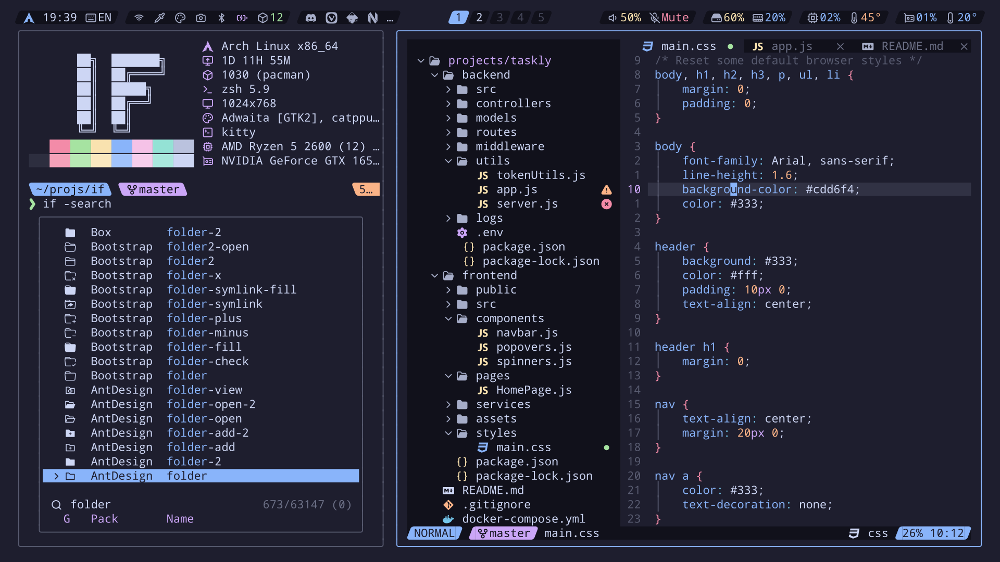

<!-- SHORTCUT REFERENCE LINKS -->

[zip]: https://github.com/iconicFonts/if/releases/download/v1.1.0/Borg_Sans_Mono.zip
[tar]: https://github.com/iconicFonts/if/releases/download/v1.1.0/Borg_Sans_Mono.tar.gz
[url]: https://github.com/marnen/borg-sans-mono

# Borg Sans Mono

| Repo/Website     | [marnen/borg-sans-mono][url] |
| :--------------- | :--------------------------- |
| **Font Name**    | Borg Sans Mono IF            |
| **Font Version** | `0.2.0`                      |
| **Download**     | [zip][zip] - [tar.xz][tar]   |



> If you found this project helpful, give it a :star: or share it around.

## Installation

### Linux

- Drag the fonts from the [fonts](fonts) directory into `~/.local/share/fonts`.
- Or, use [Curl](https://github.com/curl/curl):

```sh
curl -o ~/.local/share/fonts/BorgSansMonoIF-Regular.ttf https://raw.githubusercontent.com/iconicFonts/if/main/fonts/patched/Borg_Sans_Mono/fonts/BorgSansMonoIF-Regular.ttf
```

### MacOS

- Drag the fonts from the [fonts](fonts) directory into Font Book.
- Or, use [Curl](https://github.com/curl/curl):

```sh
curl -o ~/Library/Fonts/BorgSansMonoIF-Regular.ttf https://raw.githubusercontent.com/iconicFonts/if/main/fonts/patched/Borg_Sans_Mono/fonts/BorgSansMonoIF-Regular.ttf
```

### Windows

- Drag the fonts from the [fonts](fonts) directory into `C:\Windows\Fonts`.
- Or, right-click the desired fonts and click Install.
- Or, use [Curl](https://github.com/curl/curl):

**In Windows Command Prompt or PowerShell:**

```sh
curl -o C:\Windows\Fonts\BorgSansMonoIF-Regular.ttf https://raw.githubusercontent.com/iconicFonts/if/main/fonts/patched/Borg_Sans_Mono/fonts/BorgSansMonoIF-Regular.ttf
```

**In Unix-like Shells (Git Bash, WSL):**

```sh
curl -o /mnt/c/Windows/Fonts/BorgSansMonoIF-Regular.ttf https://raw.githubusercontent.com/iconicFonts/if/main/fonts/patched/Borg_Sans_Mono/fonts/BorgSansMonoIF-Regular.ttf
```
