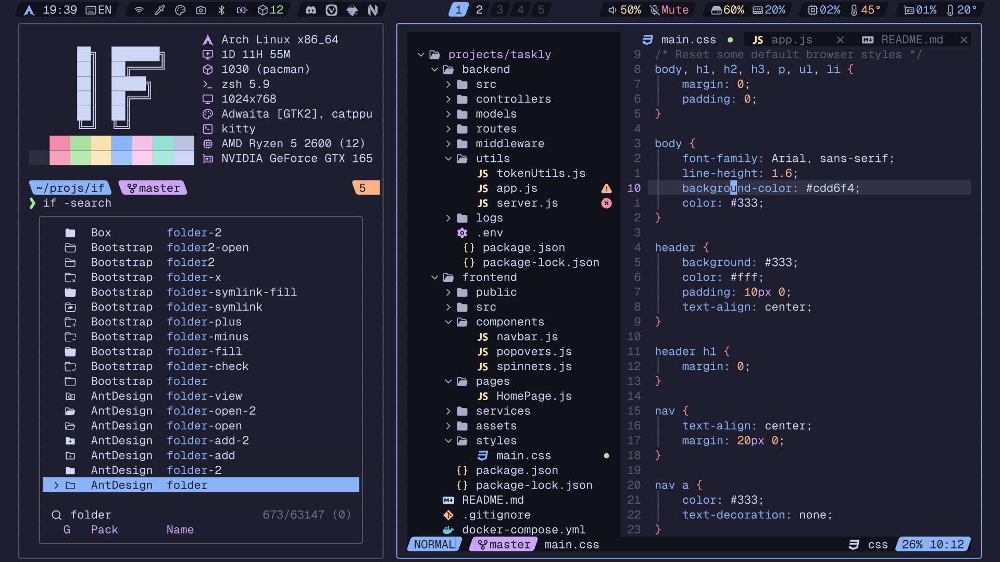

<!-- SHORTCUT REFERENCE LINKS -->

[zip]: https://github.com/iconicFonts/if/releases/download/v1.1.0/Geist_Mono.zip
[tar]: https://github.com/iconicFonts/if/releases/download/v1.1.0/Geist_Mono.tar.gz
[url]: https://github.com/vercel/geist-font

# Geist Mono

| Repo/Website     | [vercel/geist-font][url]   |
| :--------------- | :------------------------- |
| **Font Name**    | Geist Mono IF              |
| **Font Version** | `1.3.0`                    |
| **Download**     | [zip][zip] - [tar.gz][tar] |



> If you found this project helpful, give it a :star: or share it around.

## Installation

### Linux

- Drag the fonts from the [fonts](fonts) directory into `~/.local/share/fonts`.
- Or, use [Curl](https://github.com/curl/curl):

```sh
curl -o ~/.local/share/fonts/GeistMonoIF-Black.ttf https://raw.githubusercontent.com/iconicFonts/if/main/fonts/patched/Geist_Mono/fonts/GeistMonoIF-Black.ttf
curl -o ~/.local/share/fonts/GeistMonoIF-Bold.ttf https://raw.githubusercontent.com/iconicFonts/if/main/fonts/patched/Geist_Mono/fonts/GeistMonoIF-Bold.ttf
curl -o ~/.local/share/fonts/GeistMonoIF-ExtraBold.ttf https://raw.githubusercontent.com/iconicFonts/if/main/fonts/patched/Geist_Mono/fonts/GeistMonoIF-ExtraBold.ttf
curl -o ~/.local/share/fonts/GeistMonoIF-ExtraLight.ttf https://raw.githubusercontent.com/iconicFonts/if/main/fonts/patched/Geist_Mono/fonts/GeistMonoIF-ExtraLight.ttf
curl -o ~/.local/share/fonts/GeistMonoIF-Light.ttf https://raw.githubusercontent.com/iconicFonts/if/main/fonts/patched/Geist_Mono/fonts/GeistMonoIF-Light.ttf
curl -o ~/.local/share/fonts/GeistMonoIF-Medium.ttf https://raw.githubusercontent.com/iconicFonts/if/main/fonts/patched/Geist_Mono/fonts/GeistMonoIF-Medium.ttf
curl -o ~/.local/share/fonts/GeistMonoIF-Regular.ttf https://raw.githubusercontent.com/iconicFonts/if/main/fonts/patched/Geist_Mono/fonts/GeistMonoIF-Regular.ttf
curl -o ~/.local/share/fonts/GeistMonoIF-SemiBold.ttf https://raw.githubusercontent.com/iconicFonts/if/main/fonts/patched/Geist_Mono/fonts/GeistMonoIF-SemiBold.ttf
curl -o ~/.local/share/fonts/GeistMonoIF-Thin.ttf https://raw.githubusercontent.com/iconicFonts/if/main/fonts/patched/Geist_Mono/fonts/GeistMonoIF-Thin.ttf
```

### MacOS

- Drag the fonts from the [fonts](fonts) directory into Font Book.
- Or, use [Curl](https://github.com/curl/curl):

```sh
curl -o ~/Library/Fonts/GeistMonoIF-Black.ttf https://raw.githubusercontent.com/iconicFonts/if/main/fonts/patched/Geist_Mono/fonts/GeistMonoIF-Black.ttf
curl -o ~/Library/Fonts/GeistMonoIF-Bold.ttf https://raw.githubusercontent.com/iconicFonts/if/main/fonts/patched/Geist_Mono/fonts/GeistMonoIF-Bold.ttf
curl -o ~/Library/Fonts/GeistMonoIF-ExtraBold.ttf https://raw.githubusercontent.com/iconicFonts/if/main/fonts/patched/Geist_Mono/fonts/GeistMonoIF-ExtraBold.ttf
curl -o ~/Library/Fonts/GeistMonoIF-ExtraLight.ttf https://raw.githubusercontent.com/iconicFonts/if/main/fonts/patched/Geist_Mono/fonts/GeistMonoIF-ExtraLight.ttf
curl -o ~/Library/Fonts/GeistMonoIF-Light.ttf https://raw.githubusercontent.com/iconicFonts/if/main/fonts/patched/Geist_Mono/fonts/GeistMonoIF-Light.ttf
curl -o ~/Library/Fonts/GeistMonoIF-Medium.ttf https://raw.githubusercontent.com/iconicFonts/if/main/fonts/patched/Geist_Mono/fonts/GeistMonoIF-Medium.ttf
curl -o ~/Library/Fonts/GeistMonoIF-Regular.ttf https://raw.githubusercontent.com/iconicFonts/if/main/fonts/patched/Geist_Mono/fonts/GeistMonoIF-Regular.ttf
curl -o ~/Library/Fonts/GeistMonoIF-SemiBold.ttf https://raw.githubusercontent.com/iconicFonts/if/main/fonts/patched/Geist_Mono/fonts/GeistMonoIF-SemiBold.ttf
curl -o ~/Library/Fonts/GeistMonoIF-Thin.ttf https://raw.githubusercontent.com/iconicFonts/if/main/fonts/patched/Geist_Mono/fonts/GeistMonoIF-Thin.ttf
```

### Windows

- Drag the fonts from the [fonts](fonts) directory into `C:\Windows\Fonts`.
- Or, right-click the desired fonts and click Install.
- Or, use [Curl](https://github.com/curl/curl):

**In Windows Command Prompt or PowerShell:**

```sh
curl -o C:\Windows\Fonts\GeistMonoIF-Black.ttf https://raw.githubusercontent.com/iconicFonts/if/main/fonts/patched/Geist_Mono/fonts/GeistMonoIF-Black.ttf
curl -o C:\Windows\Fonts\GeistMonoIF-Bold.ttf https://raw.githubusercontent.com/iconicFonts/if/main/fonts/patched/Geist_Mono/fonts/GeistMonoIF-Bold.ttf
curl -o C:\Windows\Fonts\GeistMonoIF-ExtraBold.ttf https://raw.githubusercontent.com/iconicFonts/if/main/fonts/patched/Geist_Mono/fonts/GeistMonoIF-ExtraBold.ttf
curl -o C:\Windows\Fonts\GeistMonoIF-ExtraLight.ttf https://raw.githubusercontent.com/iconicFonts/if/main/fonts/patched/Geist_Mono/fonts/GeistMonoIF-ExtraLight.ttf
curl -o C:\Windows\Fonts\GeistMonoIF-Light.ttf https://raw.githubusercontent.com/iconicFonts/if/main/fonts/patched/Geist_Mono/fonts/GeistMonoIF-Light.ttf
curl -o C:\Windows\Fonts\GeistMonoIF-Medium.ttf https://raw.githubusercontent.com/iconicFonts/if/main/fonts/patched/Geist_Mono/fonts/GeistMonoIF-Medium.ttf
curl -o C:\Windows\Fonts\GeistMonoIF-Regular.ttf https://raw.githubusercontent.com/iconicFonts/if/main/fonts/patched/Geist_Mono/fonts/GeistMonoIF-Regular.ttf
curl -o C:\Windows\Fonts\GeistMonoIF-SemiBold.ttf https://raw.githubusercontent.com/iconicFonts/if/main/fonts/patched/Geist_Mono/fonts/GeistMonoIF-SemiBold.ttf
curl -o C:\Windows\Fonts\GeistMonoIF-Thin.ttf https://raw.githubusercontent.com/iconicFonts/if/main/fonts/patched/Geist_Mono/fonts/GeistMonoIF-Thin.ttf
```

**In Unix-like Shells (Git Bash, WSL):**

```sh
curl -o /mnt/c/Windows/Fonts/GeistMonoIF-Black.ttf https://raw.githubusercontent.com/iconicFonts/if/main/fonts/patched/Geist_Mono/fonts/GeistMonoIF-Black.ttf
curl -o /mnt/c/Windows/Fonts/GeistMonoIF-Bold.ttf https://raw.githubusercontent.com/iconicFonts/if/main/fonts/patched/Geist_Mono/fonts/GeistMonoIF-Bold.ttf
curl -o /mnt/c/Windows/Fonts/GeistMonoIF-ExtraBold.ttf https://raw.githubusercontent.com/iconicFonts/if/main/fonts/patched/Geist_Mono/fonts/GeistMonoIF-ExtraBold.ttf
curl -o /mnt/c/Windows/Fonts/GeistMonoIF-ExtraLight.ttf https://raw.githubusercontent.com/iconicFonts/if/main/fonts/patched/Geist_Mono/fonts/GeistMonoIF-ExtraLight.ttf
curl -o /mnt/c/Windows/Fonts/GeistMonoIF-Light.ttf https://raw.githubusercontent.com/iconicFonts/if/main/fonts/patched/Geist_Mono/fonts/GeistMonoIF-Light.ttf
curl -o /mnt/c/Windows/Fonts/GeistMonoIF-Medium.ttf https://raw.githubusercontent.com/iconicFonts/if/main/fonts/patched/Geist_Mono/fonts/GeistMonoIF-Medium.ttf
curl -o /mnt/c/Windows/Fonts/GeistMonoIF-Regular.ttf https://raw.githubusercontent.com/iconicFonts/if/main/fonts/patched/Geist_Mono/fonts/GeistMonoIF-Regular.ttf
curl -o /mnt/c/Windows/Fonts/GeistMonoIF-SemiBold.ttf https://raw.githubusercontent.com/iconicFonts/if/main/fonts/patched/Geist_Mono/fonts/GeistMonoIF-SemiBold.ttf
curl -o /mnt/c/Windows/Fonts/GeistMonoIF-Thin.ttf https://raw.githubusercontent.com/iconicFonts/if/main/fonts/patched/Geist_Mono/fonts/GeistMonoIF-Thin.ttf
```
