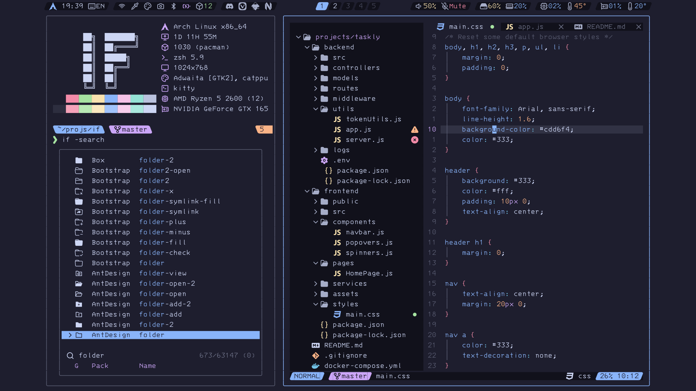

<!-- SHORTCUT REFERENCE LINKS -->

[zip]: https://github.com/iconicFonts/if/releases/download/v1.1.0/IBM_3270.zip
[tar]: https://github.com/iconicFonts/if/releases/download/v1.1.0/IBM_3270.tar.gz
[url]: https://github.com/rbanffy/3270font

# IBM 3270

| Repo/Website     | [rbanffy/3270font][url]    |
| :--------------- | :------------------------- |
| **Font Name**    | IBM 3270 IF                |
| **Font Version** | `3.0.1`                    |
| **Download**     | [zip][zip] - [tar.xz][tar] |



> If you found this project helpful, give it a :star: or share it around.

## Installation

### Linux

- Drag the fonts from the [fonts](fonts) directory into `~/.local/share/fonts`.
- Or, use [Curl](https://github.com/curl/curl):

```sh
curl -o ~/.local/share/fonts/IBM3270IF-Regular.ttf https://raw.githubusercontent.com/iconicFonts/if/main/fonts/patched/IBM_3270/fonts/IBM3270IF-Regular.ttf
```

### MacOS

- Drag the fonts from the [fonts](fonts) directory into Font Book.
- Or, use [Curl](https://github.com/curl/curl):

```sh
curl -o ~/Library/Fonts/IBM3270IF-Regular.ttf https://raw.githubusercontent.com/iconicFonts/if/main/fonts/patched/IBM_3270/fonts/IBM3270IF-Regular.ttf
```

### Windows

- Drag the fonts from the [fonts](fonts) directory into `C:\Windows\Fonts`.
- Or, right-click the desired fonts and click Install.
- Or, use [Curl](https://github.com/curl/curl):

**In Windows Command Prompt or PowerShell:**

```sh
curl -o C:\Windows\Fonts\IBM3270IF-Regular.ttf https://raw.githubusercontent.com/iconicFonts/if/main/fonts/patched/IBM_3270/fonts/IBM3270IF-Regular.ttf
```

**In Unix-like Shells (Git Bash, WSL):**

```sh
curl -o /mnt/c/Windows/Fonts/IBM3270IF-Regular.ttf https://raw.githubusercontent.com/iconicFonts/if/main/fonts/patched/IBM_3270/fonts/IBM3270IF-Regular.ttf
```
