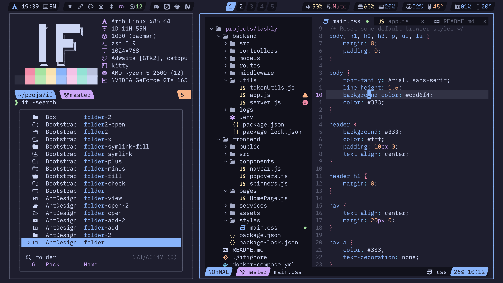

<!-- SHORTCUT REFERENCE LINKS -->

[zip]: https://github.com/iconicFonts/if/releases/download/v1.1.0/Lilex.zip
[tar]: https://github.com/iconicFonts/if/releases/download/v1.1.0/Lilex.tar.gz
[url]: https://github.com/mishamyrt/lilex

# Lilex

| Repo/Website     | [mishamyrt/lilex][url]     |
| :--------------- | :------------------------- |
| **Font Name**    | Lilex IF                   |
| **Font Version** | `2.530`                    |
| **Download**     | [zip][zip] - [tar.xz][tar] |



> If you found this project helpful, give it a :star: or share it around.

## Installation

### Linux

- Drag the fonts from the [fonts](fonts) directory into `~/.local/share/fonts`.
- Or, use [Curl](https://github.com/curl/curl):

```sh
curl -o ~/.local/share/fonts/LilexIF-Bold.ttf https://raw.githubusercontent.com/iconicFonts/if/main/fonts/patched/Lilex/fonts/LilexIF-Bold.ttf
curl -o ~/.local/share/fonts/LilexIF-ExtraLight.ttf https://raw.githubusercontent.com/iconicFonts/if/main/fonts/patched/Lilex/fonts/LilexIF-ExtraLight.ttf
curl -o ~/.local/share/fonts/LilexIF-Medium.ttf https://raw.githubusercontent.com/iconicFonts/if/main/fonts/patched/Lilex/fonts/LilexIF-Medium.ttf
curl -o ~/.local/share/fonts/LilexIF-Regular.ttf https://raw.githubusercontent.com/iconicFonts/if/main/fonts/patched/Lilex/fonts/LilexIF-Regular.ttf
curl -o ~/.local/share/fonts/LilexIF-Thin.ttf https://raw.githubusercontent.com/iconicFonts/if/main/fonts/patched/Lilex/fonts/LilexIF-Thin.ttf
```

### MacOS

- Drag the fonts from the [fonts](fonts) directory into Font Book.
- Or, use [Curl](https://github.com/curl/curl):

```sh
curl -o ~/Library/Fonts/LilexIF-Bold.ttf https://raw.githubusercontent.com/iconicFonts/if/main/fonts/patched/Lilex/fonts/LilexIF-Bold.ttf
curl -o ~/Library/Fonts/LilexIF-ExtraLight.ttf https://raw.githubusercontent.com/iconicFonts/if/main/fonts/patched/Lilex/fonts/LilexIF-ExtraLight.ttf
curl -o ~/Library/Fonts/LilexIF-Medium.ttf https://raw.githubusercontent.com/iconicFonts/if/main/fonts/patched/Lilex/fonts/LilexIF-Medium.ttf
curl -o ~/Library/Fonts/LilexIF-Regular.ttf https://raw.githubusercontent.com/iconicFonts/if/main/fonts/patched/Lilex/fonts/LilexIF-Regular.ttf
curl -o ~/Library/Fonts/LilexIF-Thin.ttf https://raw.githubusercontent.com/iconicFonts/if/main/fonts/patched/Lilex/fonts/LilexIF-Thin.ttf
```

### Windows

- Drag the fonts from the [fonts](fonts) directory into `C:\Windows\Fonts`.
- Or, right-click the desired fonts and click Install.
- Or, use [Curl](https://github.com/curl/curl):

**In Windows Command Prompt or PowerShell:**

```sh
curl -o C:\Windows\Fonts\LilexIF-Bold.ttf https://raw.githubusercontent.com/iconicFonts/if/main/fonts/patched/Lilex/fonts/LilexIF-Bold.ttf
curl -o C:\Windows\Fonts\LilexIF-ExtraLight.ttf https://raw.githubusercontent.com/iconicFonts/if/main/fonts/patched/Lilex/fonts/LilexIF-ExtraLight.ttf
curl -o C:\Windows\Fonts\LilexIF-Medium.ttf https://raw.githubusercontent.com/iconicFonts/if/main/fonts/patched/Lilex/fonts/LilexIF-Medium.ttf
curl -o C:\Windows\Fonts\LilexIF-Regular.ttf https://raw.githubusercontent.com/iconicFonts/if/main/fonts/patched/Lilex/fonts/LilexIF-Regular.ttf
curl -o C:\Windows\Fonts\LilexIF-Thin.ttf https://raw.githubusercontent.com/iconicFonts/if/main/fonts/patched/Lilex/fonts/LilexIF-Thin.ttf
```

**In Unix-like Shells (Git Bash, WSL):**

```sh
curl -o /mnt/c/Windows/Fonts/LilexIF-Bold.ttf https://raw.githubusercontent.com/iconicFonts/if/main/fonts/patched/Lilex/fonts/LilexIF-Bold.ttf
curl -o /mnt/c/Windows/Fonts/LilexIF-ExtraLight.ttf https://raw.githubusercontent.com/iconicFonts/if/main/fonts/patched/Lilex/fonts/LilexIF-ExtraLight.ttf
curl -o /mnt/c/Windows/Fonts/LilexIF-Medium.ttf https://raw.githubusercontent.com/iconicFonts/if/main/fonts/patched/Lilex/fonts/LilexIF-Medium.ttf
curl -o /mnt/c/Windows/Fonts/LilexIF-Regular.ttf https://raw.githubusercontent.com/iconicFonts/if/main/fonts/patched/Lilex/fonts/LilexIF-Regular.ttf
curl -o /mnt/c/Windows/Fonts/LilexIF-Thin.ttf https://raw.githubusercontent.com/iconicFonts/if/main/fonts/patched/Lilex/fonts/LilexIF-Thin.ttf
```
