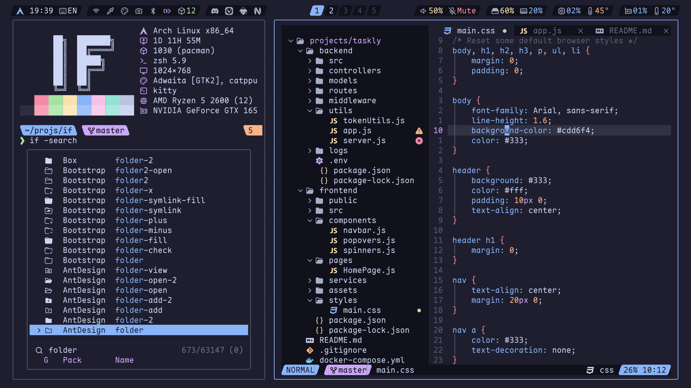

<!-- SHORTCUT REFERENCE LINKS -->

[zip]: https://github.com/iconicFonts/if/releases/download/v1.1.0/Maple_Mono.zip
[tar]: https://github.com/iconicFonts/if/releases/download/v1.1.0/Maple_Mono.tar.gz
[url]: https://github.com/subframe7536/maple-font

# Maple Mono

| Repo/Website     | [subframe7536/maple-font][url] |
| :--------------- | :----------------------------- |
| **Font Name**    | Maple Mono IF                  |
| **Font Version** | `6.4`                          |
| **Download**     | [zip][zip] - [tar.gz][tar]     |



> If you found this project helpful, give it a :star: or share it around.

## Installation

### Linux

- Drag the fonts from the [fonts](fonts) directory into `~/.local/share/fonts`.
- Or, use [Curl](https://github.com/curl/curl):

```sh
curl -o ~/.local/share/fonts/MapleMonoIF-Bold.ttf https://raw.githubusercontent.com/iconicFonts/if/main/fonts/patched/Maple_Mono/fonts/MapleMonoIF-Bold.ttf
curl -o ~/.local/share/fonts/MapleMonoIF-BoldItalic.ttf https://raw.githubusercontent.com/iconicFonts/if/main/fonts/patched/Maple_Mono/fonts/MapleMonoIF-BoldItalic.ttf
curl -o ~/.local/share/fonts/MapleMonoIF-ExtraBold.ttf https://raw.githubusercontent.com/iconicFonts/if/main/fonts/patched/Maple_Mono/fonts/MapleMonoIF-ExtraBold.ttf
curl -o ~/.local/share/fonts/MapleMonoIF-ExtraBoldItalic.ttf https://raw.githubusercontent.com/iconicFonts/if/main/fonts/patched/Maple_Mono/fonts/MapleMonoIF-ExtraBoldItalic.ttf
curl -o ~/.local/share/fonts/MapleMonoIF-ExtraLight.ttf https://raw.githubusercontent.com/iconicFonts/if/main/fonts/patched/Maple_Mono/fonts/MapleMonoIF-ExtraLight.ttf
curl -o ~/.local/share/fonts/MapleMonoIF-Italic.ttf https://raw.githubusercontent.com/iconicFonts/if/main/fonts/patched/Maple_Mono/fonts/MapleMonoIF-Italic.ttf
curl -o ~/.local/share/fonts/MapleMonoIF-Light.ttf https://raw.githubusercontent.com/iconicFonts/if/main/fonts/patched/Maple_Mono/fonts/MapleMonoIF-Light.ttf
curl -o ~/.local/share/fonts/MapleMonoIF-Medium.ttf https://raw.githubusercontent.com/iconicFonts/if/main/fonts/patched/Maple_Mono/fonts/MapleMonoIF-Medium.ttf
curl -o ~/.local/share/fonts/MapleMonoIF-MediumItalic.ttf https://raw.githubusercontent.com/iconicFonts/if/main/fonts/patched/Maple_Mono/fonts/MapleMonoIF-MediumItalic.ttf
curl -o ~/.local/share/fonts/MapleMonoIF-Regular.ttf https://raw.githubusercontent.com/iconicFonts/if/main/fonts/patched/Maple_Mono/fonts/MapleMonoIF-Regular.ttf
curl -o ~/.local/share/fonts/MapleMonoIF-SemiBold.ttf https://raw.githubusercontent.com/iconicFonts/if/main/fonts/patched/Maple_Mono/fonts/MapleMonoIF-SemiBold.ttf
curl -o ~/.local/share/fonts/MapleMonoIF-SemiBoldItalic.ttf https://raw.githubusercontent.com/iconicFonts/if/main/fonts/patched/Maple_Mono/fonts/MapleMonoIF-SemiBoldItalic.ttf
```

### MacOS

- Drag the fonts from the [fonts](fonts) directory into Font Book.
- Or, use [Curl](https://github.com/curl/curl):

```sh
curl -o ~/Library/Fonts/MapleMonoIF-Bold.ttf https://raw.githubusercontent.com/iconicFonts/if/main/fonts/patched/Maple_Mono/fonts/MapleMonoIF-Bold.ttf
curl -o ~/Library/Fonts/MapleMonoIF-BoldItalic.ttf https://raw.githubusercontent.com/iconicFonts/if/main/fonts/patched/Maple_Mono/fonts/MapleMonoIF-BoldItalic.ttf
curl -o ~/Library/Fonts/MapleMonoIF-ExtraBold.ttf https://raw.githubusercontent.com/iconicFonts/if/main/fonts/patched/Maple_Mono/fonts/MapleMonoIF-ExtraBold.ttf
curl -o ~/Library/Fonts/MapleMonoIF-ExtraBoldItalic.ttf https://raw.githubusercontent.com/iconicFonts/if/main/fonts/patched/Maple_Mono/fonts/MapleMonoIF-ExtraBoldItalic.ttf
curl -o ~/Library/Fonts/MapleMonoIF-ExtraLight.ttf https://raw.githubusercontent.com/iconicFonts/if/main/fonts/patched/Maple_Mono/fonts/MapleMonoIF-ExtraLight.ttf
curl -o ~/Library/Fonts/MapleMonoIF-Italic.ttf https://raw.githubusercontent.com/iconicFonts/if/main/fonts/patched/Maple_Mono/fonts/MapleMonoIF-Italic.ttf
curl -o ~/Library/Fonts/MapleMonoIF-Light.ttf https://raw.githubusercontent.com/iconicFonts/if/main/fonts/patched/Maple_Mono/fonts/MapleMonoIF-Light.ttf
curl -o ~/Library/Fonts/MapleMonoIF-Medium.ttf https://raw.githubusercontent.com/iconicFonts/if/main/fonts/patched/Maple_Mono/fonts/MapleMonoIF-Medium.ttf
curl -o ~/Library/Fonts/MapleMonoIF-MediumItalic.ttf https://raw.githubusercontent.com/iconicFonts/if/main/fonts/patched/Maple_Mono/fonts/MapleMonoIF-MediumItalic.ttf
curl -o ~/Library/Fonts/MapleMonoIF-Regular.ttf https://raw.githubusercontent.com/iconicFonts/if/main/fonts/patched/Maple_Mono/fonts/MapleMonoIF-Regular.ttf
curl -o ~/Library/Fonts/MapleMonoIF-SemiBold.ttf https://raw.githubusercontent.com/iconicFonts/if/main/fonts/patched/Maple_Mono/fonts/MapleMonoIF-SemiBold.ttf
curl -o ~/Library/Fonts/MapleMonoIF-SemiBoldItalic.ttf https://raw.githubusercontent.com/iconicFonts/if/main/fonts/patched/Maple_Mono/fonts/MapleMonoIF-SemiBoldItalic.ttf
```

### Windows

- Drag the fonts from the [fonts](fonts) directory into `C:\Windows\Fonts`.
- Or, right-click the desired fonts and click Install.
- Or, use [Curl](https://github.com/curl/curl):

**In Windows Command Prompt or PowerShell:**

```sh
curl -o C:\Windows\Fonts\MapleMonoIF-Bold.ttf https://raw.githubusercontent.com/iconicFonts/if/main/fonts/patched/Maple_Mono/fonts/MapleMonoIF-Bold.ttf
curl -o C:\Windows\Fonts\MapleMonoIF-BoldItalic.ttf https://raw.githubusercontent.com/iconicFonts/if/main/fonts/patched/Maple_Mono/fonts/MapleMonoIF-BoldItalic.ttf
curl -o C:\Windows\Fonts\MapleMonoIF-ExtraBold.ttf https://raw.githubusercontent.com/iconicFonts/if/main/fonts/patched/Maple_Mono/fonts/MapleMonoIF-ExtraBold.ttf
curl -o C:\Windows\Fonts\MapleMonoIF-ExtraBoldItalic.ttf https://raw.githubusercontent.com/iconicFonts/if/main/fonts/patched/Maple_Mono/fonts/MapleMonoIF-ExtraBoldItalic.ttf
curl -o C:\Windows\Fonts\MapleMonoIF-ExtraLight.ttf https://raw.githubusercontent.com/iconicFonts/if/main/fonts/patched/Maple_Mono/fonts/MapleMonoIF-ExtraLight.ttf
curl -o C:\Windows\Fonts\MapleMonoIF-Italic.ttf https://raw.githubusercontent.com/iconicFonts/if/main/fonts/patched/Maple_Mono/fonts/MapleMonoIF-Italic.ttf
curl -o C:\Windows\Fonts\MapleMonoIF-Light.ttf https://raw.githubusercontent.com/iconicFonts/if/main/fonts/patched/Maple_Mono/fonts/MapleMonoIF-Light.ttf
curl -o C:\Windows\Fonts\MapleMonoIF-Medium.ttf https://raw.githubusercontent.com/iconicFonts/if/main/fonts/patched/Maple_Mono/fonts/MapleMonoIF-Medium.ttf
curl -o C:\Windows\Fonts\MapleMonoIF-MediumItalic.ttf https://raw.githubusercontent.com/iconicFonts/if/main/fonts/patched/Maple_Mono/fonts/MapleMonoIF-MediumItalic.ttf
curl -o C:\Windows\Fonts\MapleMonoIF-Regular.ttf https://raw.githubusercontent.com/iconicFonts/if/main/fonts/patched/Maple_Mono/fonts/MapleMonoIF-Regular.ttf
curl -o C:\Windows\Fonts\MapleMonoIF-SemiBold.ttf https://raw.githubusercontent.com/iconicFonts/if/main/fonts/patched/Maple_Mono/fonts/MapleMonoIF-SemiBold.ttf
curl -o C:\Windows\Fonts\MapleMonoIF-SemiBoldItalic.ttf https://raw.githubusercontent.com/iconicFonts/if/main/fonts/patched/Maple_Mono/fonts/MapleMonoIF-SemiBoldItalic.ttf
```

**In Unix-like Shells (Git Bash, WSL):**

```sh
curl -o /mnt/c/Windows/Fonts/MapleMonoIF-Bold.ttf https://raw.githubusercontent.com/iconicFonts/if/main/fonts/patched/Maple_Mono/fonts/MapleMonoIF-Bold.ttf
curl -o /mnt/c/Windows/Fonts/MapleMonoIF-BoldItalic.ttf https://raw.githubusercontent.com/iconicFonts/if/main/fonts/patched/Maple_Mono/fonts/MapleMonoIF-BoldItalic.ttf
curl -o /mnt/c/Windows/Fonts/MapleMonoIF-ExtraBold.ttf https://raw.githubusercontent.com/iconicFonts/if/main/fonts/patched/Maple_Mono/fonts/MapleMonoIF-ExtraBold.ttf
curl -o /mnt/c/Windows/Fonts/MapleMonoIF-ExtraBoldItalic.ttf https://raw.githubusercontent.com/iconicFonts/if/main/fonts/patched/Maple_Mono/fonts/MapleMonoIF-ExtraBoldItalic.ttf
curl -o /mnt/c/Windows/Fonts/MapleMonoIF-ExtraLight.ttf https://raw.githubusercontent.com/iconicFonts/if/main/fonts/patched/Maple_Mono/fonts/MapleMonoIF-ExtraLight.ttf
curl -o /mnt/c/Windows/Fonts/MapleMonoIF-Italic.ttf https://raw.githubusercontent.com/iconicFonts/if/main/fonts/patched/Maple_Mono/fonts/MapleMonoIF-Italic.ttf
curl -o /mnt/c/Windows/Fonts/MapleMonoIF-Light.ttf https://raw.githubusercontent.com/iconicFonts/if/main/fonts/patched/Maple_Mono/fonts/MapleMonoIF-Light.ttf
curl -o /mnt/c/Windows/Fonts/MapleMonoIF-Medium.ttf https://raw.githubusercontent.com/iconicFonts/if/main/fonts/patched/Maple_Mono/fonts/MapleMonoIF-Medium.ttf
curl -o /mnt/c/Windows/Fonts/MapleMonoIF-MediumItalic.ttf https://raw.githubusercontent.com/iconicFonts/if/main/fonts/patched/Maple_Mono/fonts/MapleMonoIF-MediumItalic.ttf
curl -o /mnt/c/Windows/Fonts/MapleMonoIF-Regular.ttf https://raw.githubusercontent.com/iconicFonts/if/main/fonts/patched/Maple_Mono/fonts/MapleMonoIF-Regular.ttf
curl -o /mnt/c/Windows/Fonts/MapleMonoIF-SemiBold.ttf https://raw.githubusercontent.com/iconicFonts/if/main/fonts/patched/Maple_Mono/fonts/MapleMonoIF-SemiBold.ttf
curl -o /mnt/c/Windows/Fonts/MapleMonoIF-SemiBoldItalic.ttf https://raw.githubusercontent.com/iconicFonts/if/main/fonts/patched/Maple_Mono/fonts/MapleMonoIF-SemiBoldItalic.ttf
```
