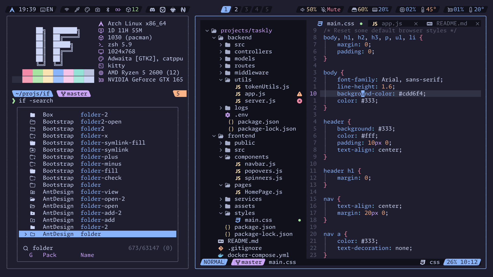

<!-- SHORTCUT REFERENCE LINKS -->

[zip]: https://github.com/iconicFonts/if/releases/download/v1.1.0/Monaspace_Argon.zip
[tar]: https://github.com/iconicFonts/if/releases/download/v1.1.0/Monaspace_Argon.tar.gz
[url]: https://github.com/githubnext/monaspace

# Monaspace Argon

| Repo/Website     | [githubnext/monaspace][url] |
| :--------------- | :-------------------------- |
| **Font Name**    | Monaspace Argon IF          |
| **Font Version** | `1.101`                     |
| **Download**     | [zip][zip] - [tar.gz][tar]  |



> If you found this project helpful, give it a :star: or share it around.

## Installation

### Linux

- Drag the fonts from the [fonts](fonts) directory into `~/.local/share/fonts`.
- Or, use [Curl](https://github.com/curl/curl):

```sh
curl -o ~/.local/share/fonts/MonaspaceArgonIF-Bold.ttf https://raw.githubusercontent.com/iconicFonts/if/main/fonts/patched/Monaspace_Argon/fonts/MonaspaceArgonIF-Bold.ttf
curl -o ~/.local/share/fonts/MonaspaceArgonIF-BoldItalic.ttf https://raw.githubusercontent.com/iconicFonts/if/main/fonts/patched/Monaspace_Argon/fonts/MonaspaceArgonIF-BoldItalic.ttf
curl -o ~/.local/share/fonts/MonaspaceArgonIF-Extra-LightItalic.ttf https://raw.githubusercontent.com/iconicFonts/if/main/fonts/patched/Monaspace_Argon/fonts/MonaspaceArgonIF-Extra-LightItalic.ttf
curl -o ~/.local/share/fonts/MonaspaceArgonIF-ExtraBold.ttf https://raw.githubusercontent.com/iconicFonts/if/main/fonts/patched/Monaspace_Argon/fonts/MonaspaceArgonIF-ExtraBold.ttf
curl -o ~/.local/share/fonts/MonaspaceArgonIF-ExtraBoldItalic.ttf https://raw.githubusercontent.com/iconicFonts/if/main/fonts/patched/Monaspace_Argon/fonts/MonaspaceArgonIF-ExtraBoldItalic.ttf
curl -o ~/.local/share/fonts/MonaspaceArgonIF-ExtraLight.ttf https://raw.githubusercontent.com/iconicFonts/if/main/fonts/patched/Monaspace_Argon/fonts/MonaspaceArgonIF-ExtraLight.ttf
curl -o ~/.local/share/fonts/MonaspaceArgonIF-Italic.ttf https://raw.githubusercontent.com/iconicFonts/if/main/fonts/patched/Monaspace_Argon/fonts/MonaspaceArgonIF-Italic.ttf
curl -o ~/.local/share/fonts/MonaspaceArgonIF-Light.ttf https://raw.githubusercontent.com/iconicFonts/if/main/fonts/patched/Monaspace_Argon/fonts/MonaspaceArgonIF-Light.ttf
curl -o ~/.local/share/fonts/MonaspaceArgonIF-LightItalic.ttf https://raw.githubusercontent.com/iconicFonts/if/main/fonts/patched/Monaspace_Argon/fonts/MonaspaceArgonIF-LightItalic.ttf
curl -o ~/.local/share/fonts/MonaspaceArgonIF-Medium.ttf https://raw.githubusercontent.com/iconicFonts/if/main/fonts/patched/Monaspace_Argon/fonts/MonaspaceArgonIF-Medium.ttf
curl -o ~/.local/share/fonts/MonaspaceArgonIF-MediumItalic.ttf https://raw.githubusercontent.com/iconicFonts/if/main/fonts/patched/Monaspace_Argon/fonts/MonaspaceArgonIF-MediumItalic.ttf
curl -o ~/.local/share/fonts/MonaspaceArgonIF-Regular.ttf https://raw.githubusercontent.com/iconicFonts/if/main/fonts/patched/Monaspace_Argon/fonts/MonaspaceArgonIF-Regular.ttf
curl -o ~/.local/share/fonts/MonaspaceArgonIF-SemiBold.ttf https://raw.githubusercontent.com/iconicFonts/if/main/fonts/patched/Monaspace_Argon/fonts/MonaspaceArgonIF-SemiBold.ttf
curl -o ~/.local/share/fonts/MonaspaceArgonIF-SemiBoldItalic.ttf https://raw.githubusercontent.com/iconicFonts/if/main/fonts/patched/Monaspace_Argon/fonts/MonaspaceArgonIF-SemiBoldItalic.ttf
curl -o ~/.local/share/fonts/MonaspaceKryptonIF-Bold.ttf https://raw.githubusercontent.com/iconicFonts/if/main/fonts/patched/Monaspace_Krypton/fonts/MonaspaceKryptonIF-Bold.ttf
```

### MacOS

- Drag the fonts from the [fonts](fonts) directory into Font Book.
- Or, use [Curl](https://github.com/curl/curl):

```sh
curl -o ~/Library/Fonts/MonaspaceArgonIF-Bold.ttf https://raw.githubusercontent.com/iconicFonts/if/main/fonts/patched/Monaspace_Argon/fonts/MonaspaceArgonIF-Bold.ttf
curl -o ~/Library/Fonts/MonaspaceArgonIF-BoldItalic.ttf https://raw.githubusercontent.com/iconicFonts/if/main/fonts/patched/Monaspace_Argon/fonts/MonaspaceArgonIF-BoldItalic.ttf
curl -o ~/Library/Fonts/MonaspaceArgonIF-Extra-LightItalic.ttf https://raw.githubusercontent.com/iconicFonts/if/main/fonts/patched/Monaspace_Argon/fonts/MonaspaceArgonIF-Extra-LightItalic.ttf
curl -o ~/Library/Fonts/MonaspaceArgonIF-ExtraBold.ttf https://raw.githubusercontent.com/iconicFonts/if/main/fonts/patched/Monaspace_Argon/fonts/MonaspaceArgonIF-ExtraBold.ttf
curl -o ~/Library/Fonts/MonaspaceArgonIF-ExtraBoldItalic.ttf https://raw.githubusercontent.com/iconicFonts/if/main/fonts/patched/Monaspace_Argon/fonts/MonaspaceArgonIF-ExtraBoldItalic.ttf
curl -o ~/Library/Fonts/MonaspaceArgonIF-ExtraLight.ttf https://raw.githubusercontent.com/iconicFonts/if/main/fonts/patched/Monaspace_Argon/fonts/MonaspaceArgonIF-ExtraLight.ttf
curl -o ~/Library/Fonts/MonaspaceArgonIF-Italic.ttf https://raw.githubusercontent.com/iconicFonts/if/main/fonts/patched/Monaspace_Argon/fonts/MonaspaceArgonIF-Italic.ttf
curl -o ~/Library/Fonts/MonaspaceArgonIF-Light.ttf https://raw.githubusercontent.com/iconicFonts/if/main/fonts/patched/Monaspace_Argon/fonts/MonaspaceArgonIF-Light.ttf
curl -o ~/Library/Fonts/MonaspaceArgonIF-LightItalic.ttf https://raw.githubusercontent.com/iconicFonts/if/main/fonts/patched/Monaspace_Argon/fonts/MonaspaceArgonIF-LightItalic.ttf
curl -o ~/Library/Fonts/MonaspaceArgonIF-Medium.ttf https://raw.githubusercontent.com/iconicFonts/if/main/fonts/patched/Monaspace_Argon/fonts/MonaspaceArgonIF-Medium.ttf
curl -o ~/Library/Fonts/MonaspaceArgonIF-MediumItalic.ttf https://raw.githubusercontent.com/iconicFonts/if/main/fonts/patched/Monaspace_Argon/fonts/MonaspaceArgonIF-MediumItalic.ttf
curl -o ~/Library/Fonts/MonaspaceArgonIF-Regular.ttf https://raw.githubusercontent.com/iconicFonts/if/main/fonts/patched/Monaspace_Argon/fonts/MonaspaceArgonIF-Regular.ttf
curl -o ~/Library/Fonts/MonaspaceArgonIF-SemiBold.ttf https://raw.githubusercontent.com/iconicFonts/if/main/fonts/patched/Monaspace_Argon/fonts/MonaspaceArgonIF-SemiBold.ttf
curl -o ~/Library/Fonts/MonaspaceArgonIF-SemiBoldItalic.ttf https://raw.githubusercontent.com/iconicFonts/if/main/fonts/patched/Monaspace_Argon/fonts/MonaspaceArgonIF-SemiBoldItalic.ttf
```

### Windows

- Drag the fonts from the [fonts](fonts) directory into `C:\Windows\Fonts`.
- Or, right-click the desired fonts and click Install.
- Or, use [Curl](https://github.com/curl/curl):

**In Windows Command Prompt or PowerShell:**

```sh
curl -o C:\Windows\Fonts\MonaspaceArgonIF-Bold.ttf https://raw.githubusercontent.com/iconicFonts/if/main/fonts/patched/Monaspace_Argon/fonts/MonaspaceArgonIF-Bold.ttf
curl -o C:\Windows\Fonts\MonaspaceArgonIF-BoldItalic.ttf https://raw.githubusercontent.com/iconicFonts/if/main/fonts/patched/Monaspace_Argon/fonts/MonaspaceArgonIF-BoldItalic.ttf
curl -o C:\Windows\Fonts\MonaspaceArgonIF-Extra-LightItalic.ttf https://raw.githubusercontent.com/iconicFonts/if/main/fonts/patched/Monaspace_Argon/fonts/MonaspaceArgonIF-Extra-LightItalic.ttf
curl -o C:\Windows\Fonts\MonaspaceArgonIF-ExtraBold.ttf https://raw.githubusercontent.com/iconicFonts/if/main/fonts/patched/Monaspace_Argon/fonts/MonaspaceArgonIF-ExtraBold.ttf
curl -o C:\Windows\Fonts\MonaspaceArgonIF-ExtraBoldItalic.ttf https://raw.githubusercontent.com/iconicFonts/if/main/fonts/patched/Monaspace_Argon/fonts/MonaspaceArgonIF-ExtraBoldItalic.ttf
curl -o C:\Windows\Fonts\MonaspaceArgonIF-ExtraLight.ttf https://raw.githubusercontent.com/iconicFonts/if/main/fonts/patched/Monaspace_Argon/fonts/MonaspaceArgonIF-ExtraLight.ttf
curl -o C:\Windows\Fonts\MonaspaceArgonIF-Italic.ttf https://raw.githubusercontent.com/iconicFonts/if/main/fonts/patched/Monaspace_Argon/fonts/MonaspaceArgonIF-Italic.ttf
curl -o C:\Windows\Fonts\MonaspaceArgonIF-Light.ttf https://raw.githubusercontent.com/iconicFonts/if/main/fonts/patched/Monaspace_Argon/fonts/MonaspaceArgonIF-Light.ttf
curl -o C:\Windows\Fonts\MonaspaceArgonIF-LightItalic.ttf https://raw.githubusercontent.com/iconicFonts/if/main/fonts/patched/Monaspace_Argon/fonts/MonaspaceArgonIF-LightItalic.ttf
curl -o C:\Windows\Fonts\MonaspaceArgonIF-Medium.ttf https://raw.githubusercontent.com/iconicFonts/if/main/fonts/patched/Monaspace_Argon/fonts/MonaspaceArgonIF-Medium.ttf
curl -o C:\Windows\Fonts\MonaspaceArgonIF-MediumItalic.ttf https://raw.githubusercontent.com/iconicFonts/if/main/fonts/patched/Monaspace_Argon/fonts/MonaspaceArgonIF-MediumItalic.ttf
curl -o C:\Windows\Fonts\MonaspaceArgonIF-Regular.ttf https://raw.githubusercontent.com/iconicFonts/if/main/fonts/patched/Monaspace_Argon/fonts/MonaspaceArgonIF-Regular.ttf
curl -o C:\Windows\Fonts\MonaspaceArgonIF-SemiBold.ttf https://raw.githubusercontent.com/iconicFonts/if/main/fonts/patched/Monaspace_Argon/fonts/MonaspaceArgonIF-SemiBold.ttf
curl -o C:\Windows\Fonts\MonaspaceArgonIF-SemiBoldItalic.ttf https://raw.githubusercontent.com/iconicFonts/if/main/fonts/patched/Monaspace_Argon/fonts/MonaspaceArgonIF-SemiBoldItalic.ttf
```

**In Unix-like Shells (Git Bash, WSL):**

```sh
curl -o /mnt/c/Windows/Fonts/MonaspaceArgonIF-Bold.ttf https://raw.githubusercontent.com/iconicFonts/if/main/fonts/patched/Monaspace_Argon/fonts/MonaspaceArgonIF-Bold.ttf
curl -o /mnt/c/Windows/Fonts/MonaspaceArgonIF-BoldItalic.ttf https://raw.githubusercontent.com/iconicFonts/if/main/fonts/patched/Monaspace_Argon/fonts/MonaspaceArgonIF-BoldItalic.ttf
curl -o /mnt/c/Windows/Fonts/MonaspaceArgonIF-Extra-LightItalic.ttf https://raw.githubusercontent.com/iconicFonts/if/main/fonts/patched/Monaspace_Argon/fonts/MonaspaceArgonIF-Extra-LightItalic.ttf
curl -o /mnt/c/Windows/Fonts/MonaspaceArgonIF-ExtraBold.ttf https://raw.githubusercontent.com/iconicFonts/if/main/fonts/patched/Monaspace_Argon/fonts/MonaspaceArgonIF-ExtraBold.ttf
curl -o /mnt/c/Windows/Fonts/MonaspaceArgonIF-ExtraBoldItalic.ttf https://raw.githubusercontent.com/iconicFonts/if/main/fonts/patched/Monaspace_Argon/fonts/MonaspaceArgonIF-ExtraBoldItalic.ttf
curl -o /mnt/c/Windows/Fonts/MonaspaceArgonIF-ExtraLight.ttf https://raw.githubusercontent.com/iconicFonts/if/main/fonts/patched/Monaspace_Argon/fonts/MonaspaceArgonIF-ExtraLight.ttf
curl -o /mnt/c/Windows/Fonts/MonaspaceArgonIF-Italic.ttf https://raw.githubusercontent.com/iconicFonts/if/main/fonts/patched/Monaspace_Argon/fonts/MonaspaceArgonIF-Italic.ttf
curl -o /mnt/c/Windows/Fonts/MonaspaceArgonIF-Light.ttf https://raw.githubusercontent.com/iconicFonts/if/main/fonts/patched/Monaspace_Argon/fonts/MonaspaceArgonIF-Light.ttf
curl -o /mnt/c/Windows/Fonts/MonaspaceArgonIF-LightItalic.ttf https://raw.githubusercontent.com/iconicFonts/if/main/fonts/patched/Monaspace_Argon/fonts/MonaspaceArgonIF-LightItalic.ttf
curl -o /mnt/c/Windows/Fonts/MonaspaceArgonIF-Medium.ttf https://raw.githubusercontent.com/iconicFonts/if/main/fonts/patched/Monaspace_Argon/fonts/MonaspaceArgonIF-Medium.ttf
curl -o /mnt/c/Windows/Fonts/MonaspaceArgonIF-MediumItalic.ttf https://raw.githubusercontent.com/iconicFonts/if/main/fonts/patched/Monaspace_Argon/fonts/MonaspaceArgonIF-MediumItalic.ttf
curl -o /mnt/c/Windows/Fonts/MonaspaceArgonIF-Regular.ttf https://raw.githubusercontent.com/iconicFonts/if/main/fonts/patched/Monaspace_Argon/fonts/MonaspaceArgonIF-Regular.ttf
curl -o /mnt/c/Windows/Fonts/MonaspaceArgonIF-SemiBold.ttf https://raw.githubusercontent.com/iconicFonts/if/main/fonts/patched/Monaspace_Argon/fonts/MonaspaceArgonIF-SemiBold.ttf
curl -o /mnt/c/Windows/Fonts/MonaspaceArgonIF-SemiBoldItalic.ttf https://raw.githubusercontent.com/iconicFonts/if/main/fonts/patched/Monaspace_Argon/fonts/MonaspaceArgonIF-SemiBoldItalic.ttf
```
