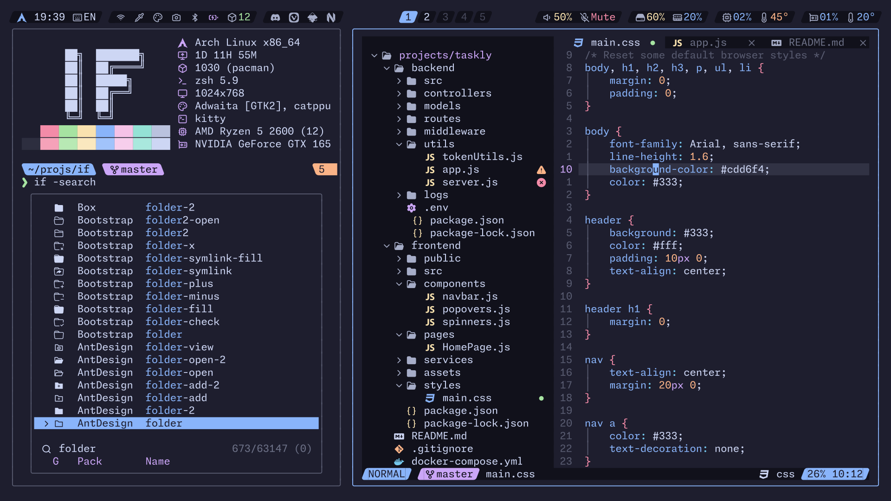

<!-- SHORTCUT REFERENCE LINKS -->

[zip]: https://github.com/iconicFonts/if/releases/download/v1.1.0/Monaspace_Neon.zip
[tar]: https://github.com/iconicFonts/if/releases/download/v1.1.0/Monaspace_Neon.tar.gz
[url]: https://github.com/githubnext/monaspace

# Monaspace Neon

| Repo/Website     | [githubnext/monaspace][url] |
| :--------------- | :-------------------------- |
| **Font Name**    | Monaspace Neon IF           |
| **Font Version** | `1.101`                     |
| **Download**     | [zip][zip] - [tar.gz][tar]  |



> If you found this project helpful, give it a :star: or share it around.

## Installation

### Linux

- Drag the fonts from the [fonts](fonts) directory into `~/.local/share/fonts`.
- Or, use [Curl](https://github.com/curl/curl):

```sh
curl -o ~/.local/share/fonts/MonaspaceNeonIF-Bold.ttf https://raw.githubusercontent.com/iconicFonts/if/main/fonts/patched/Monaspace_Neon/fonts/MonaspaceNeonIF-Bold.ttf
curl -o ~/.local/share/fonts/MonaspaceNeonIF-BoldItalic.ttf https://raw.githubusercontent.com/iconicFonts/if/main/fonts/patched/Monaspace_Neon/fonts/MonaspaceNeonIF-BoldItalic.ttf
curl -o ~/.local/share/fonts/MonaspaceNeonIF-Extra-LightItalic.ttf https://raw.githubusercontent.com/iconicFonts/if/main/fonts/patched/Monaspace_Neon/fonts/MonaspaceNeonIF-Extra-LightItalic.ttf
curl -o ~/.local/share/fonts/MonaspaceNeonIF-ExtraBold.ttf https://raw.githubusercontent.com/iconicFonts/if/main/fonts/patched/Monaspace_Neon/fonts/MonaspaceNeonIF-ExtraBold.ttf
curl -o ~/.local/share/fonts/MonaspaceNeonIF-ExtraBoldItalic.ttf https://raw.githubusercontent.com/iconicFonts/if/main/fonts/patched/Monaspace_Neon/fonts/MonaspaceNeonIF-ExtraBoldItalic.ttf
curl -o ~/.local/share/fonts/MonaspaceNeonIF-ExtraLight.ttf https://raw.githubusercontent.com/iconicFonts/if/main/fonts/patched/Monaspace_Neon/fonts/MonaspaceNeonIF-ExtraLight.ttf
curl -o ~/.local/share/fonts/MonaspaceNeonIF-Italic.ttf https://raw.githubusercontent.com/iconicFonts/if/main/fonts/patched/Monaspace_Neon/fonts/MonaspaceNeonIF-Italic.ttf
curl -o ~/.local/share/fonts/MonaspaceNeonIF-Light.ttf https://raw.githubusercontent.com/iconicFonts/if/main/fonts/patched/Monaspace_Neon/fonts/MonaspaceNeonIF-Light.ttf
curl -o ~/.local/share/fonts/MonaspaceNeonIF-LightItalic.ttf https://raw.githubusercontent.com/iconicFonts/if/main/fonts/patched/Monaspace_Neon/fonts/MonaspaceNeonIF-LightItalic.ttf
curl -o ~/.local/share/fonts/MonaspaceNeonIF-Medium.ttf https://raw.githubusercontent.com/iconicFonts/if/main/fonts/patched/Monaspace_Neon/fonts/MonaspaceNeonIF-Medium.ttf
curl -o ~/.local/share/fonts/MonaspaceNeonIF-MediumItalic.ttf https://raw.githubusercontent.com/iconicFonts/if/main/fonts/patched/Monaspace_Neon/fonts/MonaspaceNeonIF-MediumItalic.ttf
curl -o ~/.local/share/fonts/MonaspaceNeonIF-Regular.ttf https://raw.githubusercontent.com/iconicFonts/if/main/fonts/patched/Monaspace_Neon/fonts/MonaspaceNeonIF-Regular.ttf
curl -o ~/.local/share/fonts/MonaspaceNeonIF-SemiBold.ttf https://raw.githubusercontent.com/iconicFonts/if/main/fonts/patched/Monaspace_Neon/fonts/MonaspaceNeonIF-SemiBold.ttf
curl -o ~/.local/share/fonts/MonaspaceNeonIF-SemiBoldItalic.ttf https://raw.githubusercontent.com/iconicFonts/if/main/fonts/patched/Monaspace_Neon/fonts/MonaspaceNeonIF-SemiBoldItalic.ttf
```

### MacOS

- Drag the fonts from the [fonts](fonts) directory into Font Book.
- Or, use [Curl](https://github.com/curl/curl):

```sh
curl -o ~/Library/Fonts/MonaspaceNeonIF-Bold.ttf https://raw.githubusercontent.com/iconicFonts/if/main/fonts/patched/Monaspace_Neon/fonts/MonaspaceNeonIF-Bold.ttf
curl -o ~/Library/Fonts/MonaspaceNeonIF-BoldItalic.ttf https://raw.githubusercontent.com/iconicFonts/if/main/fonts/patched/Monaspace_Neon/fonts/MonaspaceNeonIF-BoldItalic.ttf
curl -o ~/Library/Fonts/MonaspaceNeonIF-Extra-LightItalic.ttf https://raw.githubusercontent.com/iconicFonts/if/main/fonts/patched/Monaspace_Neon/fonts/MonaspaceNeonIF-Extra-LightItalic.ttf
curl -o ~/Library/Fonts/MonaspaceNeonIF-ExtraBold.ttf https://raw.githubusercontent.com/iconicFonts/if/main/fonts/patched/Monaspace_Neon/fonts/MonaspaceNeonIF-ExtraBold.ttf
curl -o ~/Library/Fonts/MonaspaceNeonIF-ExtraBoldItalic.ttf https://raw.githubusercontent.com/iconicFonts/if/main/fonts/patched/Monaspace_Neon/fonts/MonaspaceNeonIF-ExtraBoldItalic.ttf
curl -o ~/Library/Fonts/MonaspaceNeonIF-ExtraLight.ttf https://raw.githubusercontent.com/iconicFonts/if/main/fonts/patched/Monaspace_Neon/fonts/MonaspaceNeonIF-ExtraLight.ttf
curl -o ~/Library/Fonts/MonaspaceNeonIF-Italic.ttf https://raw.githubusercontent.com/iconicFonts/if/main/fonts/patched/Monaspace_Neon/fonts/MonaspaceNeonIF-Italic.ttf
curl -o ~/Library/Fonts/MonaspaceNeonIF-Light.ttf https://raw.githubusercontent.com/iconicFonts/if/main/fonts/patched/Monaspace_Neon/fonts/MonaspaceNeonIF-Light.ttf
curl -o ~/Library/Fonts/MonaspaceNeonIF-LightItalic.ttf https://raw.githubusercontent.com/iconicFonts/if/main/fonts/patched/Monaspace_Neon/fonts/MonaspaceNeonIF-LightItalic.ttf
curl -o ~/Library/Fonts/MonaspaceNeonIF-Medium.ttf https://raw.githubusercontent.com/iconicFonts/if/main/fonts/patched/Monaspace_Neon/fonts/MonaspaceNeonIF-Medium.ttf
curl -o ~/Library/Fonts/MonaspaceNeonIF-MediumItalic.ttf https://raw.githubusercontent.com/iconicFonts/if/main/fonts/patched/Monaspace_Neon/fonts/MonaspaceNeonIF-MediumItalic.ttf
curl -o ~/Library/Fonts/MonaspaceNeonIF-Regular.ttf https://raw.githubusercontent.com/iconicFonts/if/main/fonts/patched/Monaspace_Neon/fonts/MonaspaceNeonIF-Regular.ttf
curl -o ~/Library/Fonts/MonaspaceNeonIF-SemiBold.ttf https://raw.githubusercontent.com/iconicFonts/if/main/fonts/patched/Monaspace_Neon/fonts/MonaspaceNeonIF-SemiBold.ttf
curl -o ~/Library/Fonts/MonaspaceNeonIF-SemiBoldItalic.ttf https://raw.githubusercontent.com/iconicFonts/if/main/fonts/patched/Monaspace_Neon/fonts/MonaspaceNeonIF-SemiBoldItalic.ttf
```

### Windows

- Drag the fonts from the [fonts](fonts) directory into `C:\Windows\Fonts`.
- Or, right-click the desired fonts and click Install.
- Or, use [Curl](https://github.com/curl/curl):

**In Windows Command Prompt or PowerShell:**

```sh
curl -o C:\Windows\Fonts\MonaspaceNeonIF-Bold.ttf https://raw.githubusercontent.com/iconicFonts/if/main/fonts/patched/Monaspace_Neon/fonts/MonaspaceNeonIF-Bold.ttf
curl -o C:\Windows\Fonts\MonaspaceNeonIF-BoldItalic.ttf https://raw.githubusercontent.com/iconicFonts/if/main/fonts/patched/Monaspace_Neon/fonts/MonaspaceNeonIF-BoldItalic.ttf
curl -o C:\Windows\Fonts\MonaspaceNeonIF-Extra-LightItalic.ttf https://raw.githubusercontent.com/iconicFonts/if/main/fonts/patched/Monaspace_Neon/fonts/MonaspaceNeonIF-Extra-LightItalic.ttf
curl -o C:\Windows\Fonts\MonaspaceNeonIF-ExtraBold.ttf https://raw.githubusercontent.com/iconicFonts/if/main/fonts/patched/Monaspace_Neon/fonts/MonaspaceNeonIF-ExtraBold.ttf
curl -o C:\Windows\Fonts\MonaspaceNeonIF-ExtraBoldItalic.ttf https://raw.githubusercontent.com/iconicFonts/if/main/fonts/patched/Monaspace_Neon/fonts/MonaspaceNeonIF-ExtraBoldItalic.ttf
curl -o C:\Windows\Fonts\MonaspaceNeonIF-ExtraLight.ttf https://raw.githubusercontent.com/iconicFonts/if/main/fonts/patched/Monaspace_Neon/fonts/MonaspaceNeonIF-ExtraLight.ttf
curl -o C:\Windows\Fonts\MonaspaceNeonIF-Italic.ttf https://raw.githubusercontent.com/iconicFonts/if/main/fonts/patched/Monaspace_Neon/fonts/MonaspaceNeonIF-Italic.ttf
curl -o C:\Windows\Fonts\MonaspaceNeonIF-Light.ttf https://raw.githubusercontent.com/iconicFonts/if/main/fonts/patched/Monaspace_Neon/fonts/MonaspaceNeonIF-Light.ttf
curl -o C:\Windows\Fonts\MonaspaceNeonIF-LightItalic.ttf https://raw.githubusercontent.com/iconicFonts/if/main/fonts/patched/Monaspace_Neon/fonts/MonaspaceNeonIF-LightItalic.ttf
curl -o C:\Windows\Fonts\MonaspaceNeonIF-Medium.ttf https://raw.githubusercontent.com/iconicFonts/if/main/fonts/patched/Monaspace_Neon/fonts/MonaspaceNeonIF-Medium.ttf
curl -o C:\Windows\Fonts\MonaspaceNeonIF-MediumItalic.ttf https://raw.githubusercontent.com/iconicFonts/if/main/fonts/patched/Monaspace_Neon/fonts/MonaspaceNeonIF-MediumItalic.ttf
curl -o C:\Windows\Fonts\MonaspaceNeonIF-Regular.ttf https://raw.githubusercontent.com/iconicFonts/if/main/fonts/patched/Monaspace_Neon/fonts/MonaspaceNeonIF-Regular.ttf
curl -o C:\Windows\Fonts\MonaspaceNeonIF-SemiBold.ttf https://raw.githubusercontent.com/iconicFonts/if/main/fonts/patched/Monaspace_Neon/fonts/MonaspaceNeonIF-SemiBold.ttf
curl -o C:\Windows\Fonts\MonaspaceNeonIF-SemiBoldItalic.ttf https://raw.githubusercontent.com/iconicFonts/if/main/fonts/patched/Monaspace_Neon/fonts/MonaspaceNeonIF-SemiBoldItalic.ttf
```

**In Unix-like Shells (Git Bash, WSL):**

```sh
curl -o /mnt/c/Windows/Fonts/MonaspaceNeonIF-Bold.ttf https://raw.githubusercontent.com/iconicFonts/if/main/fonts/patched/Monaspace_Neon/fonts/MonaspaceNeonIF-Bold.ttf
curl -o /mnt/c/Windows/Fonts/MonaspaceNeonIF-BoldItalic.ttf https://raw.githubusercontent.com/iconicFonts/if/main/fonts/patched/Monaspace_Neon/fonts/MonaspaceNeonIF-BoldItalic.ttf
curl -o /mnt/c/Windows/Fonts/MonaspaceNeonIF-Extra-LightItalic.ttf https://raw.githubusercontent.com/iconicFonts/if/main/fonts/patched/Monaspace_Neon/fonts/MonaspaceNeonIF-Extra-LightItalic.ttf
curl -o /mnt/c/Windows/Fonts/MonaspaceNeonIF-ExtraBold.ttf https://raw.githubusercontent.com/iconicFonts/if/main/fonts/patched/Monaspace_Neon/fonts/MonaspaceNeonIF-ExtraBold.ttf
curl -o /mnt/c/Windows/Fonts/MonaspaceNeonIF-ExtraBoldItalic.ttf https://raw.githubusercontent.com/iconicFonts/if/main/fonts/patched/Monaspace_Neon/fonts/MonaspaceNeonIF-ExtraBoldItalic.ttf
curl -o /mnt/c/Windows/Fonts/MonaspaceNeonIF-ExtraLight.ttf https://raw.githubusercontent.com/iconicFonts/if/main/fonts/patched/Monaspace_Neon/fonts/MonaspaceNeonIF-ExtraLight.ttf
curl -o /mnt/c/Windows/Fonts/MonaspaceNeonIF-Italic.ttf https://raw.githubusercontent.com/iconicFonts/if/main/fonts/patched/Monaspace_Neon/fonts/MonaspaceNeonIF-Italic.ttf
curl -o /mnt/c/Windows/Fonts/MonaspaceNeonIF-Light.ttf https://raw.githubusercontent.com/iconicFonts/if/main/fonts/patched/Monaspace_Neon/fonts/MonaspaceNeonIF-Light.ttf
curl -o /mnt/c/Windows/Fonts/MonaspaceNeonIF-LightItalic.ttf https://raw.githubusercontent.com/iconicFonts/if/main/fonts/patched/Monaspace_Neon/fonts/MonaspaceNeonIF-LightItalic.ttf
curl -o /mnt/c/Windows/Fonts/MonaspaceNeonIF-Medium.ttf https://raw.githubusercontent.com/iconicFonts/if/main/fonts/patched/Monaspace_Neon/fonts/MonaspaceNeonIF-Medium.ttf
curl -o /mnt/c/Windows/Fonts/MonaspaceNeonIF-MediumItalic.ttf https://raw.githubusercontent.com/iconicFonts/if/main/fonts/patched/Monaspace_Neon/fonts/MonaspaceNeonIF-MediumItalic.ttf
curl -o /mnt/c/Windows/Fonts/MonaspaceNeonIF-Regular.ttf https://raw.githubusercontent.com/iconicFonts/if/main/fonts/patched/Monaspace_Neon/fonts/MonaspaceNeonIF-Regular.ttf
curl -o /mnt/c/Windows/Fonts/MonaspaceNeonIF-SemiBold.ttf https://raw.githubusercontent.com/iconicFonts/if/main/fonts/patched/Monaspace_Neon/fonts/MonaspaceNeonIF-SemiBold.ttf
curl -o /mnt/c/Windows/Fonts/MonaspaceNeonIF-SemiBoldItalic.ttf https://raw.githubusercontent.com/iconicFonts/if/main/fonts/patched/Monaspace_Neon/fonts/MonaspaceNeonIF-SemiBoldItalic.ttf
```
