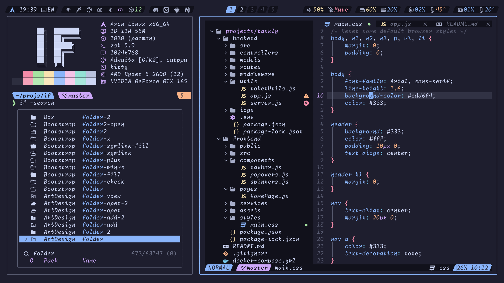

<!-- SHORTCUT REFERENCE LINKS -->

[zip]: https://github.com/iconicFonts/if/releases/download/v1.1.0/Monaspace_Radon.zip
[tar]: https://github.com/iconicFonts/if/releases/download/v1.1.0/Monaspace_Radon.tar.gz
[url]: https://github.com/githubnext/monaspace

# Monaspace Radon

| Repo/Website     | [githubnext/monaspace][url] |
| :--------------- | :-------------------------- |
| **Font Name**    | Monaspace Radon IF          |
| **Font Version** | `1.101`                     |
| **Download**     | [zip][zip] - [tar.gz][tar]  |



> If you found this project helpful, give it a :star: or share it around.

## Installation

### Linux

- Drag the fonts from the [fonts](fonts) directory into `~/.local/share/fonts`.
- Or, use [Curl](https://github.com/curl/curl):

```sh
curl -o ~/.local/share/fonts/MonaspaceRadonIF-Bold.ttf https://raw.githubusercontent.com/iconicFonts/if/main/fonts/patched/Monaspace_Radon/fonts/MonaspaceRadonIF-Bold.ttf
curl -o ~/.local/share/fonts/MonaspaceRadonIF-BoldItalic.ttf https://raw.githubusercontent.com/iconicFonts/if/main/fonts/patched/Monaspace_Radon/fonts/MonaspaceRadonIF-BoldItalic.ttf
curl -o ~/.local/share/fonts/MonaspaceRadonIF-Extra-LightItalic.ttf https://raw.githubusercontent.com/iconicFonts/if/main/fonts/patched/Monaspace_Radon/fonts/MonaspaceRadonIF-Extra-LightItalic.ttf
curl -o ~/.local/share/fonts/MonaspaceRadonIF-ExtraBold.ttf https://raw.githubusercontent.com/iconicFonts/if/main/fonts/patched/Monaspace_Radon/fonts/MonaspaceRadonIF-ExtraBold.ttf
curl -o ~/.local/share/fonts/MonaspaceRadonIF-ExtraBoldItalic.ttf https://raw.githubusercontent.com/iconicFonts/if/main/fonts/patched/Monaspace_Radon/fonts/MonaspaceRadonIF-ExtraBoldItalic.ttf
curl -o ~/.local/share/fonts/MonaspaceRadonIF-ExtraLight.ttf https://raw.githubusercontent.com/iconicFonts/if/main/fonts/patched/Monaspace_Radon/fonts/MonaspaceRadonIF-ExtraLight.ttf
curl -o ~/.local/share/fonts/MonaspaceRadonIF-Italic.ttf https://raw.githubusercontent.com/iconicFonts/if/main/fonts/patched/Monaspace_Radon/fonts/MonaspaceRadonIF-Italic.ttf
curl -o ~/.local/share/fonts/MonaspaceRadonIF-Light.ttf https://raw.githubusercontent.com/iconicFonts/if/main/fonts/patched/Monaspace_Radon/fonts/MonaspaceRadonIF-Light.ttf
curl -o ~/.local/share/fonts/MonaspaceRadonIF-LightItalic.ttf https://raw.githubusercontent.com/iconicFonts/if/main/fonts/patched/Monaspace_Radon/fonts/MonaspaceRadonIF-LightItalic.ttf
curl -o ~/.local/share/fonts/MonaspaceRadonIF-Medium.ttf https://raw.githubusercontent.com/iconicFonts/if/main/fonts/patched/Monaspace_Radon/fonts/MonaspaceRadonIF-Medium.ttf
curl -o ~/.local/share/fonts/MonaspaceRadonIF-MediumItalic.ttf https://raw.githubusercontent.com/iconicFonts/if/main/fonts/patched/Monaspace_Radon/fonts/MonaspaceRadonIF-MediumItalic.ttf
curl -o ~/.local/share/fonts/MonaspaceRadonIF-Regular.ttf https://raw.githubusercontent.com/iconicFonts/if/main/fonts/patched/Monaspace_Radon/fonts/MonaspaceRadonIF-Regular.ttf
curl -o ~/.local/share/fonts/MonaspaceRadonIF-SemiBold.ttf https://raw.githubusercontent.com/iconicFonts/if/main/fonts/patched/Monaspace_Radon/fonts/MonaspaceRadonIF-SemiBold.ttf
curl -o ~/.local/share/fonts/MonaspaceRadonIF-SemiBoldItalic.ttf https://raw.githubusercontent.com/iconicFonts/if/main/fonts/patched/Monaspace_Radon/fonts/MonaspaceRadonIF-SemiBoldItalic.ttf
```

### MacOS

- Drag the fonts from the [fonts](fonts) directory into Font Book.
- Or, use [Curl](https://github.com/curl/curl):

```sh
curl -o ~/Library/Fonts/MonaspaceRadonIF-Bold.ttf https://raw.githubusercontent.com/iconicFonts/if/main/fonts/patched/Monaspace_Radon/fonts/MonaspaceRadonIF-Bold.ttf
curl -o ~/Library/Fonts/MonaspaceRadonIF-BoldItalic.ttf https://raw.githubusercontent.com/iconicFonts/if/main/fonts/patched/Monaspace_Radon/fonts/MonaspaceRadonIF-BoldItalic.ttf
curl -o ~/Library/Fonts/MonaspaceRadonIF-Extra-LightItalic.ttf https://raw.githubusercontent.com/iconicFonts/if/main/fonts/patched/Monaspace_Radon/fonts/MonaspaceRadonIF-Extra-LightItalic.ttf
curl -o ~/Library/Fonts/MonaspaceRadonIF-ExtraBold.ttf https://raw.githubusercontent.com/iconicFonts/if/main/fonts/patched/Monaspace_Radon/fonts/MonaspaceRadonIF-ExtraBold.ttf
curl -o ~/Library/Fonts/MonaspaceRadonIF-ExtraBoldItalic.ttf https://raw.githubusercontent.com/iconicFonts/if/main/fonts/patched/Monaspace_Radon/fonts/MonaspaceRadonIF-ExtraBoldItalic.ttf
curl -o ~/Library/Fonts/MonaspaceRadonIF-ExtraLight.ttf https://raw.githubusercontent.com/iconicFonts/if/main/fonts/patched/Monaspace_Radon/fonts/MonaspaceRadonIF-ExtraLight.ttf
curl -o ~/Library/Fonts/MonaspaceRadonIF-Italic.ttf https://raw.githubusercontent.com/iconicFonts/if/main/fonts/patched/Monaspace_Radon/fonts/MonaspaceRadonIF-Italic.ttf
curl -o ~/Library/Fonts/MonaspaceRadonIF-Light.ttf https://raw.githubusercontent.com/iconicFonts/if/main/fonts/patched/Monaspace_Radon/fonts/MonaspaceRadonIF-Light.ttf
curl -o ~/Library/Fonts/MonaspaceRadonIF-LightItalic.ttf https://raw.githubusercontent.com/iconicFonts/if/main/fonts/patched/Monaspace_Radon/fonts/MonaspaceRadonIF-LightItalic.ttf
curl -o ~/Library/Fonts/MonaspaceRadonIF-Medium.ttf https://raw.githubusercontent.com/iconicFonts/if/main/fonts/patched/Monaspace_Radon/fonts/MonaspaceRadonIF-Medium.ttf
curl -o ~/Library/Fonts/MonaspaceRadonIF-MediumItalic.ttf https://raw.githubusercontent.com/iconicFonts/if/main/fonts/patched/Monaspace_Radon/fonts/MonaspaceRadonIF-MediumItalic.ttf
curl -o ~/Library/Fonts/MonaspaceRadonIF-Regular.ttf https://raw.githubusercontent.com/iconicFonts/if/main/fonts/patched/Monaspace_Radon/fonts/MonaspaceRadonIF-Regular.ttf
curl -o ~/Library/Fonts/MonaspaceRadonIF-SemiBold.ttf https://raw.githubusercontent.com/iconicFonts/if/main/fonts/patched/Monaspace_Radon/fonts/MonaspaceRadonIF-SemiBold.ttf
curl -o ~/Library/Fonts/MonaspaceRadonIF-SemiBoldItalic.ttf https://raw.githubusercontent.com/iconicFonts/if/main/fonts/patched/Monaspace_Radon/fonts/MonaspaceRadonIF-SemiBoldItalic.ttf
```

### Windows

- Drag the fonts from the [fonts](fonts) directory into `C:\Windows\Fonts`.
- Or, right-click the desired fonts and click Install.
- Or, use [Curl](https://github.com/curl/curl):

**In Windows Command Prompt or PowerShell:**

```sh
curl -o C:\Windows\Fonts\MonaspaceRadonIF-Bold.ttf https://raw.githubusercontent.com/iconicFonts/if/main/fonts/patched/Monaspace_Radon/fonts/MonaspaceRadonIF-Bold.ttf
curl -o C:\Windows\Fonts\MonaspaceRadonIF-BoldItalic.ttf https://raw.githubusercontent.com/iconicFonts/if/main/fonts/patched/Monaspace_Radon/fonts/MonaspaceRadonIF-BoldItalic.ttf
curl -o C:\Windows\Fonts\MonaspaceRadonIF-Extra-LightItalic.ttf https://raw.githubusercontent.com/iconicFonts/if/main/fonts/patched/Monaspace_Radon/fonts/MonaspaceRadonIF-Extra-LightItalic.ttf
curl -o C:\Windows\Fonts\MonaspaceRadonIF-ExtraBold.ttf https://raw.githubusercontent.com/iconicFonts/if/main/fonts/patched/Monaspace_Radon/fonts/MonaspaceRadonIF-ExtraBold.ttf
curl -o C:\Windows\Fonts\MonaspaceRadonIF-ExtraBoldItalic.ttf https://raw.githubusercontent.com/iconicFonts/if/main/fonts/patched/Monaspace_Radon/fonts/MonaspaceRadonIF-ExtraBoldItalic.ttf
curl -o C:\Windows\Fonts\MonaspaceRadonIF-ExtraLight.ttf https://raw.githubusercontent.com/iconicFonts/if/main/fonts/patched/Monaspace_Radon/fonts/MonaspaceRadonIF-ExtraLight.ttf
curl -o C:\Windows\Fonts\MonaspaceRadonIF-Italic.ttf https://raw.githubusercontent.com/iconicFonts/if/main/fonts/patched/Monaspace_Radon/fonts/MonaspaceRadonIF-Italic.ttf
curl -o C:\Windows\Fonts\MonaspaceRadonIF-Light.ttf https://raw.githubusercontent.com/iconicFonts/if/main/fonts/patched/Monaspace_Radon/fonts/MonaspaceRadonIF-Light.ttf
curl -o C:\Windows\Fonts\MonaspaceRadonIF-LightItalic.ttf https://raw.githubusercontent.com/iconicFonts/if/main/fonts/patched/Monaspace_Radon/fonts/MonaspaceRadonIF-LightItalic.ttf
curl -o C:\Windows\Fonts\MonaspaceRadonIF-Medium.ttf https://raw.githubusercontent.com/iconicFonts/if/main/fonts/patched/Monaspace_Radon/fonts/MonaspaceRadonIF-Medium.ttf
curl -o C:\Windows\Fonts\MonaspaceRadonIF-MediumItalic.ttf https://raw.githubusercontent.com/iconicFonts/if/main/fonts/patched/Monaspace_Radon/fonts/MonaspaceRadonIF-MediumItalic.ttf
curl -o C:\Windows\Fonts\MonaspaceRadonIF-Regular.ttf https://raw.githubusercontent.com/iconicFonts/if/main/fonts/patched/Monaspace_Radon/fonts/MonaspaceRadonIF-Regular.ttf
curl -o C:\Windows\Fonts\MonaspaceRadonIF-SemiBold.ttf https://raw.githubusercontent.com/iconicFonts/if/main/fonts/patched/Monaspace_Radon/fonts/MonaspaceRadonIF-SemiBold.ttf
curl -o C:\Windows\Fonts\MonaspaceRadonIF-SemiBoldItalic.ttf https://raw.githubusercontent.com/iconicFonts/if/main/fonts/patched/Monaspace_Radon/fonts/MonaspaceRadonIF-SemiBoldItalic.ttf
```

**In Unix-like Shells (Git Bash, WSL):**

```sh
curl -o /mnt/c/Windows/Fonts/MonaspaceRadonIF-Bold.ttf https://raw.githubusercontent.com/iconicFonts/if/main/fonts/patched/Monaspace_Radon/fonts/MonaspaceRadonIF-Bold.ttf
curl -o /mnt/c/Windows/Fonts/MonaspaceRadonIF-BoldItalic.ttf https://raw.githubusercontent.com/iconicFonts/if/main/fonts/patched/Monaspace_Radon/fonts/MonaspaceRadonIF-BoldItalic.ttf
curl -o /mnt/c/Windows/Fonts/MonaspaceRadonIF-Extra-LightItalic.ttf https://raw.githubusercontent.com/iconicFonts/if/main/fonts/patched/Monaspace_Radon/fonts/MonaspaceRadonIF-Extra-LightItalic.ttf
curl -o /mnt/c/Windows/Fonts/MonaspaceRadonIF-ExtraBold.ttf https://raw.githubusercontent.com/iconicFonts/if/main/fonts/patched/Monaspace_Radon/fonts/MonaspaceRadonIF-ExtraBold.ttf
curl -o /mnt/c/Windows/Fonts/MonaspaceRadonIF-ExtraBoldItalic.ttf https://raw.githubusercontent.com/iconicFonts/if/main/fonts/patched/Monaspace_Radon/fonts/MonaspaceRadonIF-ExtraBoldItalic.ttf
curl -o /mnt/c/Windows/Fonts/MonaspaceRadonIF-ExtraLight.ttf https://raw.githubusercontent.com/iconicFonts/if/main/fonts/patched/Monaspace_Radon/fonts/MonaspaceRadonIF-ExtraLight.ttf
curl -o /mnt/c/Windows/Fonts/MonaspaceRadonIF-Italic.ttf https://raw.githubusercontent.com/iconicFonts/if/main/fonts/patched/Monaspace_Radon/fonts/MonaspaceRadonIF-Italic.ttf
curl -o /mnt/c/Windows/Fonts/MonaspaceRadonIF-Light.ttf https://raw.githubusercontent.com/iconicFonts/if/main/fonts/patched/Monaspace_Radon/fonts/MonaspaceRadonIF-Light.ttf
curl -o /mnt/c/Windows/Fonts/MonaspaceRadonIF-LightItalic.ttf https://raw.githubusercontent.com/iconicFonts/if/main/fonts/patched/Monaspace_Radon/fonts/MonaspaceRadonIF-LightItalic.ttf
curl -o /mnt/c/Windows/Fonts/MonaspaceRadonIF-Medium.ttf https://raw.githubusercontent.com/iconicFonts/if/main/fonts/patched/Monaspace_Radon/fonts/MonaspaceRadonIF-Medium.ttf
curl -o /mnt/c/Windows/Fonts/MonaspaceRadonIF-MediumItalic.ttf https://raw.githubusercontent.com/iconicFonts/if/main/fonts/patched/Monaspace_Radon/fonts/MonaspaceRadonIF-MediumItalic.ttf
curl -o /mnt/c/Windows/Fonts/MonaspaceRadonIF-Regular.ttf https://raw.githubusercontent.com/iconicFonts/if/main/fonts/patched/Monaspace_Radon/fonts/MonaspaceRadonIF-Regular.ttf
curl -o /mnt/c/Windows/Fonts/MonaspaceRadonIF-SemiBold.ttf https://raw.githubusercontent.com/iconicFonts/if/main/fonts/patched/Monaspace_Radon/fonts/MonaspaceRadonIF-SemiBold.ttf
curl -o /mnt/c/Windows/Fonts/MonaspaceRadonIF-SemiBoldItalic.ttf https://raw.githubusercontent.com/iconicFonts/if/main/fonts/patched/Monaspace_Radon/fonts/MonaspaceRadonIF-SemiBoldItalic.ttf
```
