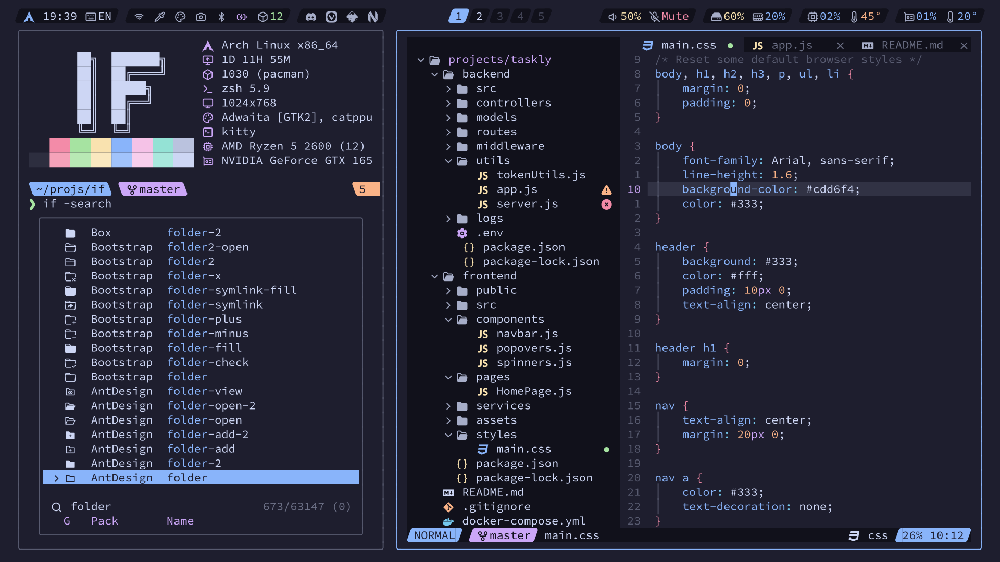

<!-- SHORTCUT REFERENCE LINKS -->

[zip]: https://github.com/iconicFonts/if/releases/download/v1.1.0/Source_Code_Pro.zip
[tar]: https://github.com/iconicFonts/if/releases/download/v1.1.0/Source_Code_Pro.tar.gz
[url]: https://github.com/adobe-fonts/source-code-pro

# Source Code Pro

| Repo/Website     | [adobe-fonts/source-code-pro][url] |
| :--------------- | :--------------------------------- |
| **Font Name**    | Source Code Pro IF                 |
| **Font Version** | `1.062`                            |
| **Download**     | [zip][zip] - [tar.gz][tar]         |



> If you found this project helpful, give it a :star: or share it around.

## Installation

### Linux

- Drag the fonts from the [fonts](fonts) directory into `~/.local/share/fonts`.
- Or, use [Curl](https://github.com/curl/curl):

```sh
curl -o ~/.local/share/fonts/SourceCodeProIF-Black.ttf https://raw.githubusercontent.com/iconicFonts/if/main/fonts/patched/Source_Code_Pro/fonts/SourceCodeProIF-Black.ttf
curl -o ~/.local/share/fonts/SourceCodeProIF-BlackItalic.ttf https://raw.githubusercontent.com/iconicFonts/if/main/fonts/patched/Source_Code_Pro/fonts/SourceCodeProIF-BlackItalic.ttf
curl -o ~/.local/share/fonts/SourceCodeProIF-Bold.ttf https://raw.githubusercontent.com/iconicFonts/if/main/fonts/patched/Source_Code_Pro/fonts/SourceCodeProIF-Bold.ttf
curl -o ~/.local/share/fonts/SourceCodeProIF-BoldItalic.ttf https://raw.githubusercontent.com/iconicFonts/if/main/fonts/patched/Source_Code_Pro/fonts/SourceCodeProIF-BoldItalic.ttf
curl -o ~/.local/share/fonts/SourceCodeProIF-Extra-LightItalic.ttf https://raw.githubusercontent.com/iconicFonts/if/main/fonts/patched/Source_Code_Pro/fonts/SourceCodeProIF-Extra-LightItalic.ttf
curl -o ~/.local/share/fonts/SourceCodeProIF-ExtraLight.ttf https://raw.githubusercontent.com/iconicFonts/if/main/fonts/patched/Source_Code_Pro/fonts/SourceCodeProIF-ExtraLight.ttf
curl -o ~/.local/share/fonts/SourceCodeProIF-Italic.ttf https://raw.githubusercontent.com/iconicFonts/if/main/fonts/patched/Source_Code_Pro/fonts/SourceCodeProIF-Italic.ttf
curl -o ~/.local/share/fonts/SourceCodeProIF-Light.ttf https://raw.githubusercontent.com/iconicFonts/if/main/fonts/patched/Source_Code_Pro/fonts/SourceCodeProIF-Light.ttf
curl -o ~/.local/share/fonts/SourceCodeProIF-LightItalic.ttf https://raw.githubusercontent.com/iconicFonts/if/main/fonts/patched/Source_Code_Pro/fonts/SourceCodeProIF-LightItalic.ttf
curl -o ~/.local/share/fonts/SourceCodeProIF-Medium.ttf https://raw.githubusercontent.com/iconicFonts/if/main/fonts/patched/Source_Code_Pro/fonts/SourceCodeProIF-Medium.ttf
curl -o ~/.local/share/fonts/SourceCodeProIF-MediumItalic.ttf https://raw.githubusercontent.com/iconicFonts/if/main/fonts/patched/Source_Code_Pro/fonts/SourceCodeProIF-MediumItalic.ttf
curl -o ~/.local/share/fonts/SourceCodeProIF-Regular.ttf https://raw.githubusercontent.com/iconicFonts/if/main/fonts/patched/Source_Code_Pro/fonts/SourceCodeProIF-Regular.ttf
curl -o ~/.local/share/fonts/SourceCodeProIF-SemiBold.ttf https://raw.githubusercontent.com/iconicFonts/if/main/fonts/patched/Source_Code_Pro/fonts/SourceCodeProIF-SemiBold.ttf
curl -o ~/.local/share/fonts/SourceCodeProIF-SemiBoldItalic.ttf https://raw.githubusercontent.com/iconicFonts/if/main/fonts/patched/Source_Code_Pro/fonts/SourceCodeProIF-SemiBoldItalic.ttf
```

### MacOS

- Drag the fonts from the [fonts](fonts) directory into Font Book.
- Or, use [Curl](https://github.com/curl/curl):

```sh
curl -o ~/Library/Fonts/SourceCodeProIF-Black.ttf https://raw.githubusercontent.com/iconicFonts/if/main/fonts/patched/Source_Code_Pro/fonts/SourceCodeProIF-Black.ttf
curl -o ~/Library/Fonts/SourceCodeProIF-BlackItalic.ttf https://raw.githubusercontent.com/iconicFonts/if/main/fonts/patched/Source_Code_Pro/fonts/SourceCodeProIF-BlackItalic.ttf
curl -o ~/Library/Fonts/SourceCodeProIF-Bold.ttf https://raw.githubusercontent.com/iconicFonts/if/main/fonts/patched/Source_Code_Pro/fonts/SourceCodeProIF-Bold.ttf
curl -o ~/Library/Fonts/SourceCodeProIF-BoldItalic.ttf https://raw.githubusercontent.com/iconicFonts/if/main/fonts/patched/Source_Code_Pro/fonts/SourceCodeProIF-BoldItalic.ttf
curl -o ~/Library/Fonts/SourceCodeProIF-Extra-LightItalic.ttf https://raw.githubusercontent.com/iconicFonts/if/main/fonts/patched/Source_Code_Pro/fonts/SourceCodeProIF-Extra-LightItalic.ttf
curl -o ~/Library/Fonts/SourceCodeProIF-ExtraLight.ttf https://raw.githubusercontent.com/iconicFonts/if/main/fonts/patched/Source_Code_Pro/fonts/SourceCodeProIF-ExtraLight.ttf
curl -o ~/Library/Fonts/SourceCodeProIF-Italic.ttf https://raw.githubusercontent.com/iconicFonts/if/main/fonts/patched/Source_Code_Pro/fonts/SourceCodeProIF-Italic.ttf
curl -o ~/Library/Fonts/SourceCodeProIF-Light.ttf https://raw.githubusercontent.com/iconicFonts/if/main/fonts/patched/Source_Code_Pro/fonts/SourceCodeProIF-Light.ttf
curl -o ~/Library/Fonts/SourceCodeProIF-LightItalic.ttf https://raw.githubusercontent.com/iconicFonts/if/main/fonts/patched/Source_Code_Pro/fonts/SourceCodeProIF-LightItalic.ttf
curl -o ~/Library/Fonts/SourceCodeProIF-Medium.ttf https://raw.githubusercontent.com/iconicFonts/if/main/fonts/patched/Source_Code_Pro/fonts/SourceCodeProIF-Medium.ttf
curl -o ~/Library/Fonts/SourceCodeProIF-MediumItalic.ttf https://raw.githubusercontent.com/iconicFonts/if/main/fonts/patched/Source_Code_Pro/fonts/SourceCodeProIF-MediumItalic.ttf
curl -o ~/Library/Fonts/SourceCodeProIF-Regular.ttf https://raw.githubusercontent.com/iconicFonts/if/main/fonts/patched/Source_Code_Pro/fonts/SourceCodeProIF-Regular.ttf
curl -o ~/Library/Fonts/SourceCodeProIF-SemiBold.ttf https://raw.githubusercontent.com/iconicFonts/if/main/fonts/patched/Source_Code_Pro/fonts/SourceCodeProIF-SemiBold.ttf
curl -o ~/Library/Fonts/SourceCodeProIF-SemiBoldItalic.ttf https://raw.githubusercontent.com/iconicFonts/if/main/fonts/patched/Source_Code_Pro/fonts/SourceCodeProIF-SemiBoldItalic.ttf
```

### Windows

- Drag the fonts from the [fonts](fonts) directory into `C:\Windows\Fonts`.
- Or, right-click the desired fonts and click Install.
- Or, use [Curl](https://github.com/curl/curl):

**In Windows Command Prompt or PowerShell:**

```sh
curl -o C:\Windows\Fonts\SourceCodeProIF-Black.ttf https://raw.githubusercontent.com/iconicFonts/if/main/fonts/patched/Source_Code_Pro/fonts/SourceCodeProIF-Black.ttf
curl -o C:\Windows\Fonts\SourceCodeProIF-BlackItalic.ttf https://raw.githubusercontent.com/iconicFonts/if/main/fonts/patched/Source_Code_Pro/fonts/SourceCodeProIF-BlackItalic.ttf
curl -o C:\Windows\Fonts\SourceCodeProIF-Bold.ttf https://raw.githubusercontent.com/iconicFonts/if/main/fonts/patched/Source_Code_Pro/fonts/SourceCodeProIF-Bold.ttf
curl -o C:\Windows\Fonts\SourceCodeProIF-BoldItalic.ttf https://raw.githubusercontent.com/iconicFonts/if/main/fonts/patched/Source_Code_Pro/fonts/SourceCodeProIF-BoldItalic.ttf
curl -o C:\Windows\Fonts\SourceCodeProIF-Extra-LightItalic.ttf https://raw.githubusercontent.com/iconicFonts/if/main/fonts/patched/Source_Code_Pro/fonts/SourceCodeProIF-Extra-LightItalic.ttf
curl -o C:\Windows\Fonts\SourceCodeProIF-ExtraLight.ttf https://raw.githubusercontent.com/iconicFonts/if/main/fonts/patched/Source_Code_Pro/fonts/SourceCodeProIF-ExtraLight.ttf
curl -o C:\Windows\Fonts\SourceCodeProIF-Italic.ttf https://raw.githubusercontent.com/iconicFonts/if/main/fonts/patched/Source_Code_Pro/fonts/SourceCodeProIF-Italic.ttf
curl -o C:\Windows\Fonts\SourceCodeProIF-Light.ttf https://raw.githubusercontent.com/iconicFonts/if/main/fonts/patched/Source_Code_Pro/fonts/SourceCodeProIF-Light.ttf
curl -o C:\Windows\Fonts\SourceCodeProIF-LightItalic.ttf https://raw.githubusercontent.com/iconicFonts/if/main/fonts/patched/Source_Code_Pro/fonts/SourceCodeProIF-LightItalic.ttf
curl -o C:\Windows\Fonts\SourceCodeProIF-Medium.ttf https://raw.githubusercontent.com/iconicFonts/if/main/fonts/patched/Source_Code_Pro/fonts/SourceCodeProIF-Medium.ttf
curl -o C:\Windows\Fonts\SourceCodeProIF-MediumItalic.ttf https://raw.githubusercontent.com/iconicFonts/if/main/fonts/patched/Source_Code_Pro/fonts/SourceCodeProIF-MediumItalic.ttf
curl -o C:\Windows\Fonts\SourceCodeProIF-Regular.ttf https://raw.githubusercontent.com/iconicFonts/if/main/fonts/patched/Source_Code_Pro/fonts/SourceCodeProIF-Regular.ttf
curl -o C:\Windows\Fonts\SourceCodeProIF-SemiBold.ttf https://raw.githubusercontent.com/iconicFonts/if/main/fonts/patched/Source_Code_Pro/fonts/SourceCodeProIF-SemiBold.ttf
curl -o C:\Windows\Fonts\SourceCodeProIF-SemiBoldItalic.ttf https://raw.githubusercontent.com/iconicFonts/if/main/fonts/patched/Source_Code_Pro/fonts/SourceCodeProIF-SemiBoldItalic.ttf
```

**In Unix-like Shells (Git Bash, WSL):**

```sh
curl -o /mnt/c/Windows/Fonts/SourceCodeProIF-Black.ttf https://raw.githubusercontent.com/iconicFonts/if/main/fonts/patched/Source_Code_Pro/fonts/SourceCodeProIF-Black.ttf
curl -o /mnt/c/Windows/Fonts/SourceCodeProIF-BlackItalic.ttf https://raw.githubusercontent.com/iconicFonts/if/main/fonts/patched/Source_Code_Pro/fonts/SourceCodeProIF-BlackItalic.ttf
curl -o /mnt/c/Windows/Fonts/SourceCodeProIF-Bold.ttf https://raw.githubusercontent.com/iconicFonts/if/main/fonts/patched/Source_Code_Pro/fonts/SourceCodeProIF-Bold.ttf
curl -o /mnt/c/Windows/Fonts/SourceCodeProIF-BoldItalic.ttf https://raw.githubusercontent.com/iconicFonts/if/main/fonts/patched/Source_Code_Pro/fonts/SourceCodeProIF-BoldItalic.ttf
curl -o /mnt/c/Windows/Fonts/SourceCodeProIF-Extra-LightItalic.ttf https://raw.githubusercontent.com/iconicFonts/if/main/fonts/patched/Source_Code_Pro/fonts/SourceCodeProIF-Extra-LightItalic.ttf
curl -o /mnt/c/Windows/Fonts/SourceCodeProIF-ExtraLight.ttf https://raw.githubusercontent.com/iconicFonts/if/main/fonts/patched/Source_Code_Pro/fonts/SourceCodeProIF-ExtraLight.ttf
curl -o /mnt/c/Windows/Fonts/SourceCodeProIF-Italic.ttf https://raw.githubusercontent.com/iconicFonts/if/main/fonts/patched/Source_Code_Pro/fonts/SourceCodeProIF-Italic.ttf
curl -o /mnt/c/Windows/Fonts/SourceCodeProIF-Light.ttf https://raw.githubusercontent.com/iconicFonts/if/main/fonts/patched/Source_Code_Pro/fonts/SourceCodeProIF-Light.ttf
curl -o /mnt/c/Windows/Fonts/SourceCodeProIF-LightItalic.ttf https://raw.githubusercontent.com/iconicFonts/if/main/fonts/patched/Source_Code_Pro/fonts/SourceCodeProIF-LightItalic.ttf
curl -o /mnt/c/Windows/Fonts/SourceCodeProIF-Medium.ttf https://raw.githubusercontent.com/iconicFonts/if/main/fonts/patched/Source_Code_Pro/fonts/SourceCodeProIF-Medium.ttf
curl -o /mnt/c/Windows/Fonts/SourceCodeProIF-MediumItalic.ttf https://raw.githubusercontent.com/iconicFonts/if/main/fonts/patched/Source_Code_Pro/fonts/SourceCodeProIF-MediumItalic.ttf
curl -o /mnt/c/Windows/Fonts/SourceCodeProIF-Regular.ttf https://raw.githubusercontent.com/iconicFonts/if/main/fonts/patched/Source_Code_Pro/fonts/SourceCodeProIF-Regular.ttf
curl -o /mnt/c/Windows/Fonts/SourceCodeProIF-SemiBold.ttf https://raw.githubusercontent.com/iconicFonts/if/main/fonts/patched/Source_Code_Pro/fonts/SourceCodeProIF-SemiBold.ttf
curl -o /mnt/c/Windows/Fonts/SourceCodeProIF-SemiBoldItalic.ttf https://raw.githubusercontent.com/iconicFonts/if/main/fonts/patched/Source_Code_Pro/fonts/SourceCodeProIF-SemiBoldItalic.ttf
```
