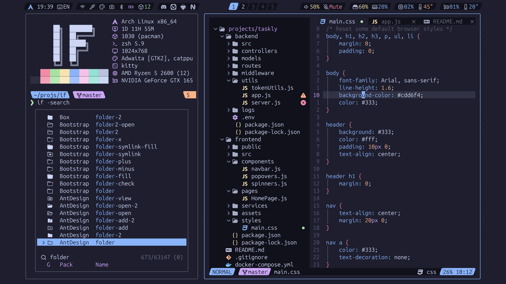

<!-- SHORTCUT REFERENCE LINKS -->

[zip]: https://github.com/iconicFonts/if/releases/download/v1.1.0/Ubuntu_Sans_Mono.zip
[tar]: https://github.com/iconicFonts/if/releases/download/v1.1.0/Ubuntu_Sans_Mono.tar.gz
[url]: https://github.com/canonical/ubuntu-sans-mono-fonts

# Ubuntu Sans Mono

| Repo/Website     | [canonical/ubuntu-sans-mono-fonts][url] |
| :--------------- | :-------------------------------------- |
| **Font Name**    | Ubuntu Sans Mono IF                     |
| **Font Version** | `1.006`                                 |
| **Download**     | [zip][zip] - [tar.xz][tar]              |



> If you found this project helpful, give it a :star: or share it around.

## Installation

### Linux

- Drag the fonts from the [fonts](fonts) directory into `~/.local/share/fonts`.
- Or, use [Curl](https://github.com/curl/curl):

```sh
curl -o ~/.local/share/fonts/UbuntuSansMonoIF-Bold.ttf https://raw.githubusercontent.com/iconicFonts/if/main/fonts/patched/Ubuntu_Sans_Mono/fonts/UbuntuSansMonoIF-Bold.ttf
curl -o ~/.local/share/fonts/UbuntuSansMonoIF-BoldItalic.ttf https://raw.githubusercontent.com/iconicFonts/if/main/fonts/patched/Ubuntu_Sans_Mono/fonts/UbuntuSansMonoIF-BoldItalic.ttf
curl -o ~/.local/share/fonts/UbuntuSansMonoIF-ExtraLight.ttf https://raw.githubusercontent.com/iconicFonts/if/main/fonts/patched/Ubuntu_Sans_Mono/fonts/UbuntuSansMonoIF-ExtraLight.ttf
curl -o ~/.local/share/fonts/UbuntuSansMonoIF-Italic.ttf https://raw.githubusercontent.com/iconicFonts/if/main/fonts/patched/Ubuntu_Sans_Mono/fonts/UbuntuSansMonoIF-Italic.ttf
curl -o ~/.local/share/fonts/UbuntuSansMonoIF-Light.ttf https://raw.githubusercontent.com/iconicFonts/if/main/fonts/patched/Ubuntu_Sans_Mono/fonts/UbuntuSansMonoIF-Light.ttf
curl -o ~/.local/share/fonts/UbuntuSansMonoIF-Medium.ttf https://raw.githubusercontent.com/iconicFonts/if/main/fonts/patched/Ubuntu_Sans_Mono/fonts/UbuntuSansMonoIF-Medium.ttf
curl -o ~/.local/share/fonts/UbuntuSansMonoIF-MediumItalic.ttf https://raw.githubusercontent.com/iconicFonts/if/main/fonts/patched/Ubuntu_Sans_Mono/fonts/UbuntuSansMonoIF-MediumItalic.ttf
curl -o ~/.local/share/fonts/UbuntuSansMonoIF-Regular.ttf https://raw.githubusercontent.com/iconicFonts/if/main/fonts/patched/Ubuntu_Sans_Mono/fonts/UbuntuSansMonoIF-Regular.ttf
curl -o ~/.local/share/fonts/UbuntuSansMonoIF-SemiBold.ttf https://raw.githubusercontent.com/iconicFonts/if/main/fonts/patched/Ubuntu_Sans_Mono/fonts/UbuntuSansMonoIF-SemiBold.ttf
curl -o ~/.local/share/fonts/UbuntuSansMonoIF-SemiBoldItalic.ttf https://raw.githubusercontent.com/iconicFonts/if/main/fonts/patched/Ubuntu_Sans_Mono/fonts/UbuntuSansMonoIF-SemiBoldItalic.ttf
curl -o ~/.local/share/fonts/UbuntuSansMonoIF-Thin.ttf https://raw.githubusercontent.com/iconicFonts/if/main/fonts/patched/Ubuntu_Sans_Mono/fonts/UbuntuSansMonoIF-Thin.ttf
```

### MacOS

- Drag the fonts from the [fonts](fonts) directory into Font Book.
- Or, use [Curl](https://github.com/curl/curl):

```sh
curl -o ~/Library/Fonts/UbuntuSansMonoIF-Bold.ttf https://raw.githubusercontent.com/iconicFonts/if/main/fonts/patched/Ubuntu_Sans_Mono/fonts/UbuntuSansMonoIF-Bold.ttf
curl -o ~/Library/Fonts/UbuntuSansMonoIF-BoldItalic.ttf https://raw.githubusercontent.com/iconicFonts/if/main/fonts/patched/Ubuntu_Sans_Mono/fonts/UbuntuSansMonoIF-BoldItalic.ttf
curl -o ~/Library/Fonts/UbuntuSansMonoIF-ExtraLight.ttf https://raw.githubusercontent.com/iconicFonts/if/main/fonts/patched/Ubuntu_Sans_Mono/fonts/UbuntuSansMonoIF-ExtraLight.ttf
curl -o ~/Library/Fonts/UbuntuSansMonoIF-Italic.ttf https://raw.githubusercontent.com/iconicFonts/if/main/fonts/patched/Ubuntu_Sans_Mono/fonts/UbuntuSansMonoIF-Italic.ttf
curl -o ~/Library/Fonts/UbuntuSansMonoIF-Light.ttf https://raw.githubusercontent.com/iconicFonts/if/main/fonts/patched/Ubuntu_Sans_Mono/fonts/UbuntuSansMonoIF-Light.ttf
curl -o ~/Library/Fonts/UbuntuSansMonoIF-Medium.ttf https://raw.githubusercontent.com/iconicFonts/if/main/fonts/patched/Ubuntu_Sans_Mono/fonts/UbuntuSansMonoIF-Medium.ttf
curl -o ~/Library/Fonts/UbuntuSansMonoIF-MediumItalic.ttf https://raw.githubusercontent.com/iconicFonts/if/main/fonts/patched/Ubuntu_Sans_Mono/fonts/UbuntuSansMonoIF-MediumItalic.ttf
curl -o ~/Library/Fonts/UbuntuSansMonoIF-Regular.ttf https://raw.githubusercontent.com/iconicFonts/if/main/fonts/patched/Ubuntu_Sans_Mono/fonts/UbuntuSansMonoIF-Regular.ttf
curl -o ~/Library/Fonts/UbuntuSansMonoIF-SemiBold.ttf https://raw.githubusercontent.com/iconicFonts/if/main/fonts/patched/Ubuntu_Sans_Mono/fonts/UbuntuSansMonoIF-SemiBold.ttf
curl -o ~/Library/Fonts/UbuntuSansMonoIF-SemiBoldItalic.ttf https://raw.githubusercontent.com/iconicFonts/if/main/fonts/patched/Ubuntu_Sans_Mono/fonts/UbuntuSansMonoIF-SemiBoldItalic.ttf
curl -o ~/Library/Fonts/UbuntuSansMonoIF-Thin.ttf https://raw.githubusercontent.com/iconicFonts/if/main/fonts/patched/Ubuntu_Sans_Mono/fonts/UbuntuSansMonoIF-Thin.ttf
```

### Windows

- Drag the fonts from the [fonts](fonts) directory into `C:\Windows\Fonts`.
- Or, right-click the desired fonts and click Install.
- Or, use [Curl](https://github.com/curl/curl):

**In Windows Command Prompt or PowerShell:**

```sh
curl -o C:\Windows\Fonts\UbuntuSansMonoIF-Bold.ttf https://raw.githubusercontent.com/iconicFonts/if/main/fonts/patched/Ubuntu_Sans_Mono/fonts/UbuntuSansMonoIF-Bold.ttf
curl -o C:\Windows\Fonts\UbuntuSansMonoIF-BoldItalic.ttf https://raw.githubusercontent.com/iconicFonts/if/main/fonts/patched/Ubuntu_Sans_Mono/fonts/UbuntuSansMonoIF-BoldItalic.ttf
curl -o C:\Windows\Fonts\UbuntuSansMonoIF-ExtraLight.ttf https://raw.githubusercontent.com/iconicFonts/if/main/fonts/patched/Ubuntu_Sans_Mono/fonts/UbuntuSansMonoIF-ExtraLight.ttf
curl -o C:\Windows\Fonts\UbuntuSansMonoIF-Italic.ttf https://raw.githubusercontent.com/iconicFonts/if/main/fonts/patched/Ubuntu_Sans_Mono/fonts/UbuntuSansMonoIF-Italic.ttf
curl -o C:\Windows\Fonts\UbuntuSansMonoIF-Light.ttf https://raw.githubusercontent.com/iconicFonts/if/main/fonts/patched/Ubuntu_Sans_Mono/fonts/UbuntuSansMonoIF-Light.ttf
curl -o C:\Windows\Fonts\UbuntuSansMonoIF-Medium.ttf https://raw.githubusercontent.com/iconicFonts/if/main/fonts/patched/Ubuntu_Sans_Mono/fonts/UbuntuSansMonoIF-Medium.ttf
curl -o C:\Windows\Fonts\UbuntuSansMonoIF-MediumItalic.ttf https://raw.githubusercontent.com/iconicFonts/if/main/fonts/patched/Ubuntu_Sans_Mono/fonts/UbuntuSansMonoIF-MediumItalic.ttf
curl -o C:\Windows\Fonts\UbuntuSansMonoIF-Regular.ttf https://raw.githubusercontent.com/iconicFonts/if/main/fonts/patched/Ubuntu_Sans_Mono/fonts/UbuntuSansMonoIF-Regular.ttf
curl -o C:\Windows\Fonts\UbuntuSansMonoIF-SemiBold.ttf https://raw.githubusercontent.com/iconicFonts/if/main/fonts/patched/Ubuntu_Sans_Mono/fonts/UbuntuSansMonoIF-SemiBold.ttf
curl -o C:\Windows\Fonts\UbuntuSansMonoIF-SemiBoldItalic.ttf https://raw.githubusercontent.com/iconicFonts/if/main/fonts/patched/Ubuntu_Sans_Mono/fonts/UbuntuSansMonoIF-SemiBoldItalic.ttf
curl -o C:\Windows\Fonts\UbuntuSansMonoIF-Thin.ttf https://raw.githubusercontent.com/iconicFonts/if/main/fonts/patched/Ubuntu_Sans_Mono/fonts/UbuntuSansMonoIF-Thin.ttf
```

**In Unix-like Shells (Git Bash, WSL):**

```sh
curl -o /mnt/c/Windows/Fonts/UbuntuSansMonoIF-Bold.ttf https://raw.githubusercontent.com/iconicFonts/if/main/fonts/patched/Ubuntu_Sans_Mono/fonts/UbuntuSansMonoIF-Bold.ttf
curl -o /mnt/c/Windows/Fonts/UbuntuSansMonoIF-BoldItalic.ttf https://raw.githubusercontent.com/iconicFonts/if/main/fonts/patched/Ubuntu_Sans_Mono/fonts/UbuntuSansMonoIF-BoldItalic.ttf
curl -o /mnt/c/Windows/Fonts/UbuntuSansMonoIF-ExtraLight.ttf https://raw.githubusercontent.com/iconicFonts/if/main/fonts/patched/Ubuntu_Sans_Mono/fonts/UbuntuSansMonoIF-ExtraLight.ttf
curl -o /mnt/c/Windows/Fonts/UbuntuSansMonoIF-Italic.ttf https://raw.githubusercontent.com/iconicFonts/if/main/fonts/patched/Ubuntu_Sans_Mono/fonts/UbuntuSansMonoIF-Italic.ttf
curl -o /mnt/c/Windows/Fonts/UbuntuSansMonoIF-Light.ttf https://raw.githubusercontent.com/iconicFonts/if/main/fonts/patched/Ubuntu_Sans_Mono/fonts/UbuntuSansMonoIF-Light.ttf
curl -o /mnt/c/Windows/Fonts/UbuntuSansMonoIF-Medium.ttf https://raw.githubusercontent.com/iconicFonts/if/main/fonts/patched/Ubuntu_Sans_Mono/fonts/UbuntuSansMonoIF-Medium.ttf
curl -o /mnt/c/Windows/Fonts/UbuntuSansMonoIF-MediumItalic.ttf https://raw.githubusercontent.com/iconicFonts/if/main/fonts/patched/Ubuntu_Sans_Mono/fonts/UbuntuSansMonoIF-MediumItalic.ttf
curl -o /mnt/c/Windows/Fonts/UbuntuSansMonoIF-Regular.ttf https://raw.githubusercontent.com/iconicFonts/if/main/fonts/patched/Ubuntu_Sans_Mono/fonts/UbuntuSansMonoIF-Regular.ttf
curl -o /mnt/c/Windows/Fonts/UbuntuSansMonoIF-SemiBold.ttf https://raw.githubusercontent.com/iconicFonts/if/main/fonts/patched/Ubuntu_Sans_Mono/fonts/UbuntuSansMonoIF-SemiBold.ttf
curl -o /mnt/c/Windows/Fonts/UbuntuSansMonoIF-SemiBoldItalic.ttf https://raw.githubusercontent.com/iconicFonts/if/main/fonts/patched/Ubuntu_Sans_Mono/fonts/UbuntuSansMonoIF-SemiBoldItalic.ttf
curl -o /mnt/c/Windows/Fonts/UbuntuSansMonoIF-Thin.ttf https://raw.githubusercontent.com/iconicFonts/if/main/fonts/patched/Ubuntu_Sans_Mono/fonts/UbuntuSansMonoIF-Thin.ttf
```
