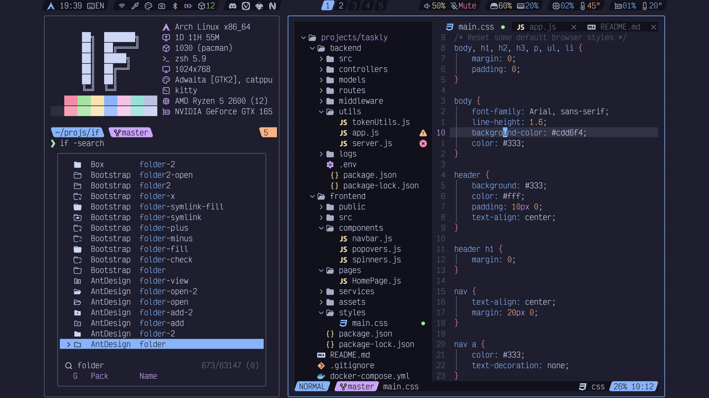

<!-- SHORTCUT REFERENCE LINKS -->

[zip]: https://github.com/iconicFonts/if/releases/download/v1.1.0/Victor_Mono.zip
[tar]: https://github.com/iconicFonts/if/releases/download/v1.1.0/Victor_Mono.tar.gz
[url]: https://github.com/rubjo/victor-mono

# Victor Mono

| Repo/Website     | [rubjo/victor-mono][url]   |
| :--------------- | -------------------------- |
| **Font Name**    | Victor Mono IF             |
| **Font Version** | `1.5.6`                    |
| **Download**     | [zip][zip] - [tar.gz][tar] |



> If you found this project helpful, give it a :star: or share it around.

## Installation

### Linux

- Drag the fonts from the [fonts](fonts) directory into `~/.local/share/fonts`.
- Or, use [Curl](https://github.com/curl/curl):

```sh
curl -o ~/.local/share/fonts/VictorMonoIF-Bold.ttf https://raw.githubusercontent.com/iconicFonts/if/main/fonts/patched/Victor_Mono/fonts/VictorMonoIF-Bold.ttf
curl -o ~/.local/share/fonts/VictorMonoIF-BoldItalic.ttf https://raw.githubusercontent.com/iconicFonts/if/main/fonts/patched/Victor_Mono/fonts/VictorMonoIF-BoldItalic.ttf
curl -o ~/.local/share/fonts/VictorMonoIF-Extra-LightItalic.ttf https://raw.githubusercontent.com/iconicFonts/if/main/fonts/patched/Victor_Mono/fonts/VictorMonoIF-Extra-LightItalic.ttf
curl -o ~/.local/share/fonts/VictorMonoIF-ExtraLight.ttf https://raw.githubusercontent.com/iconicFonts/if/main/fonts/patched/Victor_Mono/fonts/VictorMonoIF-ExtraLight.ttf
curl -o ~/.local/share/fonts/VictorMonoIF-Italic.ttf https://raw.githubusercontent.com/iconicFonts/if/main/fonts/patched/Victor_Mono/fonts/VictorMonoIF-Italic.ttf
curl -o ~/.local/share/fonts/VictorMonoIF-Light.ttf https://raw.githubusercontent.com/iconicFonts/if/main/fonts/patched/Victor_Mono/fonts/VictorMonoIF-Light.ttf
curl -o ~/.local/share/fonts/VictorMonoIF-LightItalic.ttf https://raw.githubusercontent.com/iconicFonts/if/main/fonts/patched/Victor_Mono/fonts/VictorMonoIF-LightItalic.ttf
curl -o ~/.local/share/fonts/VictorMonoIF-Medium.ttf https://raw.githubusercontent.com/iconicFonts/if/main/fonts/patched/Victor_Mono/fonts/VictorMonoIF-Medium.ttf
curl -o ~/.local/share/fonts/VictorMonoIF-MediumItalic.ttf https://raw.githubusercontent.com/iconicFonts/if/main/fonts/patched/Victor_Mono/fonts/VictorMonoIF-MediumItalic.ttf
curl -o ~/.local/share/fonts/VictorMonoIF-Regular.ttf https://raw.githubusercontent.com/iconicFonts/if/main/fonts/patched/Victor_Mono/fonts/VictorMonoIF-Regular.ttf
curl -o ~/.local/share/fonts/VictorMonoIF-SemiBold.ttf https://raw.githubusercontent.com/iconicFonts/if/main/fonts/patched/Victor_Mono/fonts/VictorMonoIF-SemiBold.ttf
curl -o ~/.local/share/fonts/VictorMonoIF-SemiBoldItalic.ttf https://raw.githubusercontent.com/iconicFonts/if/main/fonts/patched/Victor_Mono/fonts/VictorMonoIF-SemiBoldItalic.ttf
curl -o ~/.local/share/fonts/VictorMonoIF-Thin.ttf https://raw.githubusercontent.com/iconicFonts/if/main/fonts/patched/Victor_Mono/fonts/VictorMonoIF-Thin.ttf
curl -o ~/.local/share/fonts/VictorMonoIF-ThinItalic.ttf https://raw.githubusercontent.com/iconicFonts/if/main/fonts/patched/Victor_Mono/fonts/VictorMonoIF-ThinItalic.ttf
```

### MacOS

- Drag the fonts from the [fonts](fonts) directory into Font Book.
- Or, use [Curl](https://github.com/curl/curl):

```sh
curl -o ~/Library/Fonts/VictorMonoIF-Bold.ttf https://raw.githubusercontent.com/iconicFonts/if/main/fonts/patched/Victor_Mono/fonts/VictorMonoIF-Bold.ttf
curl -o ~/Library/Fonts/VictorMonoIF-BoldItalic.ttf https://raw.githubusercontent.com/iconicFonts/if/main/fonts/patched/Victor_Mono/fonts/VictorMonoIF-BoldItalic.ttf
curl -o ~/Library/Fonts/VictorMonoIF-Extra-LightItalic.ttf https://raw.githubusercontent.com/iconicFonts/if/main/fonts/patched/Victor_Mono/fonts/VictorMonoIF-Extra-LightItalic.ttf
curl -o ~/Library/Fonts/VictorMonoIF-ExtraLight.ttf https://raw.githubusercontent.com/iconicFonts/if/main/fonts/patched/Victor_Mono/fonts/VictorMonoIF-ExtraLight.ttf
curl -o ~/Library/Fonts/VictorMonoIF-Italic.ttf https://raw.githubusercontent.com/iconicFonts/if/main/fonts/patched/Victor_Mono/fonts/VictorMonoIF-Italic.ttf
curl -o ~/Library/Fonts/VictorMonoIF-Light.ttf https://raw.githubusercontent.com/iconicFonts/if/main/fonts/patched/Victor_Mono/fonts/VictorMonoIF-Light.ttf
curl -o ~/Library/Fonts/VictorMonoIF-LightItalic.ttf https://raw.githubusercontent.com/iconicFonts/if/main/fonts/patched/Victor_Mono/fonts/VictorMonoIF-LightItalic.ttf
curl -o ~/Library/Fonts/VictorMonoIF-Medium.ttf https://raw.githubusercontent.com/iconicFonts/if/main/fonts/patched/Victor_Mono/fonts/VictorMonoIF-Medium.ttf
curl -o ~/Library/Fonts/VictorMonoIF-MediumItalic.ttf https://raw.githubusercontent.com/iconicFonts/if/main/fonts/patched/Victor_Mono/fonts/VictorMonoIF-MediumItalic.ttf
curl -o ~/Library/Fonts/VictorMonoIF-Regular.ttf https://raw.githubusercontent.com/iconicFonts/if/main/fonts/patched/Victor_Mono/fonts/VictorMonoIF-Regular.ttf
curl -o ~/Library/Fonts/VictorMonoIF-SemiBold.ttf https://raw.githubusercontent.com/iconicFonts/if/main/fonts/patched/Victor_Mono/fonts/VictorMonoIF-SemiBold.ttf
curl -o ~/Library/Fonts/VictorMonoIF-SemiBoldItalic.ttf https://raw.githubusercontent.com/iconicFonts/if/main/fonts/patched/Victor_Mono/fonts/VictorMonoIF-SemiBoldItalic.ttf
curl -o ~/Library/Fonts/VictorMonoIF-Thin.ttf https://raw.githubusercontent.com/iconicFonts/if/main/fonts/patched/Victor_Mono/fonts/VictorMonoIF-Thin.ttf
curl -o ~/Library/Fonts/VictorMonoIF-ThinItalic.ttf https://raw.githubusercontent.com/iconicFonts/if/main/fonts/patched/Victor_Mono/fonts/VictorMonoIF-ThinItalic.ttf
```

### Windows

- Drag the fonts from the [fonts](fonts) directory into `C:\Windows\Fonts`.
- Or, right-click the desired fonts and click Install.
- Or, use [Curl](https://github.com/curl/curl):

**In Windows Command Prompt or PowerShell:**

```sh
curl -o C:\Windows\Fonts\VictorMonoIF-Bold.ttf https://raw.githubusercontent.com/iconicFonts/if/main/fonts/patched/Victor_Mono/fonts/VictorMonoIF-Bold.ttf
curl -o C:\Windows\Fonts\VictorMonoIF-BoldItalic.ttf https://raw.githubusercontent.com/iconicFonts/if/main/fonts/patched/Victor_Mono/fonts/VictorMonoIF-BoldItalic.ttf
curl -o C:\Windows\Fonts\VictorMonoIF-Extra-LightItalic.ttf https://raw.githubusercontent.com/iconicFonts/if/main/fonts/patched/Victor_Mono/fonts/VictorMonoIF-Extra-LightItalic.ttf
curl -o C:\Windows\Fonts\VictorMonoIF-ExtraLight.ttf https://raw.githubusercontent.com/iconicFonts/if/main/fonts/patched/Victor_Mono/fonts/VictorMonoIF-ExtraLight.ttf
curl -o C:\Windows\Fonts\VictorMonoIF-Italic.ttf https://raw.githubusercontent.com/iconicFonts/if/main/fonts/patched/Victor_Mono/fonts/VictorMonoIF-Italic.ttf
curl -o C:\Windows\Fonts\VictorMonoIF-Light.ttf https://raw.githubusercontent.com/iconicFonts/if/main/fonts/patched/Victor_Mono/fonts/VictorMonoIF-Light.ttf
curl -o C:\Windows\Fonts\VictorMonoIF-LightItalic.ttf https://raw.githubusercontent.com/iconicFonts/if/main/fonts/patched/Victor_Mono/fonts/VictorMonoIF-LightItalic.ttf
curl -o C:\Windows\Fonts\VictorMonoIF-Medium.ttf https://raw.githubusercontent.com/iconicFonts/if/main/fonts/patched/Victor_Mono/fonts/VictorMonoIF-Medium.ttf
curl -o C:\Windows\Fonts\VictorMonoIF-MediumItalic.ttf https://raw.githubusercontent.com/iconicFonts/if/main/fonts/patched/Victor_Mono/fonts/VictorMonoIF-MediumItalic.ttf
curl -o C:\Windows\Fonts\VictorMonoIF-Regular.ttf https://raw.githubusercontent.com/iconicFonts/if/main/fonts/patched/Victor_Mono/fonts/VictorMonoIF-Regular.ttf
curl -o C:\Windows\Fonts\VictorMonoIF-SemiBold.ttf https://raw.githubusercontent.com/iconicFonts/if/main/fonts/patched/Victor_Mono/fonts/VictorMonoIF-SemiBold.ttf
curl -o C:\Windows\Fonts\VictorMonoIF-SemiBoldItalic.ttf https://raw.githubusercontent.com/iconicFonts/if/main/fonts/patched/Victor_Mono/fonts/VictorMonoIF-SemiBoldItalic.ttf
curl -o C:\Windows\Fonts\VictorMonoIF-Thin.ttf https://raw.githubusercontent.com/iconicFonts/if/main/fonts/patched/Victor_Mono/fonts/VictorMonoIF-Thin.ttf
curl -o C:\Windows\Fonts\VictorMonoIF-ThinItalic.ttf https://raw.githubusercontent.com/iconicFonts/if/main/fonts/patched/Victor_Mono/fonts/VictorMonoIF-ThinItalic.ttf
```

**In Unix-like Shells (Git Bash, WSL):**

```sh
curl -o /mnt/c/Windows/Fonts/VictorMonoIF-Bold.ttf https://raw.githubusercontent.com/iconicFonts/if/main/fonts/patched/Victor_Mono/fonts/VictorMonoIF-Bold.ttf
curl -o /mnt/c/Windows/Fonts/VictorMonoIF-BoldItalic.ttf https://raw.githubusercontent.com/iconicFonts/if/main/fonts/patched/Victor_Mono/fonts/VictorMonoIF-BoldItalic.ttf
curl -o /mnt/c/Windows/Fonts/VictorMonoIF-Extra-LightItalic.ttf https://raw.githubusercontent.com/iconicFonts/if/main/fonts/patched/Victor_Mono/fonts/VictorMonoIF-Extra-LightItalic.ttf
curl -o /mnt/c/Windows/Fonts/VictorMonoIF-ExtraLight.ttf https://raw.githubusercontent.com/iconicFonts/if/main/fonts/patched/Victor_Mono/fonts/VictorMonoIF-ExtraLight.ttf
curl -o /mnt/c/Windows/Fonts/VictorMonoIF-Italic.ttf https://raw.githubusercontent.com/iconicFonts/if/main/fonts/patched/Victor_Mono/fonts/VictorMonoIF-Italic.ttf
curl -o /mnt/c/Windows/Fonts/VictorMonoIF-Light.ttf https://raw.githubusercontent.com/iconicFonts/if/main/fonts/patched/Victor_Mono/fonts/VictorMonoIF-Light.ttf
curl -o /mnt/c/Windows/Fonts/VictorMonoIF-LightItalic.ttf https://raw.githubusercontent.com/iconicFonts/if/main/fonts/patched/Victor_Mono/fonts/VictorMonoIF-LightItalic.ttf
curl -o /mnt/c/Windows/Fonts/VictorMonoIF-Medium.ttf https://raw.githubusercontent.com/iconicFonts/if/main/fonts/patched/Victor_Mono/fonts/VictorMonoIF-Medium.ttf
curl -o /mnt/c/Windows/Fonts/VictorMonoIF-MediumItalic.ttf https://raw.githubusercontent.com/iconicFonts/if/main/fonts/patched/Victor_Mono/fonts/VictorMonoIF-MediumItalic.ttf
curl -o /mnt/c/Windows/Fonts/VictorMonoIF-Regular.ttf https://raw.githubusercontent.com/iconicFonts/if/main/fonts/patched/Victor_Mono/fonts/VictorMonoIF-Regular.ttf
curl -o /mnt/c/Windows/Fonts/VictorMonoIF-SemiBold.ttf https://raw.githubusercontent.com/iconicFonts/if/main/fonts/patched/Victor_Mono/fonts/VictorMonoIF-SemiBold.ttf
curl -o /mnt/c/Windows/Fonts/VictorMonoIF-SemiBoldItalic.ttf https://raw.githubusercontent.com/iconicFonts/if/main/fonts/patched/Victor_Mono/fonts/VictorMonoIF-SemiBoldItalic.ttf
curl -o /mnt/c/Windows/Fonts/VictorMonoIF-Thin.ttf https://raw.githubusercontent.com/iconicFonts/if/main/fonts/patched/Victor_Mono/fonts/VictorMonoIF-Thin.ttf
curl -o /mnt/c/Windows/Fonts/VictorMonoIF-ThinItalic.ttf https://raw.githubusercontent.com/iconicFonts/if/main/fonts/patched/Victor_Mono/fonts/VictorMonoIF-ThinItalic.ttf
```
